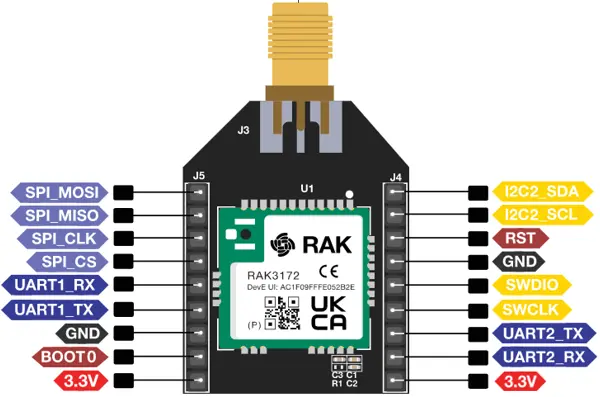

.. zephyr:board:: rak3172

Overview
********

RAK3172 is a WisDuo LPWAN module which integrating a STM32WLE5CC chip.
The breakout board has the RAK3172 as its core and with soldered to the
antenna connector.

Hardware
********

The breakout board footprint allows RAK3172 stamp module pins to be transferred to 2.54 mm headers.
It is designed to easy access to the pins on the board and simplify the evaluation of the RAK3172
module.

- RAK3172 STM32WLE5CC Module with LPWAN single-core Cortex®-M4 at 48 MHz
- 256-Kbyte Flash memory and 64-Kbyte SRAM
- RF transceiver LoRa® modulations
- Hardware encryption AES256-bit and a True random number generator
- SMA connectors for the LORA antenna
- I/O ports:

   - UART
   - I2C
   - SPI
   - SWD

For more information about the RAK3172 stamp module:

- `WisDuo RAK3172 Website`_
- `STM32WLE5CC on www.st.com`_

Supported Features
==================

.. zephyr:board-supported-hw::

Programming and Debugging
=========================

.. zephyr:board-supported-runners::

The RAK3172 board can be debugged and flashed with an external debug probe connected
to the SWD pins.
It can also be flashed via `pyOCD`_, but have to install an additional pack to support STM32WL.

.. code-block:: console

   $ pyocd pack --update
   $ pyocd pack --install stm32wl

Flashing an application
-----------------------

Connect the board to your host computer and build and flash an application.
The sample application :zephyr:code-sample:`hello_world` is used for this example.
Build the Zephyr kernel and application, then flash it to the device:

.. zephyr-app-commands::
   :zephyr-app: samples/hello_world
   :board: rak3172
   :goals: build flash

Run a serial terminal to connect with your board. By default, ``usart1`` is
accessible via the USB to TTL converter.

- Speed: 115200
- Data: 8 bits
- Parity: None
- Stop bits: 1

.. code-block:: console

   Hello World! rak3172/stm32wle5xx

References
**********

.. target-notes::

.. _WisDuo RAK3172 Website:
   https://docs.rakwireless.com/Product-Categories/WisDuo/RAK3172-Module/Overview/#product-description

.. _STM32WLE5CC on www.st.com:
   https://www.st.com/en/microcontrollers-microprocessors/stm32wle5cc.html

.. _pyOCD:
   https://github.com/pyocd/pyOCD
