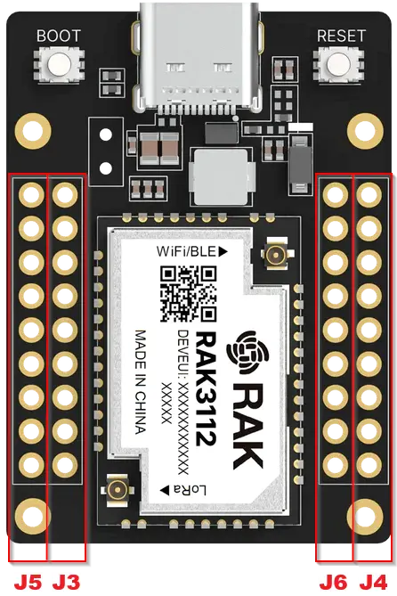

.. zephyr:board:: rak3212

Overview
********

RAK3212 Breakout Board provides easy access to the RAK3112 stamp
module's pins via 2.54 mm pitch headers, simplifying development and
evaluation of the RAK3112.

Hardware
********

It is designed for easy access to the pins on the board and to simplify the evaluation of the RAK3112
module.

The main hardware features are:

- RAK3112 based on Espressif ESP32-S3, dual-core Xtensa® LX7 CPU up to 240 MHz
- Semtech SX1262 for LoRa® modulations
- Integrated 2.4 GHz Wi-Fi (802.11 b/g/n) and Bluetooth® LE 5
- 16 MB Flash, 512 KB SRAM, and 8 MB PSRAM
- IPEX connectors for the antennas
- I/O ports:

   - UART
   - I2C
   - SPI
   - GPIO
   - ADC

For more information about the RAK3212 breakout board and its underlying RAK3112 stamp module:

- `WisDuo RAK3212 Breakout Board`_
- `WisDuo RAK3112 Module`_
- `Espressif ESP32-S3 Website`_

.. include:: ../../../espressif/common/soc-esp32s3-features.rst
   :start-after: espressif-soc-esp32s3-features

Supported Features
==================

.. zephyr:board-supported-hw::

Connections and IOs
===================

The RAK3212 exposes the RAK3112 stamp module pins through five connectors.

.. note::

   GPIO33–GPIO37 (J6 pins 1–5) are not available when 16 MB PSRAM is
   populated. GPIO3–GPIO8, GPIO47, and GPIO48 are reserved for the internal
   SX1262 LoRa transceiver and must not be used.

J2 - USB
--------

USB-C connector for AT commands and firmware update.

J3 - Power and Boot
--------------------

+-----+-----------------+--------+--------------------------------+
| Pin | Name            | Type   | Description                    |
+=====+=================+========+================================+
| 1   | 5V              | Power  | 5 V from USB                   |
+-----+-----------------+--------+--------------------------------+
| 2   | 5V              | Power  | 5 V from USB                   |
+-----+-----------------+--------+--------------------------------+
| 3   | GND             | Power  | Ground                         |
+-----+-----------------+--------+--------------------------------+
| 4   | GND             | Power  | Ground                         |
+-----+-----------------+--------+--------------------------------+
| 5   | GND             | Power  | Ground                         |
+-----+-----------------+--------+--------------------------------+
| 6   | GPIO0/BOOT      | I/O    | Boot mode select               |
+-----+-----------------+--------+--------------------------------+
| 7   | GND             | Power  | Ground                         |
+-----+-----------------+--------+--------------------------------+
| 8   | VCC             | Power  | 3.3 V supply                   |
+-----+-----------------+--------+--------------------------------+
| 9   | VCC             | Power  | 3.3 V supply                   |
+-----+-----------------+--------+--------------------------------+

J4 - GPIO / I2C / Analog
--------------------------

+-----+-----------------+--------+--------------------------------+
| Pin | Name            | Type   | Description                    |
+=====+=================+========+================================+
| 1   | GPIO18/I2C2_SCL | I/O    | I2C 2 clock                    |
+-----+-----------------+--------+--------------------------------+
| 2   | GPIO21/AIN0     | I/O    | GPIO / analog input            |
+-----+-----------------+--------+--------------------------------+
| 3   | GPIO38          | I/O    | GPIO                           |
+-----+-----------------+--------+--------------------------------+
| 4   | GPIO39          | I/O    | GPIO                           |
+-----+-----------------+--------+--------------------------------+
| 5   | GPIO40/I2C1_SCL | I/O    | I2C 1 clock                    |
+-----+-----------------+--------+--------------------------------+
| 6   | GPIO41          | I/O    | GPIO                           |
+-----+-----------------+--------+--------------------------------+
| 7   | GPIO42          | I/O    | GPIO                           |
+-----+-----------------+--------+--------------------------------+
| 8   | GPIO45          | I/O    | GPIO                           |
+-----+-----------------+--------+--------------------------------+
| 9   | GPIO46          | I/O    | GPIO                           |
+-----+-----------------+--------+--------------------------------+

J5 - GPIO / SPI / I2C
-----------------------

+-----+-----------------+--------+--------------------------------+
| Pin | Name            | Type   | Description                    |
+=====+=================+========+================================+
| 1   | GPIO1           | I/O    | GPIO                           |
+-----+-----------------+--------+--------------------------------+
| 2   | GPIO2           | I/O    | GPIO                           |
+-----+-----------------+--------+--------------------------------+
| 3   | GPIO9/I2C1_SDA  | I/O    | I2C 1 data                     |
+-----+-----------------+--------+--------------------------------+
| 4   | GPIO10/SPI_MISO | I/O    | SPI MISO                       |
+-----+-----------------+--------+--------------------------------+
| 5   | GPIO11/SPI_MOSI | I/O    | SPI MOSI                       |
+-----+-----------------+--------+--------------------------------+
| 6   | GPIO12/SPI_CS   | I/O    | SPI chip select                |
+-----+-----------------+--------+--------------------------------+
| 7   | GPIO13/SPI_SCK  | I/O    | SPI clock                      |
+-----+-----------------+--------+--------------------------------+
| 8   | GPIO14/AIN1     | I/O    | GPIO / analog input            |
+-----+-----------------+--------+--------------------------------+
| 9   | GPIO17/I2C2_SDA | I/O    | I2C 2 data                     |
+-----+-----------------+--------+--------------------------------+

J6 - GPIO / UART
-----------------

+-----+-----------------+--------+--------------------------------+
| Pin | Name            | Type   | Description                    |
+=====+=================+========+================================+
| 1   | GPIO33          | I/O    | Not available with 16 MB PSRAM |
+-----+-----------------+--------+--------------------------------+
| 2   | GPIO34          | I/O    | Not available with 16 MB PSRAM |
+-----+-----------------+--------+--------------------------------+
| 3   | GPIO35          | I/O    | Not available with 16 MB PSRAM |
+-----+-----------------+--------+--------------------------------+
| 4   | GPIO36          | I/O    | Not available with 16 MB PSRAM |
+-----+-----------------+--------+--------------------------------+
| 5   | GPIO37          | I/O    | Not available with 16 MB PSRAM |
+-----+-----------------+--------+--------------------------------+
| 6   | GPIO4           | N/C    | Reserved for internal use      |
+-----+-----------------+--------+--------------------------------+
| 7   | GPIO44/UART0_RX | Input  | UART0 receive                  |
+-----+-----------------+--------+--------------------------------+
| 8   | GPIO43/UART0_TX | Output | UART0 transmit                 |
+-----+-----------------+--------+--------------------------------+
| 9   | GND             | Power  | Ground                         |
+-----+-----------------+--------+--------------------------------+

System Requirements
*******************

.. include:: ../../../espressif/common/system-requirements.rst
   :start-after: espressif-system-requirements

Programming and Debugging
*************************

.. zephyr:board-supported-runners::

.. include:: ../../../espressif/common/building-flashing.rst
   :start-after: espressif-building-flashing

.. include:: ../../../espressif/common/board-variants.rst
   :start-after: espressif-board-variants

Debugging
=========

.. include:: ../../../espressif/common/openocd-debugging.rst
   :start-after: espressif-openocd-debugging

References
**********

.. target-notes::

.. _`WisDuo RAK3212 Breakout Board`:
   https://docs.rakwireless.com/product-categories/wisduo/rak3212-breakout-board/overview/
.. _`WisDuo RAK3112 Module`:
   https://docs.rakwireless.com/product-categories/wisduo/rak3112-module/overview/
.. _`Espressif ESP32-S3 Website`: https://www.espressif.com/en/products/socs/esp32-s3
