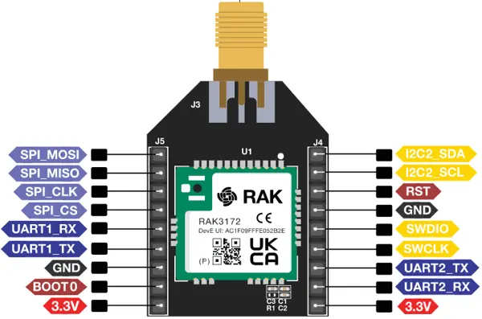

.. zephyr:board:: rak3272s

Overview
********

The RAK3272S Breakout Board carries a RAK3172 WisDuo stamp module, which
integrates an STM32WLE5CC SoC with a LoRa radio. The breakout board transfers
the stamp module pins to 2.54 mm headers and adds an antenna connector, so the
module can be evaluated without designing a carrier PCB.

The same stamp module is carried by the :zephyr:board:`rak3372` WisBlock Core
Module, which plugs into a WisBlock Base Board instead of exposing headers.

Hardware
********

- RAK3172 STM32WLE5CC module with a single-core Cortex-M4 at 48 MHz
- 256 KB flash and 64 KB SRAM
- LoRa radio integrated in the SoC, RFO-HP output rated to 22 dBm
- AES-256 hardware encryption and a true random number generator
- SMA or IPEX antenna connector, depending on the ordering option
- 2.54 mm headers exposing UART, I2C, SPI, SWD, BOOT0 and RST

For more information about the stamp module:

- `WisDuo RAK3172 Website`_
- `STM32WLE5CC on www.st.com`_

Supported Features
==================

.. zephyr:board-supported-hw::

Programming and Debugging
=========================

.. zephyr:board-supported-runners::

The board can be debugged and flashed with an external debug probe connected
to the SWD pins. It can also be flashed via `pyOCD`_, which needs an additional
pack to support STM32WL:

.. code-block:: console

   $ pyocd pack --update
   $ pyocd pack --install stm32wl

Flashing an application
-----------------------

Connect the board to your host computer and build and flash an application.
The sample application :zephyr:code-sample:`hello_world` is used for this
example. Build the Zephyr kernel and application, then flash it to the device:

.. zephyr-app-commands::
   :zephyr-app: samples/hello_world
   :board: rak3272s
   :goals: build flash

Run a serial terminal to connect with your board. ``usart1`` is the console,
reachable on the UART1_TX and UART1_RX header pins through a USB to TTL
converter.

- Speed: 115200
- Data: 8 bits
- Parity: None
- Stop bits: 1

.. code-block:: console

   Hello World! rak3272s/stm32wle5xx

References
**********

.. target-notes::

.. _WisDuo RAK3172 Website:
   https://docs.rakwireless.com/product-categories/wisduo/rak3172-module/overview/

.. _STM32WLE5CC on www.st.com:
   https://www.st.com/en/microcontrollers-microprocessors/stm32wle5cc.html

.. _pyOCD:
   https://github.com/pyocd/pyOCD
