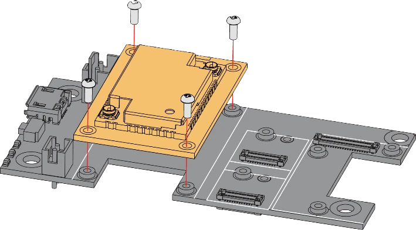

.. zephyr:board:: rak3401

Overview
********

RAK3401 is a WisBlock Core module for RAK WisBlock. It extends the WisBlock series with
a powerful Nordic nRF52840 MCU that supports Bluetooth 5.0 (Bluetooth Low Energy).
This makes the RAK3401 an ultra-low power communication solution.

- `WisBlock overview`_
- `RAK3401 datasheet`_

Hardware
********

Supported Features
==================

- Nordic nRF52840 ultra-low power MCU
- 32-bit ARM® Cortex™-M4 CPU
- 64 MHz CPU clock
- 1 MB Flash, 256 KB RAM
- Bluetooth 5.0 protocol stack
- IEEE 802.15.4 support
- I2C, SPI, Analog inputs, Digital inputs, and outputs
- Low power consumption
- Chipset: Nordic nRF52840

.. zephyr:board-supported-hw::

Connections and IOs
===================

The RAK3401 features a 40-pin header with various I/O interfaces for the WisBlock ecosystem. The pinout is as follows:

+-----------------------------+----------+-----+-----+----------+-----------------------------+
| Used                        | Name     | Pin | Pin | Name     | Used                        |
+=============================+==========+=====+=====+==========+=============================+
| NC                          | VBAT     | 1   | 2   | VBAT     | NC                          |
+-----------------------------+----------+-----+-----+----------+-----------------------------+
| GND                         | GND      | 3   | 4   | GND      | GND                         |
+-----------------------------+----------+-----+-----+----------+-----------------------------+
| 3V3                         | 3V3      | 5   | 6   | 3V3      | 3V3                         |
+-----------------------------+----------+-----+-----+----------+-----------------------------+
| USB_P                       | USB_P    | 7   | 8   | USB_N    | USB_N                       |
+-----------------------------+----------+-----+-----+----------+-----------------------------+
| NC                          | VBUS     | 9   | 10  | SW1      | P1.00                       |
+-----------------------------+----------+-----+-----+----------+-----------------------------+
| P0.20 / UART0_TX            | TXD0     | 11  | 12  | RXD0     | P0.19 / UART0_RX            |
+-----------------------------+----------+-----+-----+----------+-----------------------------+
| RESET                       | RESET    | 13  | 14  | LED1     | P1.03                       |
+-----------------------------+----------+-----+-----+----------+-----------------------------+
| P1.04                       | LED2     | 15  | 16  | LED3     | P0.02                       |
+-----------------------------+----------+-----+-----+----------+-----------------------------+
| 3V3                         | VDD      | 17  | 18  | VDD      | 3V3                         |
+-----------------------------+----------+-----+-----+----------+-----------------------------+
| P0.13 / I2C0_SDA            | I2C1_SDA | 19  | 20  | I2C1_SCL | P0.14 / I2C0_SCL            |
+-----------------------------+----------+-----+-----+----------+-----------------------------+
| P0.05 / ADC_VBAT            | AIN0     | 21  | 22  | AIN1     | P0.31 / ADC                 |
+-----------------------------+----------+-----+-----+----------+-----------------------------+
| BOOT                        | BOOT0    | 23  | 24  | IO7      | P0.28                       |
+-----------------------------+----------+-----+-----+----------+-----------------------------+
| P0.26 / SPI2_CS             | SPI_CS   | 25  | 26  | SPI_CLK  | P0.03 / SPI2_SCK            |
+-----------------------------+----------+-----+-----+----------+-----------------------------+
| P0.29 / SPI2_MISO           | SPI_MISO | 27  | 28  | SPI_MOSI | P0.30 / SPI2_MOSI           |
+-----------------------------+----------+-----+-----+----------+-----------------------------+
| P0.17                       | IO1      | 29  | 30  | IO2      | P1.02                       |
+-----------------------------+----------+-----+-----+----------+-----------------------------+
| P0.21                       | IO3      | 31  | 32  | IO4      | P0.04                       |
+-----------------------------+----------+-----+-----+----------+-----------------------------+
| P0.16 / UART1_TX            | TXD1     | 33  | 34  | RXD1     | P0.15 / UART1_RX            |
+-----------------------------+----------+-----+-----+----------+-----------------------------+
| P0.24 / I2C1_SDA            | I2C2_SDA | 35  | 36  | I2C2_SCL | P0.25 / I2C1_SCL            |
+-----------------------------+----------+-----+-----+----------+-----------------------------+
| P0.09                       | IO5      | 37  | 38  | IO6      | P0.10                       |
+-----------------------------+----------+-----+-----+----------+-----------------------------+
| GND                         | GND      | 39  | 40  | GND      | GND                         |
+-----------------------------+----------+-----+-----+----------+-----------------------------+

Connecting to a Baseboard
=========================

The RAK3401 can be mounted on a baseboard using the 40-pin header, called WisBlock I/O connector. It is compatible with
the WisBlock ecosystem, allowing for easy integration with various WisBlock modules and sensors.

Programming and debugging
*************************

.. zephyr:board-supported-runners::

Building & Flashing
===================

.. zephyr-app-commands::
   :zephyr-app: samples/basic/blinky
   :board: rak3401/nrf52840
   :shield: rakwireless_rak19010,rakwireless_rak19012
   :goals: build flash

.. note::

   When using the RAKDAP1 (CMSIS-DAP) debug probe, pass
   ``-DOPENOCD_NRF5_INTERFACE=cmsis-dap`` to the build command.

Debugging
=========

You can debug an application in the usual way. Here is an example for the
:zephyr:code-sample:`hello_world` application.

.. zephyr-app-commands::
   :zephyr-app: samples/hello_world
   :board: rak3401/nrf52840
   :shield: rakwireless_rak19007
   :maybe-skip-config:
   :goals: debug

References
**********

.. target-notes::

.. _WisBlock overview:
   https://www.rakwireless.com/en-us/products/wisblock

.. _RAK3401 datasheet:
   https://docs.rakwireless.com/product-categories/wisblock/rak3401/datasheet
