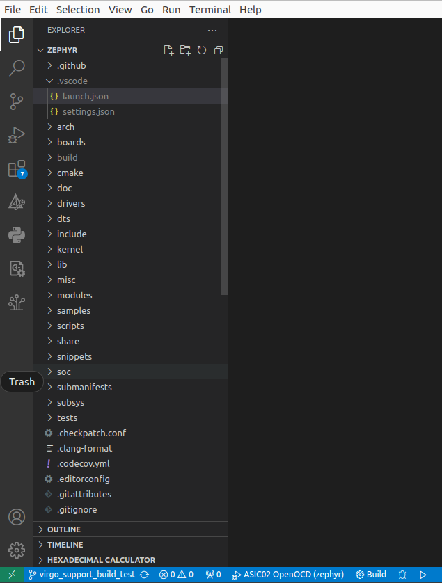
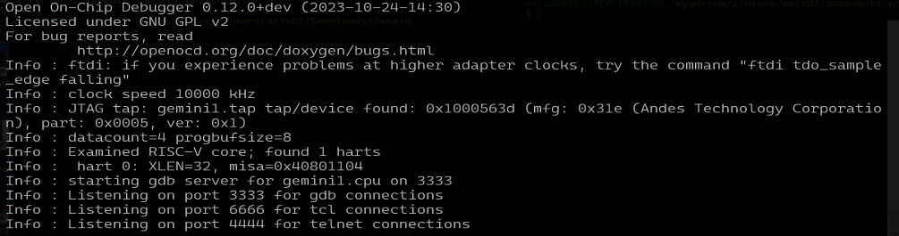
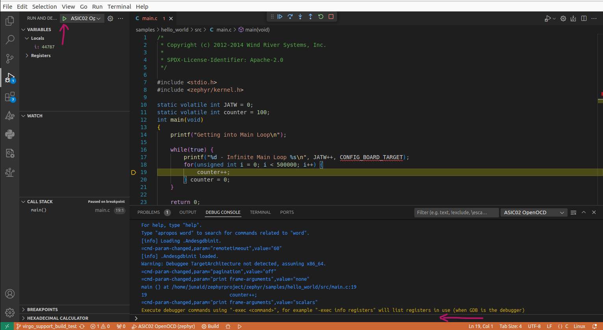
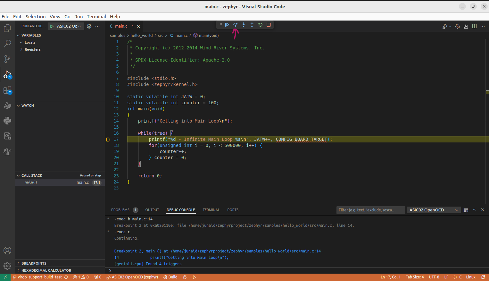
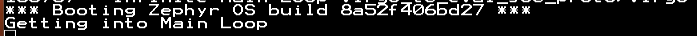
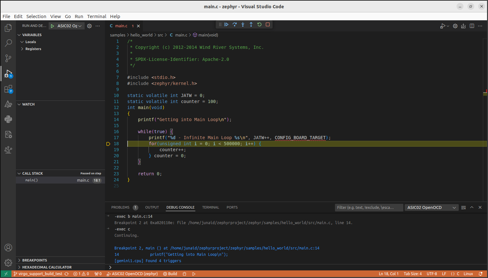
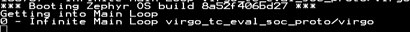

.. virgo:

Rapidsi Virgo
####################

Overview
********

.. image:: img/virgo.jpg
     :align: center
     :alt: Virgo

More information can be found on ' ' websites.

Hardware
********

Summary:

The virgo platform provides following hardware components:

- 1 core 32-bit 266MHz AndeStar v5 (N22) RISC-V CPU
- 64KB on-board ILM
- 32KB on-board DLM
- 2MB SPI flash memory (Can be used for XIP)
- UART
- I2C
- SPI
- GPIO
- PWM
- DMA
- Crypto Modules

Supported Features
==================

The ``virgo`` board configuration supports the following hardware features:

+----------------+------------+----------------------+
| Interface      | Controller | Driver/Component     |
+================+============+======================+
| CLIC           | on-chip    | interrupt_controller |
+----------------+------------+----------------------+
| RISC-V Machine | on-chip    | timer                |
| Timer          |            |                      |
+----------------+------------+----------------------+
| GPIO           | on-chip    | gpio                 |
+----------------+------------+----------------------+
| UART           | on-chip    | serial               |
+----------------+------------+----------------------+
| COUNTER        | on-chip    | counter              |
+----------------+------------+----------------------+
| SPI            | on-chip    | spi                  |
+----------------+------------+----------------------+
| I2C            | on-chip    | i2c                  |
+----------------+------------+----------------------+
| FLASH          | on-chip    | flash                |
+----------------+------------+----------------------+
| HWINFO         | on-chip    | syscon               |
+----------------+------------+----------------------+
| DMA            | on-chip    | dma                  |
+----------------+------------+----------------------+
| WATCHDOG       | on-chip    | wdt                  |
+----------------+------------+----------------------+
| CRYPTO         | on-chip    | pufcc                |
+----------------+------------+----------------------+

Other hardware features are not supported yet.

Connections and IOs
===================

The Rapidsi Virgo platform has 1 GPIO controller. It providing 8 bits of IO.
It is responsible for pin input/output, while the pull-up, etc are controlled
by the pin controller module

Mapping from GPIO controller to the Virgo Evaluation board pins:

+--------------------+--------------------+
| GPIO controller    | Usage / Board pins |
+====================+====================+
| **Push Buttons**   |                    |
+--------------------+--------------------+
| GPIO.x             | -                  |
+--------------------+--------------------+

Other peripheral mapping are listed below:

+-------------+---------------------------------+
| Peripherals | Usage / Board pins              |
+=============+=================================+
| SPI_1       | internal connected to SPI Flash |
+-------------+---------------------------------+

System Clock
------------

The Rapidsi Virgo platform has 266MHz core clock.

Serial Port
-----------

The Rapidsi Virgo platform has 1 UART.
The Zephyr console output is by default assigned to UART0 and the default
settings are 115200 8N1.

Programming and debugging
*************************

For debugging zephyr applications or burning them into a flash, you will need to
connect Rapidsi OpenOCD Port host computer to Virgo Evaluation board and execute the
west flash command by filling in the appropriate IP and Port number in the board.cmake
file.

For Stepwise interactive debugging, follow the procedure mentioned below:

Interactive Zephyr Flashing and Debugging
===========================

In order to do debugging of Zephyr RTOS over SoC prototype, follow the steps below:

1 - In the project navigation pan of the VS Code, create a folder ‘.vscode’. Under this folder, create a file called launch.json as shown in picture below:

2 - Run the OpenOCD or GDB Server as shown in the picture below:

3 - In the launch.json, copy the following contents:

.. code-block:: console
   {
    "version": "0.2.0",
    "configurations": [
        {
            "name": "OpenOCD_JTAG_Connection",
            "type": "cppdbg",
            "request": "launch",
            "program": "/home/<users>/zephyrproject/zephyr/build/zephyr/zephyr.elf", // Path to your executable
            "miDebuggerServerAddress": "<IP>:<PORT>", // Address of the remote GDB server
            "miDebuggerPath": "/home/<user>/Andestech/AndeSight_STD_v520/toolchains/nds32le-elf-mculib-v5/nds32le-elf-mculib-v5/bin/riscv32-elf-gdb",
            "cwd": "/home/<user>/zephyrproject/zephyr/", // Working directory
            "externalConsole": false, // Set to true to use an external console
            "MIMode": "gdb",
            "useExtendedRemote": true,
            "stopAtConnect": false,
            "symbolLoadInfo": {
                "loadAll": true,
                "exceptionList": ""
            },
            "postRemoteConnectCommands": [
                {
                    "text": "load"
                },
                {
                    "text": "b main"
                }
            ]
        }
    ]
   }

.. Note::

   Edit the following properties as per your project settings.
   “program:” Provide the path to the elf file for debugging.
   “miDebuggerServerAddress”: Provide the remote OpenOCD server IP and GDB Port.
   “miDebuggerPath”: Path to your custom gdb debugger.
   “cwd”: Path to the source code root directory where the debugger can search for all possible sources.

   In the “postRemoteConnectCommands”, as shown in the examples above we can tell the VS Code extension 
   to do loading of our program as well as setting initial breakpoints for the debugging. 
   We can also let the gdb to load any gdb script through the same set of commands.

   The "load" command in “postRemoteConnectCommands” will flash the binary into the target hardware.

   if "stopAtConnect" is set to true, then the program stops at the entry point and does not continue
   to the specified breakpoint "b main".

With these settings, open the terminal of the vscode from the toolbar and go to Debug Console. 
Press Ctrl+Shift+D to open the debug view. Assuming that the remote OpenOCD or GDB server is running, 
In the debug view, select the launch configuration and press the green play button to start the debug 
session as shown in the picture below:

This will connect to the remote server. After that in the Debug Console command input space there can 
be more commands passed through the gdb. To use this Debug Consol’s command input pan, each GDB command 
should be provided in this format “-exec <command>”. For example, -exec b main.c:14 will create a 
breakpoint in the main.c file at line number 14. Then we continue the program execution using either 
-exec c command as shown in picture below or through the interactive debug button at the top showing as play button:

.. image:: img/dbg_info/Main.c_Debug_View_2.jpg
     :align: center
     :alt: Main Debug View

As we can see, the program started executing and the breakpoint took place at main.c line 14 which is 
highlighted in VSCode. Now, we can control the execution of the program, using the stepwise debugging 
interactive buttons at the top of this window. We can stepwise execute the program as shown further 
in the picture below:

Pressing the highlighted button or by pressing F10, we stepped over the line 14 and reached line 17 
as expected and the corresponding print in the soc prototype uart console is shown below:

Similarly, another F10, gives us the following state of the VS Code and subsequently print on uart as expected.

The session termination can be done using red square button or shift+F5, 
and it can be restarted using green circular button or ctrl+shift+F5.

Building
========

You can build applications in the usual way. Here is an example for
the :ref:`hello_world` application from the zephyr root directory.

.. code-block:: console
   west build -p always -b virgo_proto sample/hello_world
