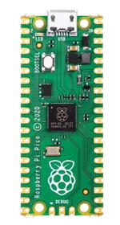
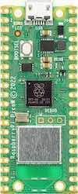

.. _rpi_pico:

Raspberry Pi Pico
#################

Overview
********

The Raspberry Pi Pico and Pico W are small, low-cost, versatile boards from
Raspberry Pi. They are equipped with an RP2040 SoC, an on-board LED,
a USB connector, and an SWD interface. The Pico W additionally contains an
Infineon CYW43439 2.4 GHz Wi-Fi/Bluetooth module. The USB bootloader allows the
ability to flash without any adapter, in a drag-and-drop manner.
It is also possible to flash and debug the boards with their SWD interface,
using an external adapter.

Hardware
********
- Dual core Arm Cortex-M0+ processor running up to 133MHz
- 264KB on-chip SRAM
- 2MB on-board QSPI flash with XIP capabilities
- 26 GPIO pins
- 3 Analog inputs
- 2 UART peripherals
- 2 SPI controllers
- 2 I2C controllers
- 16 PWM channels
- USB 1.1 controller (host/device)
- 8 Programmable I/O (PIO) for custom peripherals
- On-board LED
- 1 Watchdog timer peripheral
- Infineon CYW43439 2.4 GHz Wi-Fi chip (Pico W only)

     Raspberry Pi Pico (above) and Pico W (below)
     (Images courtesy of Raspberry Pi)

Supported Features
==================

The rpi_pico board configuration supports the following
hardware features:

.. list-table::
   :header-rows: 1

   * - Peripheral
     - Kconfig option
     - Devicetree compatible
   * - NVIC
     - N/A
     - :dtcompatible:`arm,v6m-nvic`
   * - UART
     - :kconfig:option:`CONFIG_SERIAL`
     - :dtcompatible:`raspberrypi,pico-uart`
   * - GPIO
     - :kconfig:option:`CONFIG_GPIO`
     - :dtcompatible:`raspberrypi,pico-gpio`
   * - ADC
     - :kconfig:option:`CONFIG_ADC`
     - :dtcompatible:`raspberrypi,pico-adc`
   * - I2C
     - :kconfig:option:`CONFIG_I2C`
     - :dtcompatible:`snps,designware-i2c`
   * - SPI
     - :kconfig:option:`CONFIG_SPI`
     - :dtcompatible:`raspberrypi,pico-spi`
   * - USB Device
     - :kconfig:option:`CONFIG_USB_DEVICE_STACK`
     - :dtcompatible:`raspberrypi,pico-usbd`
   * - HWINFO
     - :kconfig:option:`CONFIG_HWINFO`
     - N/A
   * - Watchdog Timer (WDT)
     - :kconfig:option:`CONFIG_WATCHDOG`
     - :dtcompatible:`raspberrypi,pico-watchdog`
   * - PWM
     - :kconfig:option:`CONFIG_PWM`
     - :dtcompatible:`raspberrypi,pico-pwm`
   * - Flash
     - :kconfig:option:`CONFIG_FLASH`
     - :dtcompatible:`raspberrypi,pico-flash`
   * - Clock controller
     - :kconfig:option:`CONFIG_CLOCK_CONTROL`
     - :dtcompatible:`raspberrypi,pico-clock-controller`
   * - UART (PIO)
     - :kconfig:option:`CONFIG_SERIAL`
     - :dtcompatible:`raspberrypi,pico-uart-pio`
   * - SPI (PIO)
     - :kconfig:option:`CONFIG_SPI`
     - :dtcompatible:`raspberrypi,pico-spi-pio`

Pin Mapping
===========

The peripherals of the RP2040 SoC can be routed to various pins on the board.
The configuration of these routes can be modified through DTS. Please refer to
the datasheet to see the possible routings for each peripheral.

External pin mapping on the Pico W is identical to the Pico, but note that internal
RP2040 GPIO lines 23, 24, 25, and 29 are routed to the Infineon module on the W.
Since GPIO 25 is routed to the on-board LED on the Pico, but to the Infineon module
on the Pico W, the "blinky" sample program does not work on the W (use hello_world for
a simple test program instead).

Default Zephyr Peripheral Mapping:
----------------------------------

.. rst-class:: rst-columns

- UART0_TX : P0
- UART0_RX : P1
- I2C0_SDA : P4
- I2C0_SCL : P5
- I2C1_SDA : P6
- I2C1_SCL : P7
- SPI0_RX : P16
- SPI0_CSN : P17
- SPI0_SCK : P18
- SPI0_TX : P19
- ADC_CH0 : P26
- ADC_CH1 : P27
- ADC_CH2 : P28
- ADC_CH3 : P29

Programmable I/O (PIO)
**********************
The RP2040 SoC comes with two PIO periherals. These are two simple
co-processors that are designed for I/O operations. The PIOs run
a custom instruction set, generated from a custom assembly language.
PIO programs are assembled using `pioasm`, a tool provided by Raspberry Pi.

Zephyr does not (currently) assemble PIO programs. Rather, they should be
manually assembled and embedded in source code. An example of how this is done
can be found at `drivers/serial/uart_rpi_pico_pio.c`.

Sample:  SPI via PIO
====================

The :zephyr_file:`samples/sensor/bme280/README.rst` sample includes a
demonstration of using the PIO SPI driver to communicate with an
environmental sensor.  The PIO SPI driver supports using any
combination of GPIO pins for an SPI bus, as well as allowing up to
four independent SPI buses on a single board (using the two SPI
devices as well as both PIO devices).

Programming and Debugging
*************************

Flashing
========

Using SEGGER JLink
------------------

You can Flash the rpi_pico with a SEGGER JLink debug probe as described in
:ref:`Building, Flashing and Debugging <west-flashing>`.

Here is an example of building and flashing the :zephyr:code-sample:`blinky` application.

.. zephyr-app-commands::
   :zephyr-app: samples/basic/blinky
   :board: rpi_pico
   :goals: build

.. code-block:: bash

  west flash --runner jlink

Using OpenOCD
-------------

To use CMSIS-DAP, You must configure **udev**.

Create a file in /etc/udev.rules.d with any name, and write the line below.

.. code-block:: bash

   ATTRS{idVendor}=="2e8a", ATTRS{idProduct}=="000c", MODE="660", GROUP="plugdev", TAG+="uaccess"

This example is valid for the case that the user joins to `plugdev` groups.

The Raspberry Pi Pico has an SWD interface that can be used to program
and debug the on board RP2040. This interface can be utilized by OpenOCD.
To use it with the RP2040, OpenOCD version 0.12.0 or later is needed.

If you are using a Debian based system (including RaspberryPi OS, Ubuntu. and more),
using the `pico_setup.sh`_ script is a convenient way to set up the forked version of OpenOCD.

Depending on the interface used (such as JLink), you might need to
checkout to a branch that supports this interface, before proceeding.
Build and install OpenOCD as described in the README.

Here is an example of building and flashing the :zephyr:code-sample:`blinky` application.

.. zephyr-app-commands::
   :zephyr-app: samples/basic/blinky
   :board: rpi_pico
   :goals: build flash
   :gen-args: -DOPENOCD=/usr/local/bin/openocd -DOPENOCD_DEFAULT_PATH=/usr/local/share/openocd/scripts -DRPI_PICO_DEBUG_ADAPTER=cmsis-dap

Set the environment variables **OPENOCD** to `/usr/local/bin/openocd`
and **OPENOCD_DEFAULT_PATH** to `/usr/local/share/openocd/scripts`. This should work
with the OpenOCD that was installed with the default configuration.
This configuration also works with an environment that is set up by the `pico_setup.sh`_ script.

**RPI_PICO_DEBUG_ADAPTER** specifies what debug adapter is used for debugging.

If **RPI_PICO_DEBUG_ADAPTER** was not assigned, `cmsis-dap` is used by default.
The other supported adapters are `raspberrypi-swd`, `jlink` and `blackmagicprobe`.
How to connect `cmsis-dap` and `raspberrypi-swd` is described in `Getting Started with Raspberry Pi Pico`_.
Any other SWD debug adapter maybe also work with this configuration.

The value of **RPI_PICO_DEBUG_ADAPTER** is cached, so it can be omitted from
`west flash` and `west debug` if it was previously set while running `west build`.

**RPI_PICO_DEBUG_ADAPTER** is used in an argument to OpenOCD as `"source [find interface/${RPI_PICO_DEBUG_ADAPTER}.cfg]"`.
Thus, **RPI_PICO_DEBUG_ADAPTER** needs to be assigned the file name of the debug adapter.

You can also flash the board with the following
command that directly calls OpenOCD (assuming a SEGGER JLink adapter is used):

.. code-block:: console

   $ openocd -f interface/jlink.cfg -c 'transport select swd' -f target/rp2040.cfg -c "adapter speed 2000" -c 'targets rp2040.core0' -c 'program path/to/zephyr.elf verify reset exit'

Using UF2
---------

If you don't have an SWD adapter, you can flash the Raspberry Pi Pico with
a UF2 file. By default, building an app for this board will generate a
`build/zephyr/zephyr.uf2` file. If the Pico is powered on with the `BOOTSEL`
button pressed, it will appear on the host as a mass storage device. The
UF2 file should be drag-and-dropped to the device, which will flash the Pico.

Debugging
=========

The SWD interface can also be used to debug the board. To achieve this, you can
either use SEGGER JLink or OpenOCD.

Using SEGGER JLink
------------------

Use a SEGGER JLink debug probe and follow the instruction in
:ref:`Building, Flashing and Debugging<west-debugging>`.

Using OpenOCD
-------------

Install OpenOCD as described for flashing the board.

Here is an example for debugging the :zephyr:code-sample:`blinky` application.

.. zephyr-app-commands::
   :zephyr-app: samples/basic/blinky
   :board: rpi_pico
   :maybe-skip-config:
   :goals: debug
   :gen-args: -DOPENOCD=/usr/local/bin/openocd -DOPENOCD_DEFAULT_PATH=/usr/local/share/openocd/scripts -DRPI_PICO_DEBUG_ADAPTER=raspberrypi-swd

As with flashing, you can specify the debug adapter by specifying **RPI_PICO_DEBUG_ADAPTER**
at `west build` time. No needs to specify it at `west debug` time.

You can also debug with OpenOCD and gdb launching from command-line.
Run the following command:

.. code-block:: console

   $ openocd -f interface/jlink.cfg -c 'transport select swd' -f target/rp2040.cfg -c "adapter speed 2000" -c 'targets rp2040.core0'

On another terminal, run:

.. code-block:: console

   $ gdb-multiarch

Inside gdb, run:

.. code-block:: console

   (gdb) tar ext :3333
   (gdb) file path/to/zephyr.elf

You can then start debugging the board.

.. target-notes::

.. _pico_setup.sh:
   https://raw.githubusercontent.com/raspberrypi/pico-setup/master/pico_setup.sh

.. _Getting Started with Raspberry Pi Pico:
  https://datasheets.raspberrypi.com/pico/getting-started-with-pico.pdf
