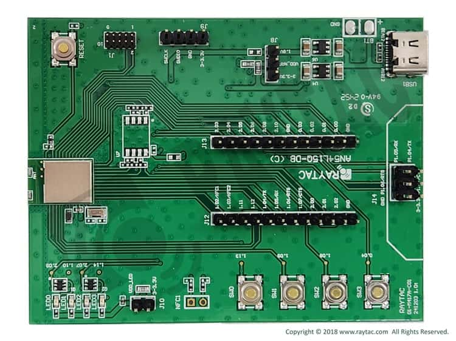

.. _an54l15q_db_nrf54l15:

Raytac AN54L15Q-DB
##################

Overview
********

The Raytac AN54L15Q-DB demonstration board is a development board based on the Raytac AN54L15Q module.
It uses the Nordic Semiconductor nRF54L15 SoC solution. The idea is to connect all the module's pins
to a 2.54mm pin header. It can easily open the verification module functions and connect with other
peripheral devices and sensor pins, making it a useful tool for early software development.

.. note::

   All software for the nRF54L15 SoC is experimental and hardware availability
   is restricted to the participants in the limited sampling program.

The Raytac AN54L15Q-DB provides support for the Nordic Semiconductor nRF54L15 Arm
Cortex-M33 CPU and the following devices:

* :abbr:`SAADC (Successive Approximation Analog to Digital Converter)`
* CLOCK
* RRAM
* :abbr:`GPIO (General Purpose Input Output)`
* :abbr:`TWIM (I2C-compatible two-wire interface master with EasyDMA)`
* :abbr:`MPU (Memory Protection Unit)`
* :abbr:`NVIC (Nested Vectored Interrupt Controller)`
* :abbr:`PWM (Pulse Width Modulation)`
* :abbr:`GRTC (Global real-time counter)`
* Segger RTT (RTT Console)
* :abbr:`SPI (Serial Peripheral Interface)`
* :abbr:`UARTE (Universal asynchronous receiver-transmitter)`
* :abbr:`WDT (Watchdog Timer)`

     Raytac AN54L15Q-DB (Credit: Raytac Corporation.)

Hardware
********

The Raytac AN54L15Q-DB has two crystal oscillators:

* High-frequency 32 MHz crystal oscillator (HFXO)
* Low-frequency 32.768 kHz crystal oscillator (LFXO)

The crystal oscillators can be configured to use either
internal or external capacitors.

- Module Demo Board built by AN54L15Q
- Nordic nRF54L15 SoC Solution
- A recommended 3rd-party module by Nordic Semiconductor.
- Intended for Bluetooth specification BT6
- Intended for FCC, IC, CE, Telec (MIC), KC, SRRC, NCC, RCM, WPC
- 128 MHz ARM® Cortex™ processor with TrustZone® technology
- 1.5MB Flash Memory / 256KB RAM
- RoHS & Reach Compliant.
- 31 GPIO
- Chip Antenna
- Interfaces: QSPI, SPI, UART, I2C, I2S, PDM, PWM, ADC, and NFC
- Highly flexible multiprotocol SoC ideally suited for Bluetooth® Low Energy,
  ANT+, Zigbee, Thread (802.15.4) ultra low-power wireless applications.

Supported Features
==================

The ``raytac_an54l15q_db/nrf54l15/cpuapp`` board configuration supports the following
hardware features:

+-----------+------------+----------------------+
| Interface | Controller | Driver/Component     |
+===========+============+======================+
| SAADC     | on-chip    | adc                  |
+-----------+------------+----------------------+
| CLOCK     | on-chip    | clock_control        |
+-----------+------------+----------------------+
| RRAM      | on-chip    | flash                |
+-----------+------------+----------------------+
| GPIO      | on-chip    | gpio                 |
+-----------+------------+----------------------+
| TWIM      | on-chip    | i2c                  |
+-----------+------------+----------------------+
| MPU       | on-chip    | arch/arm             |
+-----------+------------+----------------------+
| NVIC      | on-chip    | arch/arm             |
+-----------+------------+----------------------+
| PWM       | on-chip    | pwm                  |
+-----------+------------+----------------------+
| GRTC      | on-chip    | counter              |
+-----------+------------+----------------------+
| RTT       | Segger     | console              |
+-----------+------------+----------------------+
| SPI(M/S)  | on-chip    | spi                  |
+-----------+------------+----------------------+
| SPU       | on-chip    | system protection    |
+-----------+------------+----------------------+
| UARTE     | on-chip    | serial               |
+-----------+------------+----------------------+
| WDT       | on-chip    | watchdog             |
+-----------+------------+----------------------+

Connections and IOs
===================

LED
---

* LED0 (green) = P2.09
* LED1 (green) = P1.10
* LED2 (green) = P2.07
* LED3 (green) = P1.14

Push buttons
------------

* BUTTON1 = SW0 = P1.13
* BUTTON2 = SW1 = P1.09
* BUTTON3 = SW2 = P1.08
* BUTTON4 = SW3 = P0.04

UART
----
* RX = P1.05
* TX = P1.04
* RTS = P1.06
* CTS = P1.07

Programming and Debugging
*************************

Applications for the ``raytac_an54l15q_db/nrf54l15/cpuapp`` board can be
built, flashed, and debugged in the usual way. See
:ref:`build_an_application` and :ref:`application_run` for more details on
building and running.

.. note::
    The ``raytac_an54l15q_db`` board does not have an on-board J-Link debug IC;
    Use the Debug out connector of the nRF5340-DK or nRF54L15-DK to connect to the J1
    or J9 SWD connector, and use SEGGER J-Link OB IF to debug.

Flashing
========

As an example, this section shows how to build and flash the :zephyr:code-sample:`hello_world`
application.

.. warning::

   When programming the device, you might get an error similar to the following message::

    ERROR: The operation attempted is unavailable due to readback protection in
    ERROR: your device. Please use --recover to unlock the device.

   This error occurs when readback protection is enabled.
   To disable the readback protection, you must *recover* your device.

   Enter the following command to recover the core::

    west flash --recover

   The ``--recover`` command erases the flash memory and then writes a small binary into
   the recovered flash memory.
   This binary prevents the readback protection from enabling itself again after a pin
   reset or power cycle.

Follow the instructions in the :ref:`nordic_segger` page to install
and configure all the necessary software. Further information can be
found in :ref:`nordic_segger_flashing`.

To build and program the sample to the Raytac AN54L15Q-DB, complete the following steps:

First, connect the Raytac AN54L15Q-DB's J10 connector to you computer using a USB to TTL
converter. Then run your favorite terminal program to listen for output.

.. code-block:: console

   $ minicom -D <tty_device> -b 115200

Replace :code:`<tty_device>` with the port where the USB to TTL converter
can be found. For example, under Linux, :code:`/dev/ttyUSB0`.

Next, build the sample by running the following command:

.. zephyr-app-commands::
   :zephyr-app: samples/hello_world
   :board: raytac_an54l15q_db/nrf54l15/cpuapp
   :goals: build flash

References
**********

.. target-notes::

.. _Raytac AN54L15Q-DB website:
    https://www.raytac.com/product/ins.php?index_id=139
.. _Raytac AN54L15Q-DB Specification:
    https://www.raytac.com/download/index.php?index_id=60
.. _Raytac AN54L15Q-DB Schematic:
    https://www.raytac.com/upload/catalog_b/8b5e364600a9cc8c53a869733e97f07e.jpg
.. _J-Link Software and documentation pack:
    https://www.segger.com/jlink-software.html
