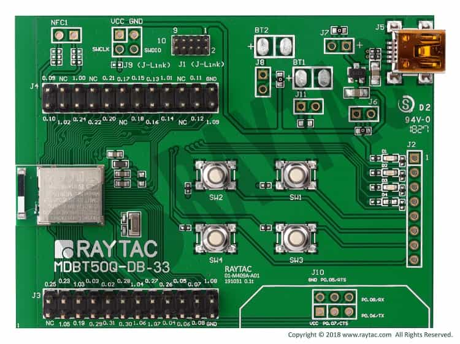

.. _raytac_mdbt50q_db_33_nrf52833:

Raytac MDBT50Q-DB-33
####################

Overview
********

The Raytac MDBT50Q-DB-33 hardware provides support for the
Nordic Semiconductor nRF52833 ARM Cortex-M4F CPU and the following devices:

* :abbr:`ADC (Analog to Digital Converter)`
* CLOCK
* FLASH
* :abbr:`GPIO (General Purpose Input Output)`
* :abbr:`I2C (Inter-Integrated Circuit)`
* :abbr:`MPU (Memory Protection Unit)`
* :abbr:`NVIC (Nested Vectored Interrupt Controller)`
* :abbr:`PWM (Pulse Width Modulation)`
* RADIO (Bluetooth Low Energy and 802.15.4)
* :abbr:`RTC (nRF RTC System Clock)`
* Segger RTT (RTT Console)
* :abbr:`SPI (Serial Peripheral Interface)`
* :abbr:`UART (Universal asynchronous receiver-transmitter)`
* :abbr:`USB (Universal Serial Bus)`
* :abbr:`WDT (Watchdog Timer)`

More information about the board can be found at the `MDBT50Q-DB-33 website`_.
The `MDBT50Q-DB-33 Specification`_ contains the demo board's datasheet.
The `MDBT50Q-DB-33 Schematic`_ contains the demo board's schematic.

Hardware
********
- Module Demo Board build by MDBT50Q-512K
- Nordic nRF52833 SoC Solution
- A recommnded 3rd-party module by Nordic Semiconductor.
- BT5.2&BT5.1&BT5 Bluetooth Specification Cerified
- Supports BT5 Long Range Features
- Cerifications: FCC, IC, CE, Telec(MIC), KC, SRRC, NCC, RCM, WPC
- 32-bit ARM® Cortex™ M4F CPU
- 512kB Flash Memory/128kB RAM
- RoHs & Reach Compiant.
- 42 GPIO
- Chip Antenna
- Interfaces: SPI, UART, I2C, I2S, PWM, ADC, NFC, and USB
- Highly flexible multiprotocol SoC ideally suited for Bluetooth® Low Energy, ANT+, Zigbee, Thread (802.15.4) ultra low-power wireless applications.
- 3 User LEDs
- 4 User buttons
- 1 Mini USB connector for power supply and USB communication
- SWD connector for FW programing
- J-Link interface for FW programing
- UART interface for UART communication

Supported Features
==================

The raytac_mdbt50q_db_33/nrf52833 board configuration supports the following
hardware features:

+-----------+------------+----------------------+
| Interface | Controller | Driver/Component     |
+===========+============+======================+
| ADC       | on-chip    | adc                  |
+-----------+------------+----------------------+
| CLOCK     | on-chip    | clock_control        |
+-----------+------------+----------------------+
| FLASH     | on-chip    | flash                |
+-----------+------------+----------------------+
| GPIO      | on-chip    | gpio                 |
+-----------+------------+----------------------+
| I2C(M)    | on-chip    | i2c                  |
+-----------+------------+----------------------+
| MPU       | on-chip    | arch/arm             |
+-----------+------------+----------------------+
| NVIC      | on-chip    | arch/arm             |
+-----------+------------+----------------------+
| PWM       | on-chip    | pwm                  |
+-----------+------------+----------------------+
| RADIO     | on-chip    | Bluetooth,           |
|           |            | ieee802154           |
+-----------+------------+----------------------+
| RTC       | on-chip    | system clock         |
+-----------+------------+----------------------+
| RTT       | Segger     | console              |
+-----------+------------+----------------------+
| SPI(M/S)  | on-chip    | spi                  |
+-----------+------------+----------------------+
| UART      | on-chip    | serial               |
+-----------+------------+----------------------+
| USB       | on-chip    | usb                  |
+-----------+------------+----------------------+
| WDT       | on-chip    | watchdog             |
+-----------+------------+----------------------+

Other hardware features have not been enabled yet for this board.
See `MDBT50Q-DB-33 website`_ and `MDBT50Q-DB-33 Specification`_
for a complete list of Raytac MDBT50Q-DB-33 board hardware features.

Connections and IOs
===================

LED
---

* LED1 (green) = P0.13
* LED2 (red) = P0.14
* LED3 (blue) = P0.15

Push buttons
------------

* BUTTON1 = SW1 = P0.11
* BUTTON2 = SW2 = P0.12
* BUTTON3 = SW3 = P0.24
* BUTTON4 = SW4 = P0.25

UART
----
* RXD = P0.08
* TXD = P0.06
* RTS = P0.05
* CTS = P0.07

Programming and Debugging
*************************

Applications for the ``raytac_mdbt50q_db_33/nrf52833`` board configuration can be
built, flashed, and debugged in the usual way. See :ref:`build_an_application` and
:ref:`application_run` for more details on building and running.

.. note::
   Flashing and Debugging Zephyr onto the raytac_mdbt50q_db_33/nrf52833 board
   requires an	external J-Link programmer. The programmer is attached to the J1
   or J9 SWD connector.

Flashing
========

Follow the instructions in the :ref:`nordic_segger` page to install
and configure all the necessary software. Further information can be
found in :ref:`nordic_segger_flashing`. Then build and flash
applications as usual (see :ref:`build_an_application` and
:ref:`application_run` for more details).

Here is an example for the :zephyr:code-sample:`hello_world` application.

Use a USB to TTL converter to connect the computer and raytac_mdbt50q_db_33/nrf52833
J10 connector. Then run your favorite terminal program to listen for output.

.. code-block:: console

   $ minicom -D <tty_device> -b 115200

Replace :code:`<tty_device>` with the port where the USB to TTL converter
can be found. For example, under Linux, :code:`/dev/ttyUSB0`.

Then build and flash the application in the usual way.

.. zephyr-app-commands::
   :zephyr-app: samples/hello_world
   :board: raytac_mdbt50q_db_33/nrf52833
   :goals: build flash

Debugging
=========

The ``raytac_mdbt50q_db_33/nrf52833`` board does not have an on-board-J-Link debug IC,
however, instructions from the :ref:`nordic_segger` page also apply to this board.
Use the Debug out connector of nRF52x DK to connect to the J1 connector, and use SEGGER
J-Link OB IF to debug.

Testing the LEDs and buttons in the Raytac MDBT50Q-DB-33
********************************************************

There are 2 samples that allow you to test that the buttons (switches) and LEDs on
the board are working properly with Zephyr:

.. code-block:: console

   samples/basic/blinky
   samples/basic/button

You can build and flash the examples to make sure Zephyr is running correctly on
your board. The button and LED definitions can be found in
:zephyr_file:`boards/raytac/mdbt50q_db_33/raytac_mdbt50q_db_33_nrf52833.dts`.

Selecting the pins
==================

Pins can be configured in the board pinctrl file. To see the available mappings,
open the `MDBT50Q-DB-33 Specification`_, chapter 2.5 'Pin Assignment'.
Select the pins marked 'General-purpose I/O'. Note that pins marked as 'low-frequency I/O
only' can only be used in under-10KHz applications. They are not suitable for SPI, I2C,
UART, and PWM.

References
**********

.. target-notes::

.. _MDBT50Q-DB-33 website:
	https://www.raytac.com/product/ins.php?index_id=97
.. _MDBT50Q-DB-33 Specification:
	https://www.raytac.com/download/index.php?index_id=46
.. _MDBT50Q-DB-33 Schematic:
	https://www.raytac.com/upload/catalog_b/407c1150fa33511a47e8a2f85d106ff3.jpg
.. _J-Link Software and documentation pack:
	https://www.segger.com/jlink-software.html
