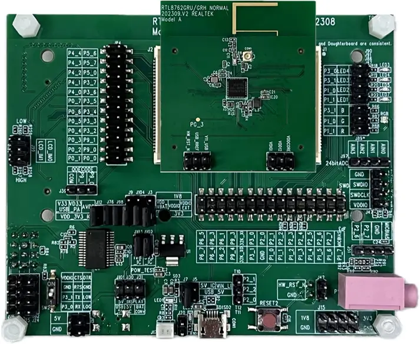
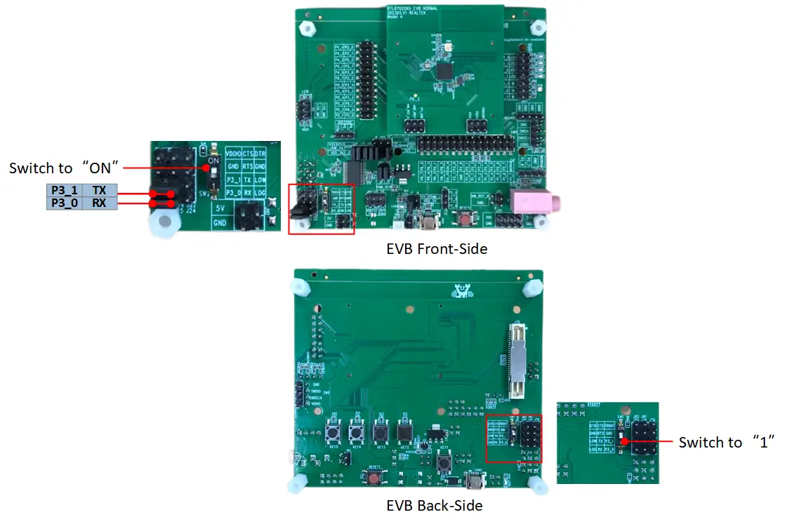
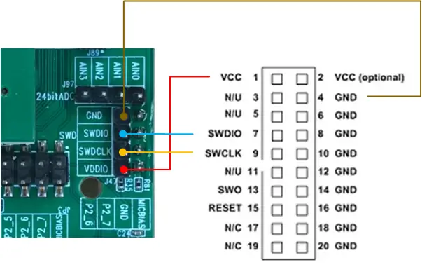

.. zephyr:board:: rtl87x2g_evb_a

Overview
********

RTL87x2G Model A evaluation board works along with an interchangeable daughterboard that houses
an RTL87x2G series SoC.

The RTL87x2G Model A evaluation board is compatible with the following daughterboards:

- RTL8762GRU/GRH Daughter Board
- RTL8762GKU/GKH Daughter Board
- RTL8762GC Daughter Board

.. note::
    The RTL8762GC is currently not supported in Zephyr due to its reliance on external flash memory, which results in a variable flash size configuration.

Hardware
********

SoC Series
==========

The RTL87x2G series comprises various chip types, each supporting different hardware features.

Below are the common hardware features of the RTL87x2G series:

- Realtek KM4 core compatible with Arm Cortex-M55, running at 40MHz (Maximum 125MHz)
- M-profile Vector Extension (MVE) for vector computation
- 32KB I-Cache, 16KB D-Cache, and 384KB SRAM
- Select part numbers include MCM 4MB PSRAM
- Hardware Keyscan / Quad Decode
- Flash On-The-Fly Decryption
- Embedded IR TX/RX
- ISO7816 Interface
- SPIC/SPI_m/SPI_s/SDIO/SD (eMMC)
- Low Power Comparator
- 8-Channel AUXADC
- 24-bit HD ADC
- CAN Bus
- RMII for Ethernet
- I2S/DAC/AMIC/DMIC/PDM
- SPIC/RGB888/SEGCOM Display Interfaces
- USB 2.0 High-Speed Interface

For detailed hardware information regarding specific part numbers of the RTL87x2G series, please refer to the `RTL87x2G Introduction`_.

Board
=====

The RTL87x2G Model A Evaluation Board supports the following features:

- 5V to 3.3V & 1.8V LDO power module
- Supports QSPI (Group1) display interface
- Supports audio module (AMIC, DMIC) interfaces
- Red LED and RGB LED module
- On-board FT232RL USB-to-UART converter

Supported Features
==================

.. zephyr:board-supported-hw::

Connections and IOs
===================

Refer to the `RTL87x2G Model A EVB Interfaces Distribution`_ for detailed information about the board interfaces.

System Clock
============

The RTL87x2G series SoC is configured to use the internal 32KHz clock as a source for the system clock.

Serial Port
===========

The RTL87x2G series SoC has 6 UARTs. By default, UART2 is configured for the console and log output.

FLashing
*********

Before flashing, please ensure the :ref:`runner_mpcli` is installed. This is the default flashing runner for the RTL87x2G series SoCs.

Flashing Realtek Images
==========================

To successfully run Zephyr on the RTL87x2G board, six essential images provided by Realtek must be programmed into the board, in addition to the Zephyr image.

To fetch these essential images, run the following command:

.. code-block:: console

   west blobs fetch hal_realtek --allow-regex 'bee/rtl87x2g/bin/.*'

**Enter Download Mode**

The board is flashed through the serial interface provided by the on-board FT232RL USB-to-UART converter. Please follow these procedures to set up the hardware and enter download mode:

1. **USB Connection**: Connect a USB cable to the **COM2** port located on the bottom left of the EVB.
2. **Jumper Configuration**: Use jumpers to connect **P3_1** to TX and **P3_0** to RX to utilize the on-board FT232RL USB-to-UART converter.
3. **Toggle DIP Switch**: Switch the DIP switch (located on either the front or back of the EVB) to the **'ON'** position. This step grounds the **P0_3** pin.
4. **Reboot**: Press the **Reset** button once to reboot the SoC and officially enter download mode.

After entering download mode, run the following command from the directory containing a ``build`` folder:

.. code-block:: console

   west flash --port <port_name> --mp-json <zephyr workspace>/modules/hal/realtek/bee/tools/mpcli/configs/rtl87x2g_essential_images.json

.. note::
   - The "west flash" command assumes you are running it from the root where the ``build`` directory resides. If not, you must specify the build directory using the ``--build-dir`` or ``-d`` option.
   - Before flashing, ensure the serial port is available and not occupied by other applications (such as a serial console).

Flashing Zephyr
===============

Follow the steps below to build and flash the :zephyr:code-sample:`hello_world` application.

   .. zephyr-app-commands::
      :zephyr-app: samples/hello_world
      :board: rtl87x2g_evb_a/rtl8762gru
      :goals: build flash
      :flash-args: --port <port_name>

**Enter Normal Mode**

After successfully flashing the Zephyr image:

1. Toggle the DIP switch back to the **'1'** (OFF) position.
2. Press the **Reset** button once to reboot the SoC. The device will then enter normal mode and execute the firmware.

Visualizing the message
***********************

The Zephyr console uses the same UART interface as the flashing process. Ensure the USB cable and jumpers remain connected as described above.

#. Open a Serial Terminal:

   - Open your preferred serial communication tool (e.g., PuTTY, Tera Term).
   - Connect to the appropriate COM port.
   - Configure the baud rate to **115200**.

#. Reset the Board:

   - Press the reset button on the EVB.
   - You should see the output ``Hello World! rtl87x2g_evb_a/rtl8762gru`` in your terminal.

Debugging
*********

You can debug an application in the usual way using a J-Link debugger.

For J-link configuration details, please refer to the `RTL87x2G J-Link Setup Guide`_. The J-Link wiring diagram is shown below:

Here is an example for the :zephyr:code-sample:`hello_world` application.

.. zephyr-app-commands::
   :zephyr-app: samples/hello_world
   :board: rtl87x2g_evb_a/rtl8762gru
   :maybe-skip-config:
   :goals: debug

References
**********

.. target-notes::

.. _RTL87x2G Introduction:
    https://www.realmcu.com/en/Home/Product/RTL8762G-RTL877xG-Series

.. _RTL87x2G Model A EVB Interfaces Distribution:
    https://docs.realmcu.com/sdk/rtl87x2g/common/en/latest/doc/evb_guide/text_en/model_a.html#interfaces-distribution

.. _RTL87x2G J-Link Setup Guide:
    https://github.com/rtkconnectivity/realtek-zephyr-project/wiki/J%E2%80%90Link-Setup-Guide
