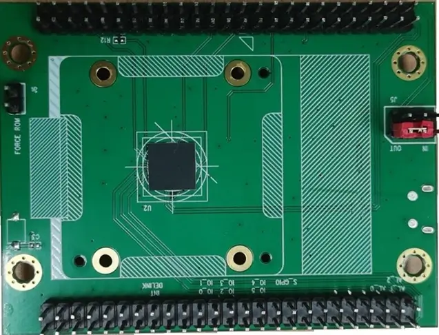

.. zephyr:board:: rts5817_maa_evb

Overview
********

The RTS5817 MAA EVB is a development platform to evaluate the Realtek RTS5817 MAA fingerprint chip.
The RTS5817 MAA chip contains a high-performance MCU and a fingerprint sensor.

Hardware
********

- 240MHz single-core 32-bit CPU with I-cache 32KB, D-cache 16KB
- 48KB boot ROM
- 256KB on-chip SRAM
- 1KB PUFrt OTP
- 2MB Flash
- USB2.0 full speed/high speed device
- Up to 11 GPIO
- 2 x UART
- 2 x Timer
- 2 x SPI, one can support slave mode
- Watchdog
- DMA
- Temperature sensor
- Cryptographic hardware acceleration (RNG, SHA, AES)
- Fingerprint matching hardware acceleration (MAC, popcount, convolution, etc.)
- SWD for debug

Supported Features
==================

.. zephyr:board-supported-hw::

Programming and Debugging
*************************

.. zephyr:board-supported-runners::

Building
========

#. Build :zephyr:code-sample:`hello_world` application as you would normally do.

.. zephyr-app-commands::
   :zephyr-app: samples/hello_world
   :board: rts5817_maa_evb
   :goals: build

#. The file ``zephyr.rts5817.bin`` will be created if the build system can build successfully.
   This binary image can be found under file "build/zephyr/".

Flashing
========

#. Short the two pins of ``J6`` to enter force rom mode (see `RTS5817MAA_EVB_User_Guide`_).
#. Connect the board to your host computer using USB.
#. Use ``west flash`` command to flash the image.
#. Disconnect the two pins of ``J6`` and reboot, The :zephyr:code-sample:`hello_world` application is running.

References
**********

.. target-notes::

.. _RTS5817MAA_EVB_User_Guide:
    https://github.com/RtkFP/Doc/blob/main/RTS5817MAA_EVB%20User%20Guide_V1.0.pdf
