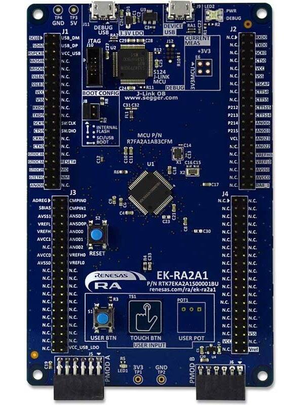
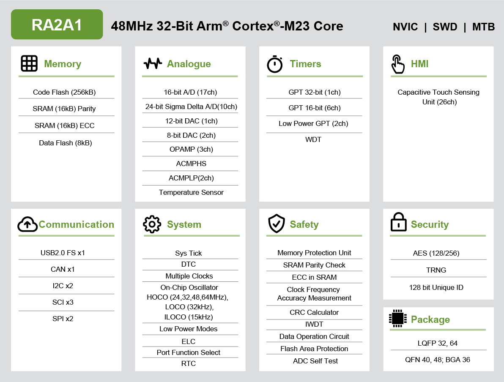

.. _ek_ra2a1:

RA2A1 Evaluation Kit
####################

Overview
********

The Renesas RA2A1 group uses the high-performance Arm® Cortex®-M23 core and
offers offers highly integrated, high-accuracy analog capabilities. The RA2A1
group supports a wide operating voltage range of 1.6V to 5.5V. It includes
a 16-bit SAR ADC, 24-bit Sigma-Delta ADC, comparators, operational amplifiers,
and DACs. The RA2A1 MCU targets cost-sensitive and low-power industrial sensor
applications where high-resolution analog will become a cost-benefit.

The EK-RA2A1 v1 enables developers to get started with initial firmware development

**Renesas RA2A1 Microcontroller Group**

- 48MHz Arm Cortex-M23 (Armv8-M architecture) with Arm MPU
- 64-pins LQFP package
- 32 KB SRAM
- 256 KB code flash memory
- 8 KB data flash memory

**Connectivity**

- A Device USB connector for the Main MCU
- S124 MCU based SEGGER J-Link® On-Board interface for debugging and programming of
  the RA2A1 MCU. A 10-pin JTAG/SWD interface is also provided for connecting optional
  external debuggers and programmers.
- Two PMOD connectors, allowing use of appropriate PMOD compliant peripheral plug-in
  modules for rapid prototyping
- Pin headers for access to power and signals for the Main MCU

**Multiple clock sources**

- Main MCU oscillator crystals, providing precision 12.000 MHz and 32,768 Hz external
  reference clocks
- Additional low-precision clocks are available internal to the Main MCU

**System Control and Ecosystem Access**

- User LEDs and buttons
  - MCU reset push-button switch
  - A two-color board status LED indicating availability of regulated power and connection status of the J-Link
    interface
  - A red User LED, controlled by the Main MCU firmware
  - A User Push-Button switch, User Capacitive Touch Button sensor, and an optional User Potentiometer
    all of which are controlled by the Main MCU firmware

- MCU boot configuration jumper

	EK-RA2A1 Board Functional Area Definitions (Credit: Renesas Electronics Corporation)

Hardware
********
Detail Hardware feature for the RA2A1 MCU group can be found at `RA2A1 Group User's Manual Hardware`_

	RA2A1 Block diagram (Credit: Renesas Electronics Corporation)

Detail Hardware feature for the EK-RA2A1 MCU can be found at `EK-RA2A1 - User's Manual`_

Supported Features
==================

The below features are currently supported on Zephyr OS for EK-RA2A1 board:

+-----------+------------+----------------------+
| Interface | Controller | Driver/Component     |
+===========+============+======================+
| GPIO      | on-chip    | gpio                 |
+-----------+------------+----------------------+
| MPU       | on-chip    | arch/arm             |
+-----------+------------+----------------------+
| NVIC      | on-chip    | arch/arm             |
+-----------+------------+----------------------+
| UART      | on-chip    | serial               |
+-----------+------------+----------------------+
| CLOCK     | on-chip    | clock control        |
+-----------+------------+----------------------+

Other hardware features are currently not supported by the port.

Programming and Debugging
*************************

Applications for the ``ek_ra2a1`` board configuration can be
built, flashed, and debugged in the usual way. See
:ref:`build_an_application` and :ref:`application_run` for more details on
building and running.

Flashing
========

Program can be flashed to EK-RA2A1 via the on-board SEGGER J-Link debugger.
SEGGER J-link's drivers are avaialbe at https://www.segger.com/downloads/jlink/

To flash the program to board

  1. Connect to J-Link OB via USB port to host PC

  2. Make sure J-Link OB jumper is in default configuration as describe in `EK-RA2A1 - User's Manual`_

  3. Execute west command

	.. code-block:: console

		west flash -r jlink

Debugging
=========

You can use Segger Ozone (`Segger Ozone Download`_) for a visual debug interface

Once downloaded and installed, open Segger Ozone and configure the debug project
like so:

* Target Device: R7FA2A1AB
* Target Interface: SWD
* Target Interface Speed: 4 MHz
* Host Interface: USB
* Program File: <path/to/your/build/zephyr.elf>

References
**********
- `EK-RA2A1 Website`_
- `RA2A1 MCU group Website`_

.. _EK-RA2A1 Website:
   https://www.renesas.com/us/en/products/microcontrollers-microprocessors/ra-cortex-m-mcus/ek-ra2a1-evaluation-kit-ra2a1-mcu-group

.. _RA2A1 MCU group Website:
   https://www.renesas.com/us/en/products/microcontrollers-microprocessors/ra-cortex-m-mcus/ra2a1-32-bit-microcontrollers-48mhz-arm-cortex-m23-and-integration-24-bit-sigma-delta-adc

.. _EK-RA2A1 - User's Manual:
   https://www.renesas.com/us/en/document/mat/ek-ra2a1-v1-users-manual

.. _RA2A1 Group User's Manual Hardware:
   https://www.renesas.com/us/en/document/mah/renesas-ra2a1-group-users-manual-hardware

.. _Segger Ozone Download:
   https://www.segger.com/downloads/jlink#Ozone
