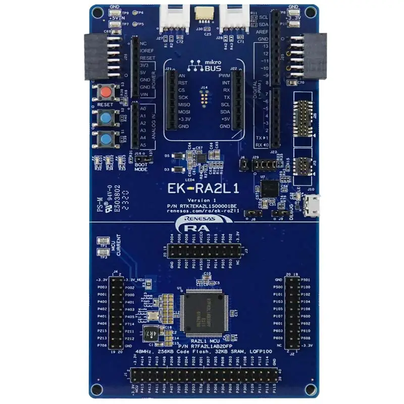
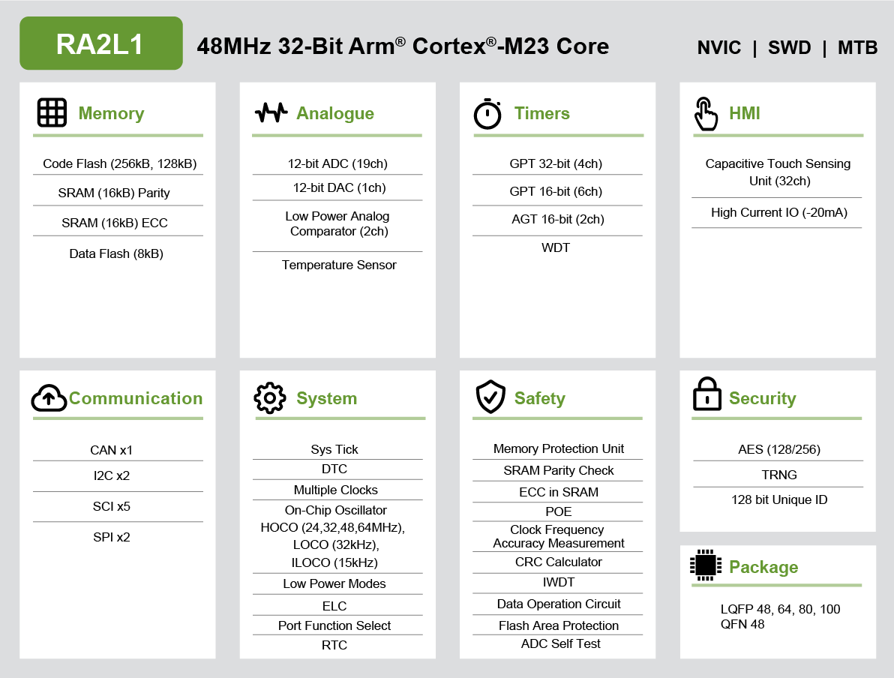

.. _ek_ra2l1:

RA2L1 Evaluation Kit
####################

Overview
********

The RA2L1 group is based on the Arm® Cortex®-M23 core, the most energy-efficient
CPU among Arm Cortex-M today. The optimized processing and Renesas low power process
technology makes it the industry's most energy-efficient ultra-low power microcontroller.
The RA2L1 group also features an enhanced Capacitive Touch Sensing Unit (CTSU2) a set
of serial communication interfaces, highly accurate converters and timers

The key features of the EK-RA2L1 board are categorized in three groups as follow:

**MCU Native Pin Access**

- 48MHz Arm Cortex-M23 based RA2L1 MCU in 100 pins, LQFP package
- Native pin access through 1 x 40-pin and 3 x 20-pin male headers
- MCU current measurement points for precision current consumption measurement
- Multiple clock sources - Low-precision clocks are available internal to the RA MCU
  Additionally, RA MCU oscillator and sub-clock oscillator crystals, 20.000 MHz and 32,768 Hz,
  are provided for precision
- Internal MCU DC-DC power option

**System Control and Ecosystem Access**

- Two 5 V input sources

  - USB (Debug)
  - External power supply (using surface mount clamp test points and power input vias)

- Three Debug modes

  - Debug on-board (SWD)
  - Debug in (ETM, SWD and JTAG)
  - Debug out (SWD)

- User LEDs and buttons

  - Three User LEDs (red, blue, green)
  - Power LED (white) indicating availability of regulated power
  - Debug LED (yellow) indicating the debug connection
  - Two User buttons
  - One Reset button

- Five most popular ecosystems expansions

  - Two Seeed Grove system (I2C/Analog) connectors
  - SparkFun Qwiic connector
  - Two Digilent Pmod (SPI and UART) connectors
  - Arduino (Uno R3) connector
  - MikroElektronika mikroBUS connector

- MCU boot configuration jumper

	EK-RA2L1 Board Functional Area Definitions (Credit: Renesas Electronics Corporation)

Hardware
********
Detail Hardware feature for the RA2L1 MCU group can be found at `RA2L1 Group User's Manual Hardware`_

	RA2L1 Block diagram (Credit: Renesas Electronics Corporation)

Detail Hardware feature for the EK-RA2L1 MCU can be found at `EK-RA2L1 - User's Manual`_

Supported Features
==================

The below features are currently supported on Zephyr OS for EK-RA2L1 board:

+-----------+------------+----------------------+
| Interface | Controller | Driver/Component     |
+===========+============+======================+
| GPIO      | on-chip    | gpio                 |
+-----------+------------+----------------------+
| MPU       | on-chip    | arch/arm             |
+-----------+------------+----------------------+
| NVIC      | on-chip    | arch/arm             |
+-----------+------------+----------------------+
| UART      | on-chip    | serial               |
+-----------+------------+----------------------+
| CLOCK     | on-chip    | clock control        |
+-----------+------------+----------------------+

Other hardware features are currently not supported by the port.

Programming and Debugging
*************************

Applications for the ``ek_ra2l1`` board configuration can be
built, flashed, and debugged in the usual way. See
:ref:`build_an_application` and :ref:`application_run` for more details on
building and running.

Flashing
========

Program can be flashed to EK-RA2L1 via the on-board SEGGER J-Link debugger.
SEGGER J-link's drivers are avaialbe at https://www.segger.com/downloads/jlink/

To flash the program to board

  1. Connect to J-Link OB via USB port to host PC

  2. Make sure J-Link OB jumper is in default configuration as describe in `EK-RA2L1 - User's Manual`_

  3. Execute west command

	.. code-block:: console

		west flash -r jlink

Debugging
=========

You can use Segger Ozone (`Segger Ozone Download`_) for a visual debug interface

Once downloaded and installed, open Segger Ozone and configure the debug project
like so:

* Target Device: R7FA2L1AB
* Target Interface: SWD
* Target Interface Speed: 4 MHz
* Host Interface: USB
* Program File: <path/to/your/build/zephyr.elf>

References
**********
- `EK-RA2L1 Website`_
- `RA2L1 MCU group Website`_

.. _EK-RA2L1 Website:
   https://www.renesas.com/us/en/products/microcontrollers-microprocessors/ra-cortex-m-mcus/ek-ra2l1-evaluation-kit-ra2l1-mcu-group

.. _RA2L1 MCU group Website:
   https://www.renesas.com/us/en/products/microcontrollers-microprocessors/ra-cortex-m-mcus/ra2l1-48mhz-arm-cortex-m23-ultra-low-power-general-purpose-microcontroller

.. _EK-RA2L1 - User's Manual:
   https://www.renesas.com/us/en/document/mae/ek-ra2l1-v1-users-manual

.. _RA2L1 Group User's Manual Hardware:
   https://www.renesas.com/us/en/document/mah/ra2l1-group-users-manual-hardware

.. _Segger Ozone Download:
   https://www.segger.com/downloads/jlink#Ozone
