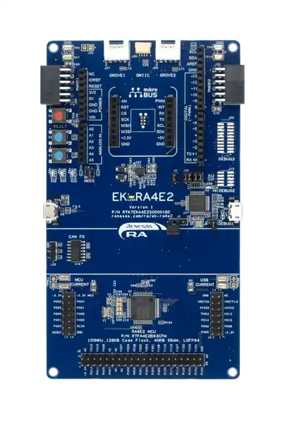
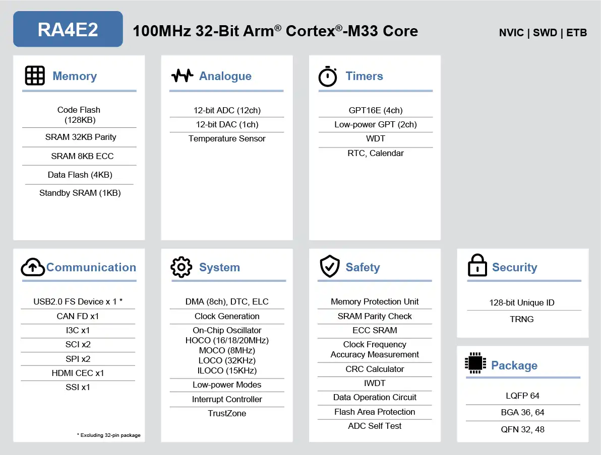

.. _ek_ra4e2:

RA4E2 Evaluation Kit
####################

Overview
********

The RA4E2 Group delivers up to 100 MHz of CPU performance using an Arm® Cortex®-M33 core
with 128 KB of code flash memory, 4 KB of data flash memory, and 40 KB of SRAM. RA4E2 MCUs
offer high-performance and optimized peripheral functions along with the smallest package
options, including space-saving 36-pin BGA and 32-pin QFN packages. The RA4E2
Group offers a wide set of peripherals, including USB Full Speed, CANFD, I3C, and ADC.

The MCU in this series incorporates a high-performance Arm Cortex®-M33 core running up to
100 MHz with the following features:

**MCU Native Pin Access**
- R7FA4E2B93CFM MCU (referred to as RA MCU)
- 100 MHz, Arm® Cortex®-M33 core
- 128 kB Code Flash, 40 kB SRAM
- 64 pins, LQFP package
- Native pin access through 2 x 14-pin and 1 x 40-pin male headers
- MCU current measurement points for precision current consumption measurement
- Multiple clock sources - RA MCU oscillator and sub-clock oscillator crystals, providing precision
20.000 MHz and 32,768 Hz reference clock. Additional low-precision clocks are available internal to the
RA MCU

**System Control and Ecosystem Access**
- USB Full Speed Device (micro-AB connector)
- Three 5 V input sources

	- USB (Debug, Full Speed)
	- External power supply (using surface mount clamp test points and J31 through holes)

- Three Debug modes

	- Debug on-board (SWD)
	- Debug in (SWD)
	- Debug out (JTAG, SWD)

- User LEDs and buttons

	- Three User LEDs (red, blue, green)
	- Power LED (white) indicating availability of regulated power
	- Debug LED (yellow) indicating the debug connection
	- Two User buttons
	- One Reset button

- Five most popular ecosystems expansions

	- 2 Seeed Grove® system (I3C/Analog) connectors
	- SparkFun® Qwiic® connector
	- 2 Digilent PmodTM (SPI and UART) connectors
	- ArduinoTM (Uno R3) connector
	- MikroElektronikaTM mikroBUS connector

- MCU boot configuration jumper

**Special Feature Access**

- CAN FD (3-pin header)

	EK-RA4E2 Board Functional Area Definitions (Credit: Renesas Electronics Corporation)

Hardware
********
Detail Hardware feature for the RA4E2 MCU group can be found at `RA4E2 Group User's Manual Hardware`_

	RA4E2 Block diagram (Credit: Renesas Electronics Corporation)

Detail Hardware feature for the EK-RA4E2 MCU can be found at `EK-RA4E2 - User's Manual`_

Supported Features
==================

The below features are currently supported on Zephyr OS for EK-RA4E2 board:

+-----------+------------+----------------------+
| Interface | Controller | Driver/Component     |
+===========+============+======================+
| GPIO      | on-chip    | gpio                 |
+-----------+------------+----------------------+
| MPU       | on-chip    | arch/arm             |
+-----------+------------+----------------------+
| NVIC      | on-chip    | arch/arm             |
+-----------+------------+----------------------+
| UART      | on-chip    | serial               |
+-----------+------------+----------------------+
| CLOCK     | on-chip    | clock control        |
+-----------+------------+----------------------+
| SPI       | on-chip    | spi                  |
+-----------+------------+----------------------+
| ADC       | on-chip    | adc                  |
+-----------+------------+----------------------+
| PWM       | on-chip    | pwm                  |
+-----------+------------+----------------------+
| ENTROPY   | on-chip    | entropy              |
+-----------+------------+----------------------+

Other hardware features are currently not supported by the port.

Programming and Debugging
*************************

Applications for the ``ek_ra4e2`` board target configuration can be
built, flashed, and debugged in the usual way. See
:ref:`build_an_application` and :ref:`application_run` for more details on
building and running.

Flashing
========

Program can be flashed to EK-RA4E2 via the on-board SEGGER J-Link debugger.
SEGGER J-link's drivers are avaialbe at https://www.segger.com/downloads/jlink/

To flash the program to board

  1. Connect to J-Link OB via USB port to host PC

  2. Make sure J-Link OB jumper is in default configuration as describe in `EK-RA4E2 - User's Manual`_

  3. Execute west command

	.. code-block:: console

		west flash -r jlink

Debugging
=========

You can use Segger Ozone (`Segger Ozone Download`_) for a visual debug interface

Once downloaded and installed, open Segger Ozone and configure the debug project
like so:

* Target Device: R7FA4E2B9
* Target Interface: SWD
* Target Interface Speed: 4 MHz
* Host Interface: USB
* Program File: <path/to/your/build/zephyr.elf>

**Note:** It's verified that we can debug OK on Segger Ozone v3.30d so please use this or later
version of Segger Ozone

References
**********
- `EK-RA4E2 Website`_
- `RA4E2 MCU group Website`_

.. _EK-RA4E2 Website:
   https://www.renesas.com/us/en/products/microcontrollers-microprocessors/ra-cortex-m-mcus/ek-ra4e2-evaluation-kit-ra4e2-mcu-group

.. _RA4E2 MCU group Website:
   https://www.renesas.com/us/en/products/microcontrollers-microprocessors/ra-cortex-m-mcus/ra4e2-entry-line-100mhz-arm-cortex-m33-general-purpose-microcontroller

.. _EK-RA4E2 - User's Manual:
   https://www.renesas.com/us/en/document/mat/ek-ra4e2-v1-users-manual

.. _RA4E2 Group User's Manual Hardware:
   https://www.renesas.com/us/en/document/mah/ra4e2-group-users-manual-hardware

.. _Segger Ozone Download:
   https://www.segger.com/downloads/jlink#Ozone
