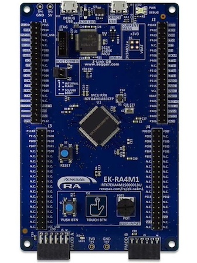

.. _renesas_ek_ra4m1:

Renesas EK-RA4M1
################

Overview
********

The Renesas EK-RA4M1 development board contains a Renesas Cortex-M4 based
R7FA4M1AB3CFP Microcontroller operating at up to 48 MHz with 256 KB of Flash
memory and 32 KB of SRAM.

   EK-RA4M1 (Credit: Courtesy of Renesas Electronics Corporation)

Hardware
********

The EK-RA4M1 board contains two USB connectors, a user LED, a push
button and a reset button. It has J-Link onboard and two PMOD sockets for
interfacing with external electronics. For more information about the
evalutation kit board see the `Renesas EK-RA4M1 website`_.

Supported Features
==================

The Zephyr Renesas EK-RA4M1 configuration supports the following hardware
features:

+-----------+------------+-------------------------------------+
| Interface | Controller | Driver/Component                    |
+===========+============+=====================================+
| NVIC      | on-chip    | nested vector interrupt controller  |
+-----------+------------+-------------------------------------+
| UART      | on-chip    | serial port-polling;                |
|           |            | serial port-interrupt               |
+-----------+------------+-------------------------------------+
| PINMUX    | on-chip    | pinmux                              |
+-----------+------------+-------------------------------------+
| GPIO      | on-chip    | GPIO output                         |
|           |            | GPIO input                          |
+-----------+------------+-------------------------------------+

Other hardware features have not been enabled yet for this board.

The default configuration can be found in the defconfig file:
:zephyr_file:`boards/renesas/ek_ra4m1/ek_ra4m1_defconfig`.

Programming and debugging
*************************

Building & Flashing
===================

You can build and flash an application in the usual way (See
:ref:`build_an_application` and
:ref:`application_run` for more details).

Here is an example for building and flashing the :zephyr:code-sample:`blinky` application.

.. zephyr-app-commands::
   :zephyr-app: samples/basic/blinky
   :board: ek_ra4m1
   :goals: build flash

Debugging
=========

Debugging also can be done in the usual way.
The following command is debugging the :zephyr:code-sample:`blinky` application.
Also, see the instructions specific to the debug server that you use.

.. zephyr-app-commands::
   :zephyr-app: samples/basic/blinky
   :board: ek_ra4m1
   :maybe-skip-config:
   :goals: debug

References
**********

.. target-notes::

.. _Renesas EK-RA4M1 website: https://www.renesas.com/us/en/products/microcontrollers-microprocessors/ra-cortex-m-mcus/ek-ra4m1-evaluation-kit-ra4m1-mcu-group
