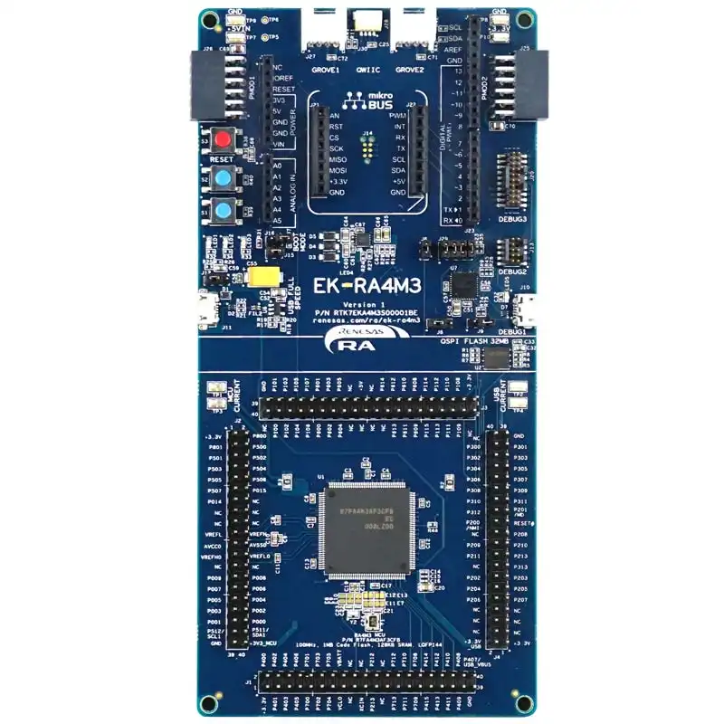

.. _ek_ra4m3:

RA4M3 Evaluation Kit
####################

Overview
********

The Renesas RA4M3 group of 32-bit microcontrollers (MCUs) uses the high-performance
Arm® Cortex®-M33 core with TrustZone. In concert with the secure crypto engine, it
offers secure element functionality. The RA4M3 is built on a highly efficient 40nm
process, built on FreeRTOS—and is expandable to use other RTOSes and middleware.
The RA4M3 is suitable for IoT applications requiring vast communication options, future
proof security, large embedded RAM, and low active power consumption down to 119µA/MHz
running the CoreMark® algorithm from Flash.

The MCU in this series incorporates a high-performance Arm Cortex®-M33 core running up to
100 MHz with the following features:

**MCU Native Pin Access**
- R7FA4M3AF3CFB
- 100-pin LQFP package
- 100 MHz Arm® Cortex®-M33 core
- 1 MB Code Flash, 128 KB SRAM
- 144 pins, LQFP package
- Native pin access through 4 x 40-pin male headers
- MCU and USB current measurement points for precision current consumption measurement
- Multiple clock sources - RA MCU oscillator and sub-clock oscillator crystals, providing precision
24.000 MHz and 32,768 Hz reference clock. Additional low-precision clocks are available internal to the
RA MCU

**System Control and Ecosystem Access**
- USB Full Speed Host and Device (micro AB connector)
- Three 5 V input sources

	- USB (Debug, Full Speed)
	- External power supply (using surface mount clamp test points and power input vias)

 Three Debug modes

	- Debug on-board (SWD)
	- Debug in (ETM, SWD, and JTAG)
	- Debug out (SWD)

 User LEDs and buttons

	- Three User LEDs (red, blue, green)
	- Power LED (white) indicating availability of regulated power
	- Debug LED (yellow) indicating the debug connection
	- Two User buttons
	- One Reset button

- Five most popular ecosystems expansions

	- 2 Seeed Grove® system (I2C/Analog) connectors
	- SparkFun® Qwiic® connector
	- 2 Digilent PmodTM (SPI and UART) connectors
	- ArduinoTM (Uno R3) connector
	- MikroElektronikaTM mikroBUS connector

- MCU boot configuration jumper

**Special Feature Access**
- 32 MB (256 Mb) External Quad-SPI Flash

	EK-RA4M3 Board Functional Area Definitions (Credit: Renesas Electronics Corporation)

Hardware
********
Detail Hardware feature for the RA4M3 MCU group can be found at `RA4M3 Group User's Manual Hardware`_

.. figure:: ra4m3_block_diagram.webp
	:width: 442px
	:align: center
	:alt: RA4M3 MCU group feature

	RA4M3 Block diagram (Credit: Renesas Electronics Corporation)

Detail Hardware feature for the EK-RA4M3 MCU can be found at `EK-RA4M3 - User's Manual`_

Supported Features
==================

The below features are currently supported on Zephyr OS for EK-RA4M3 board:

+-----------+------------+----------------------+
| Interface | Controller | Driver/Component     |
+===========+============+======================+
| GPIO      | on-chip    | gpio                 |
+-----------+------------+----------------------+
| MPU       | on-chip    | arch/arm             |
+-----------+------------+----------------------+
| NVIC      | on-chip    | arch/arm             |
+-----------+------------+----------------------+
| UART      | on-chip    | serial               |
+-----------+------------+----------------------+
| CLOCK     | on-chip    | clock control        |
+-----------+------------+----------------------+
| SPI       | on-chip    | spi                  |
+-----------+------------+----------------------+
| COUNTER   | on-chip    | counter              |
+-----------+------------+----------------------+
| ADC       | on-chip    | adc                  |
+-----------+------------+----------------------+
| PWM       | on-chip    | pwm                  |
+-----------+------------+----------------------+
| I2C       | on-chip    | i2c                  |
+-----------+------------+----------------------+
| FLASH     | on-chip    | flash                |
+-----------+------------+----------------------+
| ENTROPY   | on-chip    | entropy              |
+-----------+------------+----------------------+

Other hardware features are currently not supported by the port.

Programming and Debugging
*************************

Applications for the ``ek_ra4m3`` board target configuration can be
built, flashed, and debugged in the usual way. See
:ref:`build_an_application` and :ref:`application_run` for more details on
building and running.

Flashing
========

Program can be flashed to EK-RA4M3 via the on-board SEGGER J-Link debugger.
SEGGER J-link's drivers are avaialbe at https://www.segger.com/downloads/jlink/

To flash the program to board

  1. Connect to J-Link OB via USB port to host PC

  2. Make sure J-Link OB jumper is in default configuration as describe in `EK-RA4M3 - User's Manual`_

  3. Execute west command

	.. code-block:: console

		west flash -r jlink

Debugging
=========

You can use Segger Ozone (`Segger Ozone Download`_) for a visual debug interface

Once downloaded and installed, open Segger Ozone and configure the debug project
like so:

* Target Device: R7FA4M3AD
* Target Interface: SWD
* Target Interface Speed: 4 MHz
* Host Interface: USB
* Program File: <path/to/your/build/zephyr.elf>

**Note:** It's verified that we can debug OK on Segger Ozone v3.30d so please use this or later
version of Segger Ozone

References
**********
- `EK-RA4M3 Website`_
- `RA4M3 MCU group Website`_

.. _EK-RA4M3 Website:
   https://www.renesas.com/us/en/products/microcontrollers-microprocessors/ra-cortex-m-mcus/ek-ra4m3-evaluation-kit-ra4m3-mcu-group

.. _RA4M3 MCU group Website:
   https://www.renesas.com/us/en/products/microcontrollers-microprocessors/ra-cortex-m-mcus/ra4m3-100mhz-arm-cortex-m33-trustzone-high-integration-rich-connectivity

.. _EK-RA4M3 - User's Manual:
   https://www.renesas.com/us/en/document/mat/ek-ra4m3-v1-users-manual

.. _RA4M3 Group User's Manual Hardware:
   https://www.renesas.com/us/en/document/man/ra4m3-group-users-manual-hardware

.. _Segger Ozone Download:
   https://www.segger.com/downloads/jlink#Ozone
