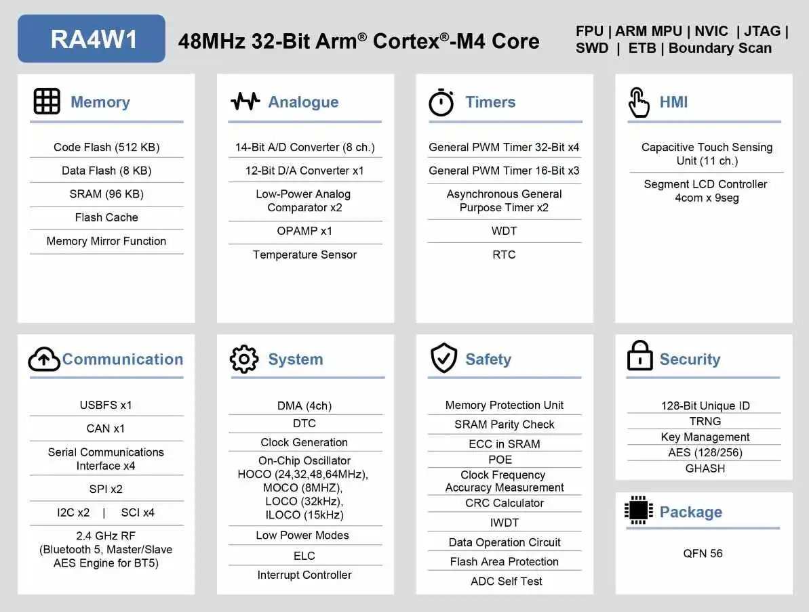

.. zephyr:board:: ek_ra4w1

Overview
********

The Renesas RA4W1 is the first Bluetooth® 5.0 Low Energy fully compliant with 2Mbit High-Throughput
(HT) and Long Range support in a single chip MCU of Renesas RA4  product series for IoT applications
that require a high-performance Arm® Cortex®-M4 core at a very attractive price point. The RA4W1 MCU
has full function support for Bluetooth 5.0 Low Energy long-range and mesh networking, and provides
excellent reception performance. RA4W1 is geared towards IoT application requiring Security, large
embedded RAM and low power consumption.

**MCU Native Pin Access**

- R7FA4W1AD2CNG
- QFN-56 package
- On-chip memory: 512-KB ROM, 96-KB RAM, 8-KB data flash memory

**Power-supply voltage**

- USB connector: 5-V input
- Power-supply IC: 5-V input, 3.3-V output
- External power-supply header*1: 3.3-V input, 2 pins x 1

**Main clock**

- Crystal oscillator (surface-mount technology (SMT)) for the main system clock
- Crystal oscillator or ceramic resonator (lead type) for the main system clock

**Sub-clock**

- Crystal oscillator (SMT) for the sub-clock

**Bluetooth Low Energy**

- Bluetooth Low Energy (BLE) circuit x1
- Range of frequency: 2402 to 2480 MHz
- Maximum transmission output power: 4 dBm (in 4-dBm output mode)
- Output variation: +2 dB

**Push switches**

- Reset switch x 1
- User switch x 1

**LED**

- Power indicator: green x 1
- User: green x 2
- ACT LED: green x 1

**Connectivity**

- Connector for an on-board emulator: USB Micro-B
- Connector for a USB serial-conversion interface: USB Micro-B
- Pmod™ connector: Angle type, 12 pins
- Arduino™ UNO connectors

- Emulator reset switch: DIP switch x 1

Hardware
********
Detailed Hardware features for the RA4W1 MCU group can be found at `RA4W1 Group User's Manual Hardware`_

	RA4W1 Block diagram (Credit: Renesas Electronics Corporation)

Detailed Hardware features for the EK-RA4W1 MCU can be found at `EK-RA4W1 - User's Manual`_

Supported Features
==================

.. zephyr:board-supported-hw::

Programming and Debugging
*************************

Applications for the ``ek_ra4w1`` board target configuration can be
built, flashed, and debugged in the usual way. See
:ref:`build_an_application` and :ref:`application_run` for more details on
building and running.

Flashing
========

Program can be flashed to EK-RA4W1 via the on-board SEGGER J-Link debugger.
SEGGER J-link's drivers are available at https://www.segger.com/downloads/jlink/

To flash the program to board

1. Connect to J-Link OB via USB port to host PC

2. Make sure J-Link OB jumper is in default configuration as describe in `EK-RA4W1 - User's Manual`_

3. Execute west command

	.. code-block:: console

		west flash -r jlink

Debugging
=========

You can use Segger Ozone (`Segger Ozone Download`_) for a visual debug interface

Once downloaded and installed, open Segger Ozone and configure the debug project
like so:

* Target Device: R7FA4W1AD
* Target Interface: SWD
* Target Interface Speed: 4 MHz
* Host Interface: USB
* Program File: <path/to/your/build/zephyr.elf>

**Note:** It's verified that we can debug OK on Segger Ozone v3.30d so please use this or later
version of Segger Ozone

References
**********
- `EK-RA4W1 Website`_
- `RA4W1 MCU group Website`_

.. _EK-RA4W1 Website:
   https://www.renesas.com/us/en/products/microcontrollers-microprocessors/ra-cortex-m-mcus/ek-ra4w1-evaluation-kit-ra4w1-mcu-group

.. _RA4W1 MCU group Website:
   https://www.renesas.com/us/en/products/microcontrollers-microprocessors/ra-cortex-m-mcus/ra4w1-low-energy-single-chip-32-bit-microcontrollers-48mhz-bluetooth-50

.. _EK-RA4W1 - User's Manual:
   https://www.renesas.com/us/en/document/man/ek-ra4w1-users-manual

.. _RA4W1 Group User's Manual Hardware:
   https://www.renesas.com/us/en/document/man/renesas-ra4w1-group-users-manual-hardware

.. _Segger Ozone Download:
   https://www.segger.com/downloads/jlink#Ozone
