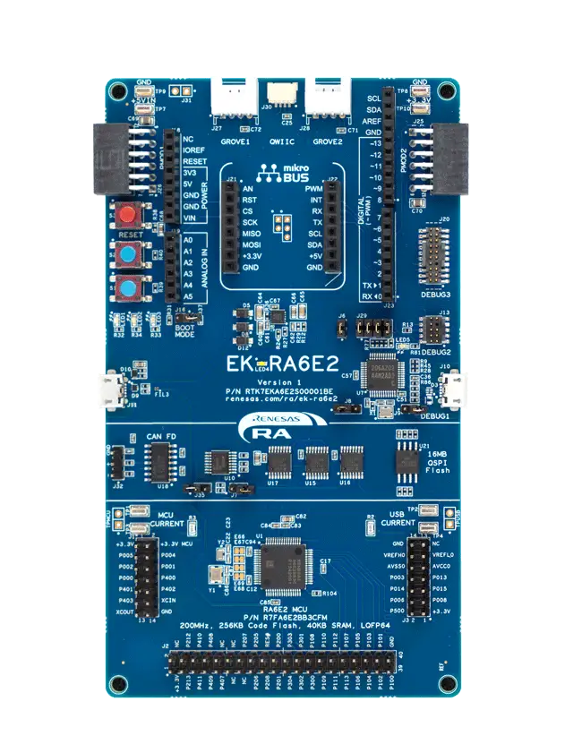

.. _ek_ra6e2:

RA6E2 Evaluation Kit
####################

Overview
********

The EK-RA6E2, an Evaluation Kit for RA6E2 MCU Group, enables users to
seamlessly evaluate the features of the RA6E2 MCU group and develop
embedded systems applications using Flexible Software Package (FSP)
and e2 studio IDE. The users can use rich on-board features along with
their choice of popular ecosystems add-ons to bring their big ideas to life

The key features of the EK-RA6E2 board are categorized in three groups as follow:

**MCU Native Pin Access**

- 200MHz Arm Cortex-M33 based RA6E2 MCU in 64 pins, LQFP package
- 256 kB Code Flash, 40 kB SRAM
- Native pin access through 2 x 14-pin and 1 x 40-pin male headers
- MCU current measurement points for precision current consumption measurement
- Multiple clock sources - RA6E2 MCU oscillator and sub-clock oscillator crystals,
  providing precision 20.000 MHz and 32,768 Hz reference clock.
  Additional low precision clocks are avaialbe internal to the RA6E2 MCU

**System Control and Ecosystem Access**

- USB Full Speed Host and Device (micro-AB connector)
- Three 5V input sources

  - USB (Debug, Full Speed)
  - External power supply (using surface mount clamp test points and J31 through holes)

- Three Debug modes

  - Debug on-board (SWD)
  - Debug in (SWD)
  - Debug out (JTAG, SWD)

- User LEDs and buttons

  - Three User LEDs (red, blue, green)
  - Power LED (white) indicating availability of regulated power
  - Debug LED (yellow) indicating the debug connection
  - Two User buttons
  - One Reset button

- Five most popular ecosystems expansions

  - Two Seeed Grove system (I3C/Analog) connectors
  - One SparkFun Qwiic connector
  - Two Digilent Pmod (SPI and UART) connectors
  - Arduino (Uno R3) connector
  - MikroElektronika mikroBUS connector

- MCU boot configuration jumper

**Special Feature Access**

- 16 Mb (128 Mb) External Quad-SPI Flash
- CAN (3-pin header)

	EK-RA6E2 Board Functional Area Definitions (Credit: Renesas Electronics Corporation)

Hardware
********
Detailed hardware feature for the RA6E2 MCU group can be found at `RA6E2 Group User's Manual Hardware`_

.. figure:: ra6e2_block_diagram.webp
	:width: 442px
	:align: center
	:alt: RA6E2 MCU group feature

	RA6E2 Block diagram (Credit: Renesas Electronics Corporation)

Detailed hardware feature for the EK-RA6E2 MCU can be found at `EK-RA6E2 - User's Manual`_

Supported Features
==================

The below features are currently supported on Zephyr OS for EK-RA6E2 board:

+-----------+------------+----------------------+
| Interface | Controller | Driver/Component     |
+===========+============+======================+
| GPIO      | on-chip    | gpio                 |
+-----------+------------+----------------------+
| MPU       | on-chip    | arch/arm             |
+-----------+------------+----------------------+
| NVIC      | on-chip    | arch/arm             |
+-----------+------------+----------------------+
| UART      | on-chip    | serial               |
+-----------+------------+----------------------+
| CLOCK     | on-chip    | clock control        |
+-----------+------------+----------------------+
| SPI       | on-chip    | spi                  |
+-----------+------------+----------------------+
| ADC       | on-chip    | adc                  |
+-----------+------------+----------------------+
| PWM       | on-chip    | pwm                  |
+-----------+------------+----------------------+
| ENTROPY   | on-chip    | entropy              |
+-----------+------------+----------------------+
| FLASH     | on-chip    | flash                |
+-----------+------------+----------------------+

Other hardware features are currently not supported by the port.

Programming and Debugging
*************************

Applications for the ``ek_ra6e2`` board target configuration can be
built, flashed, and debugged in the usual way. See
:ref:`build_an_application` and :ref:`application_run` for more details on
building and running.

Flashing
========

Program can be flashed to EK-RA6E2 via the on-board SEGGER J-Link debugger.
SEGGER J-link's drivers are avaialbe at https://www.segger.com/downloads/jlink/

To flash the program to board

  1. Connect to J-Link OB via USB port to host PC

  2. Make sure J-Link OB jumper is in default configuration as describe in `EK-RA6E2 - User's Manual`_

  3. Execute west command

	.. code-block:: console

		west flash -r jlink

Debugging
=========

You can use Segger Ozone (`Segger Ozone Download`_) for a visual debug interface

Once downloaded and installed, open Segger Ozone and configure the debug project
like so:

* Target Device: R7FA6E2BB
* Target Interface: SWD
* Target Interface Speed: 4 MHz
* Host Interface: USB
* Program File: <path/to/your/build/zephyr.elf>

**Note:** It's verified that we can debug OK on Segger Ozone v3.30d so please use this or later
version of Segger Ozone

References
**********
- `EK-RA6E2 Website`_
- `RA6E2 MCU group Website`_

.. _EK-RA6E2 Website:
   https://www.renesas.com/us/en/products/microcontrollers-microprocessors/ra-cortex-m-mcus/ek-ra6e2-evaluation-kit-ra6e2-mcu-group

.. _RA6E2 MCU group Website:
   https://www.renesas.com/us/en/products/microcontrollers-microprocessors/ra-cortex-m-mcus/ra6e2-entry-line-200mhz-arm-cortex-m33-general-purpose-microcontroller

.. _EK-RA6E2 - User's Manual:
   https://www.renesas.com/us/en/document/mat/ek-ra6e2-v1-users-manual

.. _RA6E2 Group User's Manual Hardware:
   https://www.renesas.com/us/en/document/mah/ra6e2-group-users-manual-hardware

.. _Segger Ozone Download:
   https://www.segger.com/downloads/jlink#Ozone
