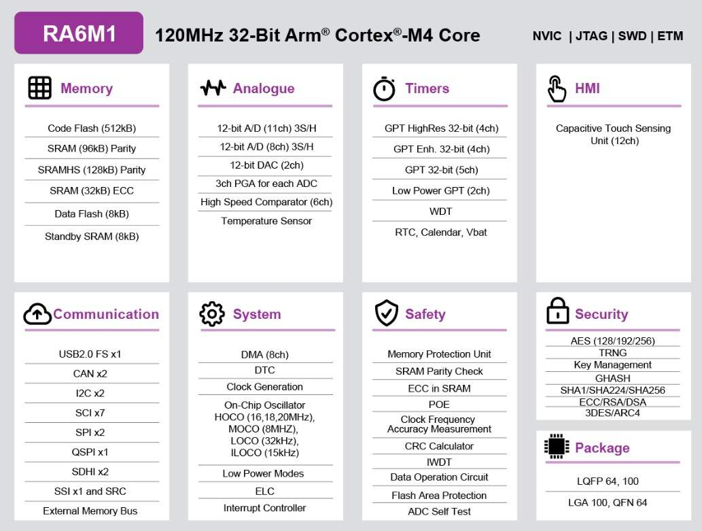

.. zephyr:board:: ek_ra6m1

Overview
********

The Renesas RA6M1 microcontroller is the entry point to the Renesas RA6 product
series for applications that require a high-performance Arm® Cortex®-M4 core at
a very attractive price point. The RA6M1 is built on a highly efficient 40nm process
and is supported by an open and flexible ecosystem concept—the Flexible Software
Package (FSP), built on FreeRTOS—and is expandable to use other RTOSes and middleware.
The RA6M1 is suitable for IoT applications requiring security, large embedded RAM and
low power consumption.

The key features of the EK-RA6M1 board are categorized in three groups as follow:

**MCU Native Pin Access**

- R7FA6M1AD3CFP
- 100-pin LQFP package
- 120 MHz Arm® Cortex®-M4 core with Floating Point Unit (FPU)
- 256 KB SRAM
- 512 KB code flash memory
- 8 KB data flash memory

**Connectivity**

- A Device USB connector for the Main MCU
- S124 MCU-based SEGGER J-Link® On-Board interface for debugging and programming of the
  RA6M1 MCU. A 10-pin JTAG/SWD interface is also provided for connecting optional external
  debuggers and programmers.
- Two PMOD connectors, allowing use of appropriate PMOD compliant peripheral plug-in modules for
  rapid prototyping.
- Pin headers for access to power and signals for the Main MCU

**Multiple clock sources**

- Main MCU oscillator crystals, providing precision 12.000 MHz and 32,768 Hz external reference
  clocks
- Additional low-precision clocks are available internal to the Main MCU

**General purpose I/O ports**

- One jumper to allow measuring of Main MCU current
- Copper jumpers on PCB bottom side for configuration and access to selected MCU signals

**Operating voltage**

- External 5 V input through the Debug USB connector supplies the on-board power regulator to power
  logic and interfaces on the board. External 5 V or 3.3 V may be also supplied through alternate
  locations on the board.
- A two-color board status LED indicating availability of regulated power and connection status of the J-Link
  interface.
- A red User LED, controlled by the Main MCU firmware
- A User Push-Button switch, User Capacitive Touch Button sensor, and an optional User Potentiometer,
  all of which are controlled by the Main MCU firmware
- MCU reset push-button switch
- MCU boot configuration jumper

Hardware
********
Detailed hardware features for the RA6M1 MCU group can be found at `RA6M1 Group User's Manual Hardware`_

	RA6M1 Block diagram (Credit: Renesas Electronics Corporation)

Detailed hardware features for the EK-RA6M1 MCU can be found at `EK-RA6M1 - User's Manual`_

Supported Features
==================

.. zephyr:board-supported-hw::

Programming and Debugging
*************************

.. zephyr:board-supported-runners::

Applications for the ``ek_ra6m1`` board target configuration can be
built, flashed, and debugged in the usual way. See
:ref:`build_an_application` and :ref:`application_run` for more details on
building and running.

Flashing
========

Program can be flashed to EK-RA6M1 via the on-board SEGGER J-Link debugger.
SEGGER J-link's drivers are available at https://www.segger.com/downloads/jlink/

To flash the program to board

1. Connect to J-Link OB via USB port to host PC

2. Make sure J-Link OB jumper is in default configuration as describe in `EK-RA6M1 - User's Manual`_

3. Execute west command

	.. code-block:: console

		west flash -r jlink

Debugging
=========

You can use Segger Ozone (`Segger Ozone Download`_) for a visual debug interface

Once downloaded and installed, open Segger Ozone and configure the debug project
like so:

* Target Device: R7FA6M1AD
* Target Interface: SWD
* Target Interface Speed: 4 MHz
* Host Interface: USB
* Program File: <path/to/your/build/zephyr.elf>

**Note:** It's verified that we can debug OK on Segger Ozone v3.30d so please use this or later
version of Segger Ozone

References
**********
- `EK-RA6M1 Website`_
- `RA6M1 MCU group Website`_

.. _EK-RA6M1 Website:
   https://www.renesas.com/us/en/products/microcontrollers-microprocessors/ra-cortex-m-mcus/ek-ra6m1-evaluation-kit-ra6m1-mcu-group

.. _RA6M1 MCU group Website:
   https://www.renesas.com/us/en/products/microcontrollers-microprocessors/ra-cortex-m-mcus/ra6m1-32-bit-microcontrollers-120mhz-optimized-entry-point-ra6-series

.. _EK-RA6M1 - User's Manual:
   https://www.renesas.com/us/en/document/mat/ek-ra6m1-v1-users-manual

.. _RA6M1 Group User's Manual Hardware:
   https://www.renesas.com/us/en/document/mah/renesas-ra6m1-group-users-manual-hardware?r=1054156

.. _Segger Ozone Download:
   https://www.segger.com/downloads/jlink#Ozone
