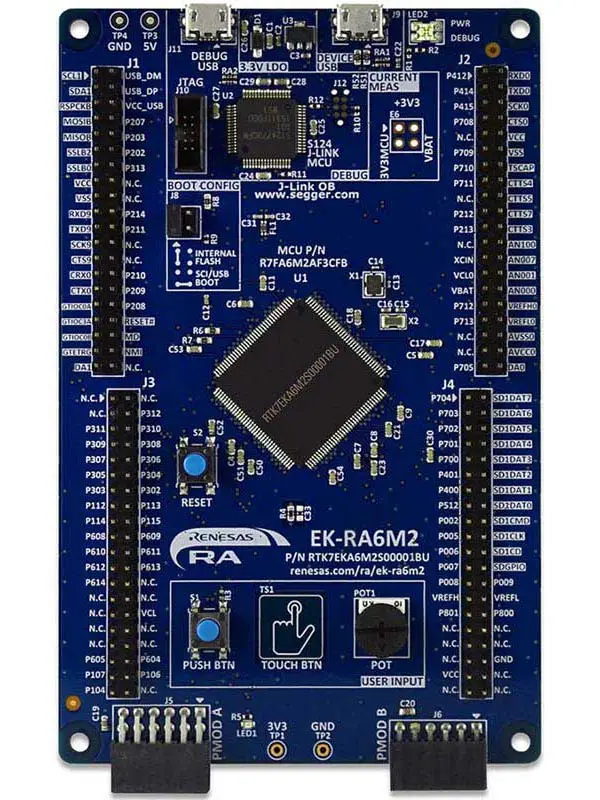

.. _ek_ra6m2:

RA6M2 Evaluation Kit
####################

Overview
********

The Renesas RA6M2 microcontroller is the entry point to the Renesas RA6 product series
for applications that require a high-performance Arm® Cortex®-M4 core at a very attractive
price point. The RA6M2 is suitable for IoT applications requiring security, large embedded
RAM and low power consumption.

The key features of the EK-RA6M2 board are categorized in three groups as follow:

**MCU Native Pin Access**

- 120MHz Arm Cortex-M4 based RA6M2 MCU in 144 pins, LQFP package
- Native pin access through 4 x 40-pin male headers
- MCU and USB current measurement points for precision current consumption measurement
- Multiple clock sources - RA6M2 MCU oscillator and sub-clock oscillator crystals,
  providing precision 12.000 MHz and 32,768 Hz reference clock.
  Additional low precision clocks are avaialbe internal to the RA6M2 MCU

**System Control and Ecosystem Access**

- USB Full Speed device
- 5V input through USB debug

- Three Debug modes

  - Debug on-board (SWD)
  - Debug in (SWD and JTAG)
  - Debug out (SWD)

- User LEDs and buttons

  - One User LEDs
  - One User buttons
  - One Reset button

- Three most popular ecosystems expansions

  - Two Digilent Pmod (SPI and UART) connectors
  - Arduino (Uno R3) connector
  - MikroElektronika mikroBUS connector

- MCU boot configuration jumper

**Special Feature Access**

- USB Full Speed Host and Device (micro-AB connector)

	EK-RA6M2 Board Functional Area Definitions (Credit: Renesas Electronics Corporation)

Hardware
********
Detailed hardware feature for the RA6M2 MCU group can be found at `RA6M2 Group User's Manual Hardware`_

.. figure:: ra6m2_block_diagram.webp
	:width: 871px
	:align: center
	:alt: RA6M2 MCU group feature

	RA6M2 Block diagram (Credit: Renesas Electronics Corporation)

Detailed hardware feature for the EK-RA6M2 MCU can be found at `EK-RA6M2 - User's Manual`_

Supported Features
==================

The below features are currently supported on Zephyr OS for EK-RA6M2 board:

+-----------+------------+----------------------+
| Interface | Controller | Driver/Component     |
+===========+============+======================+
| GPIO      | on-chip    | gpio                 |
+-----------+------------+----------------------+
| MPU       | on-chip    | arch/arm             |
+-----------+------------+----------------------+
| NVIC      | on-chip    | arch/arm             |
+-----------+------------+----------------------+
| UART      | on-chip    | serial               |
+-----------+------------+----------------------+
| CLOCK     | on-chip    | clock control        |
+-----------+------------+----------------------+
| I2C       | on-chip    | i2c                  |
+-----------+------------+----------------------+
| SPI       | on-chip    | spi                  |
+-----------+------------+----------------------+
| COUNTER   | on-chip    | counter              |
+-----------+------------+----------------------+
| ADC       | on-chip    | adc                  |
+-----------+------------+----------------------+
| PWM       | on-chip    | pwm                  |
+-----------+------------+----------------------+
| FLASH     | on-chip    | flash                |
+-----------+------------+----------------------+

Other hardware features are currently not supported by the port.

Programming and Debugging
*************************

Applications for the ``ek_ra6m2`` board target configuration can be
built, flashed, and debugged in the usual way. See
:ref:`build_an_application` and :ref:`application_run` for more details on
building and running.

Flashing
========

Program can be flashed to EK-RA6M2 via the on-board SEGGER J-Link debugger.
SEGGER J-link's drivers are avaialbe at https://www.segger.com/downloads/jlink/

To flash the program to board

  1. Connect to J-Link OB via USB port to host PC

  2. Make sure J-Link OB jumper is in default configuration as describe in `EK-RA6M2 - User's Manual`_

  3. Execute west command

	.. code-block:: console

		west flash -r jlink

Debugging
=========

You can use Segger Ozone (`Segger Ozone Download`_) for a visual debug interface

Once downloaded and installed, open Segger Ozone and configure the debug project
like so:

* Target Device: R7FA6M2AD
* Target Interface: SWD
* Target Interface Speed: 4 MHz
* Host Interface: USB
* Program File: <path/to/your/build/zephyr.elf>

**Note:** It's verified that we can debug OK on Segger Ozone v3.30d so please use this or later
version of Segger Ozone

References
**********
- `EK-RA6M2 Website`_
- `RA6M2 MCU group Website`_

.. _EK-RA6M2 Website:
   https://www.renesas.com/us/en/products/microcontrollers-microprocessors/ra-cortex-m-mcus/ek-ra6m2-evaluation-kit-ra6m2-mcu-group

.. _RA6M2 MCU group Website:
   https://www.renesas.com/us/en/products/microcontrollers-microprocessors/ra-cortex-m-mcus/ra6m2-32-bit-microcontrollers-120mhz-medium-size-memory-integration-and-ethernet

.. _EK-RA6M2 - User's Manual:
   https://www.renesas.com/us/en/document/mat/ek-ra6m2-v1-users-manual-0

.. _RA6M2 Group User's Manual Hardware:
   https://www.renesas.com/us/en/document/mah/renesas-ra6m2-group-users-manual-hardware

.. _Segger Ozone Download:
   https://www.segger.com/downloads/jlink#Ozone
