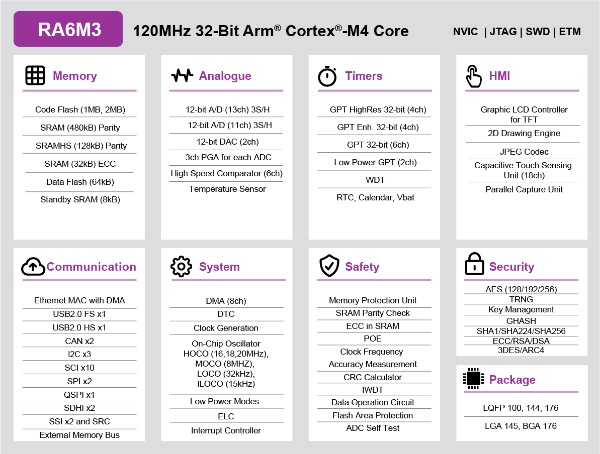

.. zephyr:board:: ek_ra6m3

Overview
********

The Renesas RA6M3 group uses the high-performance Arm® Cortex®-M4 core and
offers a TFT controller with 2D accelerator and JPEG decoder. The RA6M3 is
suitable for IoT applications requiring TFT, Ethernet, security, large
embedded RAM, and USB High Speed (HS).

The key features of the EK-RA6M3 board are categorized in three groups as follow:

**MCU Native Pin Access**

- 120MHz Arm Cortex-M4 based RA6M3 MCU in 176 pins, LQFP package
- Native pin access through 4 x 40-pin male headers
- MCU and USB current measurement points for precision current consumption measurement
- Multiple clock sources - RA6M3 MCU oscillator and sub-clock oscillator crystals,
  providing precision 24.000 MHz and 32,768 Hz reference clock.
  Additional low precision clocks are available internal to the RA6M3 MCU

**System Control and Ecosystem Access**

- USB Full Speed Host and Device (micro AB connector)
- Four 5V input sources

  - USB (Debug, Full Speed, High Speed)
  - External power supply (using surface mount clamp test points and power input vias)

- Three Debug modes

  - Debug on-board (SWD)
  - Debug in (ETM, SWD and JTAG)
  - Debug out (SWD)

- User LEDs and buttons

  - Three User LEDs (red, blue, green)
  - Power LED (white) indicating availability of regulated power
  - Debug LED (yellow) indicating the debug connection
  - Two User buttons
  - One Reset button

- Four most popular ecosystems expansions

  - Two Seeed Grove system (I2C) connectors
  - Two Digilent Pmod (SPI and UART) connectors
  - Arduino (Uno R3) connector
  - MikroElektronika mikroBUS connector

- MCU boot configuration jumper

**Special Feature Access**

- Ethernet (RJ45 RMII interface)
- USB High Speed Host and Device (micro-AB connector)
- 32 Mb (256 Mb) External Quad-SPI Flash

Hardware
********
Detailed hardware features for the RA6M3 MCU group can be found at `RA6M3 Group User's Manual Hardware`_

	RA6M3 Block diagram (Credit: Renesas Electronics Corporation)

Detailed hardware features for the EK-RA6M3 MCU can be found at `EK-RA6M3 - User's Manual`_

Supported Features
==================

.. zephyr:board-supported-hw::

Programming and Debugging
*************************

.. zephyr:board-supported-runners::

Applications for the ``ek_ra6m3`` board target configuration can be
built, flashed, and debugged in the usual way. See
:ref:`build_an_application` and :ref:`application_run` for more details on
building and running.

Flashing
========

Program can be flashed to EK-RA6M3 via the on-board SEGGER J-Link debugger.
SEGGER J-link's drivers are available at https://www.segger.com/downloads/jlink/

To flash the program to board

1. Connect to J-Link OB via USB port to host PC

2. Make sure J-Link OB jumper is in default configuration as describe in `EK-RA6M3 - User's Manual`_

3. Execute west command

	.. code-block:: console

		west flash -r jlink

Debugging
=========

You can use Segger Ozone (`Segger Ozone Download`_) for a visual debug interface

Once downloaded and installed, open Segger Ozone and configure the debug project
like so:

* Target Device: R7FA6M3AH
* Target Interface: SWD
* Target Interface Speed: 4 MHz
* Host Interface: USB
* Program File: <path/to/your/build/zephyr.elf>

**Note:** It's verified that we can debug OK on Segger Ozone v3.30d so please use this or later
version of Segger Ozone

References
**********
- `EK-RA6M3 Website`_
- `RA6M3 MCU group Website`_

.. _EK-RA6M3 Website:
   https://www.renesas.com/us/en/products/microcontrollers-microprocessors/ra-cortex-m-mcus/ek-ra6m3-evaluation-kit-ra6m3-mcu-group

.. _RA6M3 MCU group Website:
   https://www.renesas.com/us/en/products/microcontrollers-microprocessors/ra-cortex-m-mcus/ra6m3-32-bit-microcontrollers-120mhz-usb-high-speed-ethernet-and-tft-controller

.. _EK-RA6M3 - User's Manual:
   https://www.renesas.com/us/en/document/mat/ek-ra6m3-v1-users-manual

.. _RA6M3 Group User's Manual Hardware:
   https://www.renesas.com/us/en/document/mah/ra6m3-group-users-manual-hardware

.. _Segger Ozone Download:
   https://www.segger.com/downloads/jlink#Ozone
