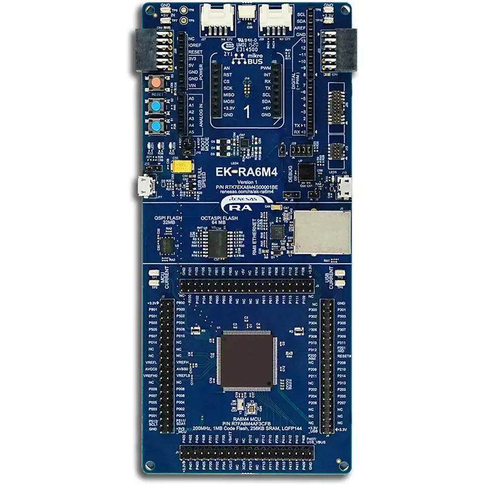
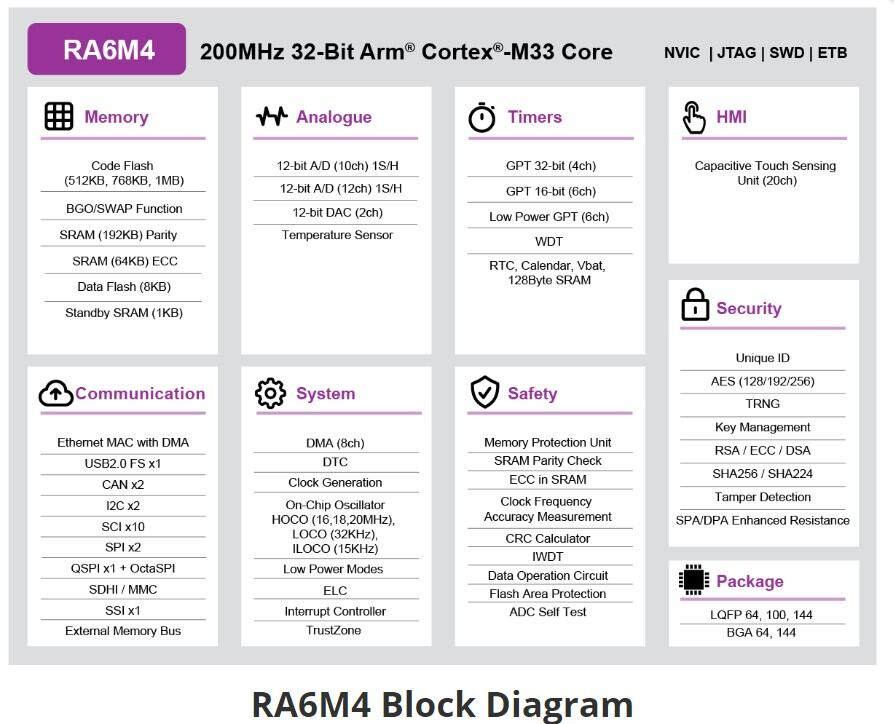

.. _ek_ra6m4:

RA6M4 Evaluation Kit
####################

Overview
********

The Renesas RA6M4 group uses the high-performance Arm® Cortex®-M33
core with TrustZone®. Secure element functionality providing better
performance, unlimited secure key storage, key management, and lower
BOM cost, as well as the integrated Ethernet MAC with individual DMA
ensures high data throughput. The RA6M4 is suitable for IoT applications
requiring Ethernet, future proof security, large embedded RAM, and low
active power consumption down to 99uA/MHz running the CoreMark®
algorithm from Flash.

The key features of the EK-RA6M4 board are categorized in three groups as follow:

**MCU Native Pin Access**

- 200MHz Arm Cortex-M33 based RA6M4 MCU in 144 pins, LQFP package
- Native pin access through 4 x 40-pin male headers
- MCU current measurement points for precision current consumption measurement
- Multiple clock sources - RA6M4 MCU oscillator and sub-clock oscillator crystals,
  providing precision 24.000 MHz and 32,768 Hz reference clock.
  Additional low precision clocks are avaialbe internal to the RA6M4 MCU

**System Control and Ecosystem Access**

- USB Full Speed Host and Device (micro-AB connector)
- Three 5 V input sources

  - USB (Debug, Full Speed)
  - External power supply (using surface mount clamp test points and power input vias)

- Three Debug modes

  - Debug on-board (SWD)
  - Debug in (ETM, SWD and JTAG)
  - Debug out (SWD)

- User LEDs and buttons

  - Three User LEDs (red, blue, green)
  - Power LED (white) indicating availability of regulated power
  - Debug LED (yellow) indicating the debug connection
  - Two User buttons
  - One Reset button

- Five most popular ecosystems expansions

  - Two Seeed Grove system (I2C/Analog) connectors
  - One SparkFun Qwiic connector
  - Two Digilent Pmod (SPI and UART) connectors
  - Arduino (Uno R3) connector
  - MikroElektronika mikroBUS connector

- MCU boot configuration jumper

**Special Feature Access**

- Ethernet (RJ45 RMII interface)
- 32 Mb (256 Mb) External Quad-SPI Flash
- 64 Mb (512 Mb) External Octo-SPI Flash

	EK-RA6M4 Board Functional Area Definitions (Credit: Renesas Electronics Corporation)

Hardware
********
Detailed hardware feature for the RA6M4 MCU group can be found at `RA6M4 Group User's Manual Hardware`_

	RA6M4 Block diagram (Credit: Renesas Electronics Corporation)

Detailed hardware feature for the EK-RA6M4 MCU can be found at `EK-RA6M4 - User's Manual`_

Supported Features
==================

The below features are currently supported on Zephyr OS for EK-RA6M4 board:

+-----------+------------+----------------------+
| Interface | Controller | Driver/Component     |
+===========+============+======================+
| GPIO      | on-chip    | gpio                 |
+-----------+------------+----------------------+
| MPU       | on-chip    | arch/arm             |
+-----------+------------+----------------------+
| NVIC      | on-chip    | arch/arm             |
+-----------+------------+----------------------+
| UART      | on-chip    | serial               |
+-----------+------------+----------------------+
| CLOCK     | on-chip    | clock control        |
+-----------+------------+----------------------+
| I2C       | on-chip    | i2c                  |
+-----------+------------+----------------------+
| SPI       | on-chip    | spi                  |
+-----------+------------+----------------------+

Other hardware features are currently not supported by the port.

Programming and Debugging
*************************

Applications for the ``ek_ra6m4`` board target configuration can be
built, flashed, and debugged in the usual way. See
:ref:`build_an_application` and :ref:`application_run` for more details on
building and running.

Flashing
========

Program can be flashed to EK-RA6M4 via the on-board SEGGER J-Link debugger.
SEGGER J-link's drivers are avaialbe at https://www.segger.com/downloads/jlink/

To flash the program to board

  1. Connect to J-Link OB via USB port to host PC

  2. Make sure J-Link OB jumper is in default configuration as describe in `EK-RA6M4 - User's Manual`_

  3. Execute west command

	.. code-block:: console

		west flash -r jlink

Debugging
=========

You can use Segger Ozone (`Segger Ozone Download`_) for a visual debug interface

Once downloaded and installed, open Segger Ozone and configure the debug project
like so:

* Target Device: R7FA6M4AF
* Target Interface: SWD
* Target Interface Speed: 4 MHz
* Host Interface: USB
* Program File: <path/to/your/build/zephyr.elf>

**Note:** It's verified that we can debug OK on Segger Ozone v3.30d so please use this or later
version of Segger Ozone

References
**********
- `EK-RA6M4 Website`_
- `RA6M4 MCU group Website`_

.. _EK-RA6M4 Website:
   https://www.renesas.com/us/en/products/microcontrollers-microprocessors/ra-cortex-m-mcus/ek-ra6m4-evaluation-kit-ra6m4-mcu-group

.. _RA6M4 MCU group Website:
   https://www.renesas.com/us/en/products/microcontrollers-microprocessors/ra-cortex-m-mcus/ra6m4-200mhz-arm-cortex-m33-trustzone-high-integration-ethernet-and-octaspi

.. _EK-RA6M4 - User's Manual:
   https://www.renesas.com/us/en/document/man/ek-ra6m4-v1-users-manual

.. _RA6M4 Group User's Manual Hardware:
   https://www.renesas.com/us/en/document/man/ra6m4-group-user-s-manual-hardware?r=1333976

.. _Segger Ozone Download:
   https://www.segger.com/downloads/jlink#Ozone
