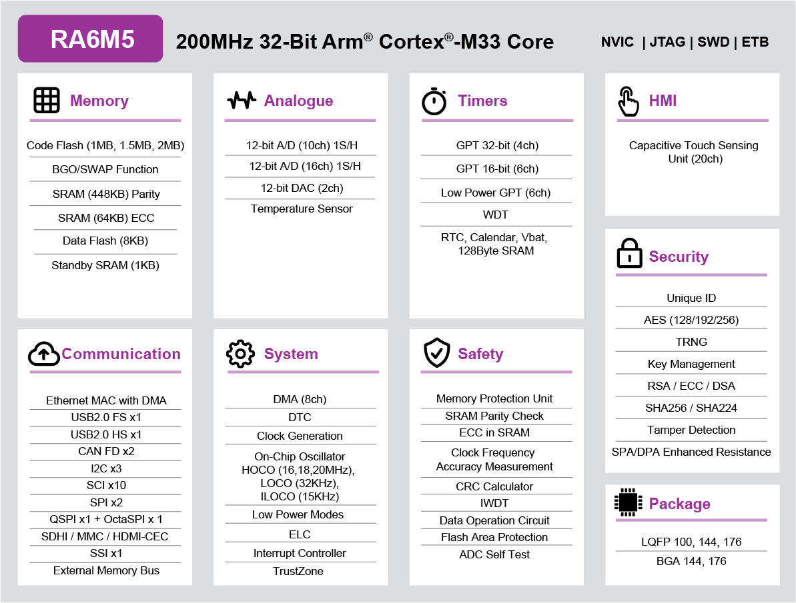

.. zephyr:board:: ek_ra6m5

Overview
********

The Renesas RA6M5 group uses the high-performance Arm® Cortex®-M33 core with
TrustZone®. The RA6M5 is suitable for IoT applications requiring Ethernet, future
proof security, large embedded RAM, and low active power consumption down
to 107uA/MHz running the CoreMark® algorithm from Flash.

The key features of the EK-RA6M5 board are categorized in three groups as follow:

**MCU Native Pin Access**

- 200MHz Arm Cortex-M33 based RA6M5 MCU in 176 pins, LQFP package
- Native pin access through 4 x 40-pin male headers
- MCU current measurement points for precision current consumption measurement
- Multiple clock sources - RA6M5 MCU oscillator and sub-clock oscillator crystals,
  providing precision 24.000 MHz and 32,768 Hz reference clock.
  Additional low precision clocks are available internal to the RA6M5 MCU

**System Control and Ecosystem Access**

- USB Full Speed Host and Device (micro-AB connector)
- Four 5V input sources

  - USB (Debug, Full Speed, High Speed)
  - External power supply (using surface mount clamp test points and power input vias)

- Three Debug modes

  - Debug on-board (SWD)
  - Debug in (ETM, SWD and JTAG)
  - Debug out (SWD)

- User LEDs and buttons

  - Three User LEDs (red, blue, green)
  - Power LED (white) indicating availability of regulated power
  - Debug LED (yellow) indicating the debug connection
  - Two User buttons
  - One Reset button

- Five most popular ecosystems expansions

  - Two Seeed Grove system (I2C/Analog) connectors
  - One SparkFun Qwiic connector
  - Two Digilent Pmod (SPI and UART) connectors
  - Arduino (Uno R3) connector
  - MikroElektronika mikroBUS connector

- MCU boot configuration jumper

**Special Feature Access**

- Ethernet (RJ45 RMII interface)
- USB High Speed Host and Device (micro-AB connector)
- 32 Mb (256 Mb) External Quad-SPI Flash
- 64 Mb (512 Mb) External Octo-SPI Flash
- CAN (3-pin header)

Hardware
********
Detailed hardware features for the RA6M5 MCU group can be found at `RA6M5 Group User's Manual Hardware`_

	RA6M5 Block diagram (Credit: Renesas Electronics Corporation)

Detailed hardware features for the EK-RA6M5 MCU can be found at `EK-RA6M5 - User's Manual`_

Supported Features
==================

.. zephyr:board-supported-hw::

Programming and Debugging
*************************

.. zephyr:board-supported-runners::

Applications for the ``ek_ra6m5`` board target configuration can be
built, flashed, and debugged in the usual way. See
:ref:`build_an_application` and :ref:`application_run` for more details on
building and running.

.. note::

   In applications using ethernet, ethernet buffers must be placed in non-secure RAM.
   This requires configuration of the Implementation Defined Attribution Unit (IDAU),
   which must be applied by partition memory using Renesas Flash Programmer.

Partition Memory
================

Renesas Flash Programmer is available at (`Renesas Flash Programmer Download`_).
Once downloaded and installed, check rfp-cli is available or set rfp-cli path manually.

Renesas partition data file will be available at build/zephyr/zephyr.rpd.
Connect jumper J6 then run Renesas Flash Programmer.

To partition memory manually, execute:

   .. code-block:: console

      # From the root of the zephyr repository
      rfp-cli -device ra -tool jlink -fo boundary-file build/zephyr/zephyr.rpd -p

Flashing
========

Program can be flashed to EK-RA6M5 via the on-board SEGGER J-Link debugger.
SEGGER J-link's drivers are available at https://www.segger.com/downloads/jlink/

To flash the program to board

1. Connect to J-Link OB via USB port to host PC

2. Make sure J-Link OB jumper is in default configuration as describe in `EK-RA6M5 - User's Manual`_

3. Execute west command to flash using jlink runner

	.. code-block:: console

		west flash -r jlink

4. Or flash using rfp runner, this will partition memory then flash zephyr image.

   .. code-block:: console

      west flash -r rfp

Debugging
=========

You can use Segger Ozone (`Segger Ozone Download`_) for a visual debug interface

Once downloaded and installed, open Segger Ozone and configure the debug project
like so:

* Target Device: R7FA6M5BH
* Target Interface: SWD
* Target Interface Speed: 4 MHz
* Host Interface: USB
* Program File: <path/to/your/build/zephyr.elf>

**Note:** It's verified that we can debug OK on Segger Ozone v3.30d so please use this or later
version of Segger Ozone

References
**********
- `EK-RA6M5 Website`_
- `RA6M5 MCU group Website`_
- `RA6 Ethernet Controller configuration`_

.. _EK-RA6M5 Website:
   https://www.renesas.com/us/en/products/microcontrollers-microprocessors/ra-cortex-m-mcus/ek-ra6m5-evaluation-kit-ra6m5-mcu-group

.. _RA6M5 MCU group Website:
   https://www.renesas.com/us/en/products/microcontrollers-microprocessors/ra-cortex-m-mcus/ra6m5-200mhz-arm-cortex-m33-trustzone-highest-integration-ethernet-and-can-fd

.. _EK-RA6M5 - User's Manual:
   https://www.renesas.com/us/en/document/man/ek-ra6m5-v1-users-manual

.. _RA6M5 Group User's Manual Hardware:
   https://www.renesas.com/us/en/document/man/ra6m5-group-users-manual-hardware

.. _Segger Ozone Download:
   https://www.segger.com/downloads/jlink#Ozone

.. _Renesas Flash Programmer Download:
   https://www.renesas.com/en/software-tool/renesas-flash-programmer-programming-gui

.. _RA6 Ethernet Controller configuration:
   https://www.renesas.com/en/blogs/configuration-issues-ra6-ethernet-controller#document
