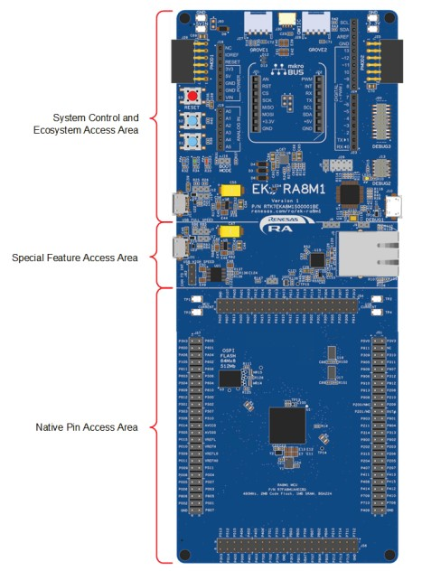
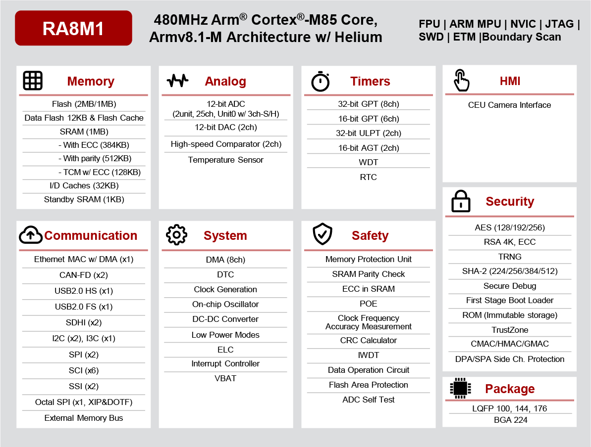

.. _ek_ra8m1:

RA8M1 Evaluation Kit
####################

Overview
********

The EK-RA8M1 is an Evaluation Kit for Renesas RA8M1 MCU Group which is the first
32-bits MCUs based on new Arm Cortex-M85. The kit offer multiple external interface
and peripherals set optimized on board allows user to seamlessly evaluate the features
of the RA8M1 MCU and develop embedded system application in various field.

The key features of the EK-RA8M1 board are categorized in three groups as follow:

**MCU Native Pin Access**

- 480MHz Arm Cortex-M85 based RA8M1 MCU in 224 pins, BGA package
- Native pin acces througgh 2 x 50-pin, and 2 x 40-pin male headers
- MCU current measurement points for precision current consumption measurement
- Multiple clock sources - RA8M1 MCU oscillator and sub-clock oscillator crystals,
  providing precision 20.000MHz and 32,768 Hz refeence clocks.
  Additional low precision clocks are avaialbe internal to the RA8M1 MCU

**System Control and Ecosystem Access**

- USB Full Speed Host and Device (micro-AB connector)
- Four 5V input sources

  - USB (Debug, Full Speed, High Speed)
  - External power supply (using surface mount clamp test points and power input vias)

- Three Debug modes

  - Debug on-board (SWD)
  - Debug in (ETM, SWD and JTAG)
  - Debug out (SWD)

- User LEDs and buttons

  - Three User LEDs (red, blue, green)
  - Power LED (white) indicating availability of regulated power
  - Debug LED (yellow) indicating the debug connection
  - Two User buttons
  - One Reset button

- Five most popular ecosystems expansions

  - Two Seeed Grove system (I2C/I3C) connectors
  - One SparkFun Qwiic connector
  - Two Digilent Pmod (SPI, UART and I2C/I3C) connectors
  - Arduino (Uno R3) connector
  - MikroElektronika mikroBUS connector

- MCU boot configuration jumper

**Special Feature Access**

- Ethernet (RJ45 RMII interface)
- USB High Speed Host and Device (micro-AB connector)
- 512 Mb (64 MB) External Octo-SPI Flash (present in the MCU Native Pin Access area of the EK-RA8M1 board)
- CAN FD (3-pin header)

	EK-RA8M1 Board Functional Area Definitions (Credit: Renesas Electronics Corporation)

Hardware
********
Detail Hardware feature for the RA8M1 MCU group can be found at `RA8M1 Group User's Manual Hardware`_

	RA8M1 Block diagram (Credit: Renesas Electronics Corporation)

Detail Hardware feature for the EK-RA8M1 MCU can be found at `EK-RA8M1 - User's Manual`_

Supported Features
==================

The below features are currently supported on Zephyr OS for EK-RA8M1 board:

+-----------+------------+----------------------+
| Interface | Controller | Driver/Component     |
+===========+============+======================+
| GPIO      | on-chip    | gpio                 |
+-----------+------------+----------------------+
| MPU       | on-chip    | arch/arm             |
+-----------+------------+----------------------+
| NVIC      | on-chip    | arch/arm             |
+-----------+------------+----------------------+
| UART      | on-chip    | serial               |
+-----------+------------+----------------------+
| CLOCK     | on-chip    | clock control        |
+-----------+------------+----------------------+
| I2C       | on-chip    | i2c                  |
+-----------+------------+----------------------+
| ENTROPY   | on-chip    | entropy              |
+-----------+------------+----------------------+
| SPI       | on-chip    | spi                  |
+-----------+------------+----------------------+
| FLASH     | on-chip    | flash                |
+-----------+------------+----------------------+

Other hardware features are currently not supported by the port.

Programming and Debugging
*************************

Applications for the ``ek_ra8m1`` board configuration can be
built, flashed, and debugged in the usual way. See
:ref:`build_an_application` and :ref:`application_run` for more details on
building and running.

**Note:** Only support from SDK v0.16.6 in which GCC for Cortex Arm-M85 was available.
To build for EK-RA8M1 user need to get and install GNU Arm Embedded toolchain from https://github.com/zephyrproject-rtos/sdk-ng/releases/tag/v0.16.6

Flashing
========

Program can be flashed to EK-RA8M1 via the on-board SEGGER J-Link debugger.
SEGGER J-link's drivers are avaialbe at https://www.segger.com/downloads/jlink/

To flash the program to board

  1. Connect to J-Link OB via USB port to host PC

  2. Make sure J-Link OB jumper is in default configuration as describe in `EK-RA8M1 - User's Manual`_

  3. Execute west command

	.. code-block:: console

		west flash -r jlink

Debugging
=========

You can use Segger Ozone (`Segger Ozone Download`_) for a visual debug interface

Once downloaded and installed, open Segger Ozone and configure the debug project
like so:

* Target Device: R7FA8M1AH
* Target Interface: SWD
* Target Interface Speed: 4 MHz
* Host Interface: USB
* Program File: <path/to/your/build/zephyr.elf>

**Note:** It's verified that we can debug OK on Segger Ozone v3.30d so please use this or later
version of Segger Ozone

References
**********
- `EK-RA8M1 Website`_
- `RA8M1 MCU group Website`_

.. _EK-RA8M1 Website:
   https://www.renesas.com/us/en/products/microcontrollers-microprocessors/ra-cortex-m-mcus/ek-ra8m1-evaluation-kit-ra8m1-mcu-group

.. _RA8M1 MCU group Website:
   https://www.renesas.com/us/en/products/microcontrollers-microprocessors/ra-cortex-m-mcus/ra8m1-480-mhz-arm-cortex-m85-based-microcontroller-helium-and-trustzone

.. _EK-RA8M1 - User's Manual:
   https://www.renesas.com/us/en/document/mat/ek-ra8m1-users-manual

.. _RA8M1 Group User's Manual Hardware:
   https://www.renesas.com/us/en/document/mah/ra8m1-group-users-manual-hardware

.. _Segger Ozone Download:
   https://www.segger.com/downloads/jlink#Ozone

.. _zephyr-sdk-0.16.5-6-ge895c4e_linux-x86_64:
   https://github.com/zephyrproject-rtos/sdk-ng/suites/22342313531/artifacts/1379111922
