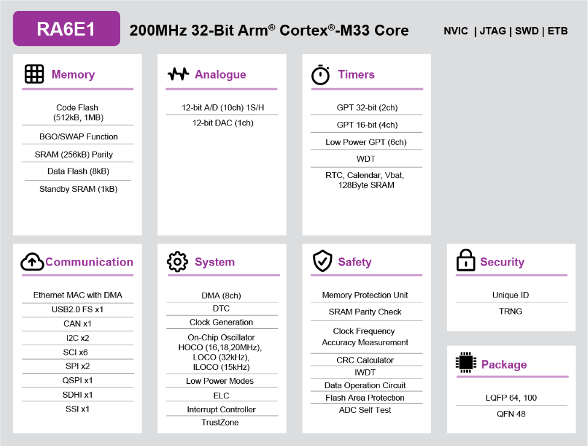

.. zephyr:board:: fpb_ra6e1

Overview
********

The Renesas RA6E1 group uses the high-performance Arm® Cortex®-M33 core with
TrustZone®. The RA6E1 is suitable for entry IoT applications requiring streamlined
feature and connectivity integration including Ethernet, and unprecedented performance
with 790.75 CoreMark, which are 3.95CoreMark / Mhz.

The key features of the FPB-RA6E1 board are categorized in three groups as follow:

**MCU Native Pin Access**

- 200MHz Arm Cortex-M33 based RA6E1 MCU in 100 pins, LQFP package
- Native pin access through 2 x 50-pin male headers (not fitted)
- MCU current measurement point for precision current consumption measurement
- Multiple clock sources - Low-precision (~1%) clocks are available internal to
  the RA MCU. RA MCU oscillator and sub-clock oscillator crystals, providing
  precision 24.000 MHz (not fitted) and 32,768 Hz reference clocks are also available

**System Control and Ecosystem Access**

- Two 5V input sources

  - USB (Debug, Full Speed, High Speed)
  - External power supply (using 2-pin header) (not fitted)

- Built-in SEGGER J-Link Emulator On-Board programmer/debugger (SWD)

- User LEDs and buttons

  - Two User LEDs (green)
  - Power LED (green) (not fitted) indicating availability of regulated power
  - Debug/power LED (yellow) indicating power and the debug connection
  - One User button
  - One Reset button

- Two popular ecosystems expansions

  - Two Digilent PmodTM (SPI, UART) connectors (not fitted)
  - Arduino (Uno R3) connector

- MCU boot configuration jumper

Hardware
********
Detailed hardware features for the RA6E1 MCU group can be found at `RA6E1 Group User's Manual Hardware`_

	RA6E1 Block diagram (Credit: Renesas Electronics Corporation)

Detailed hardware features for the FPB-RA6E1 MCU can be found at `FPB-RA6E1 - User's Manual`_

Supported Features
==================

.. zephyr:board-supported-hw::

Programming and Debugging
*************************

Applications for the ``fpb_ra6e1`` board target configuration can be
built, flashed, and debugged in the usual way. See
:ref:`build_an_application` and :ref:`application_run` for more details on
building and running.

Flashing
========

Program can be flashed to FPB-RA6E1 via the on-board SEGGER J-Link debugger.
SEGGER J-link's drivers are available at https://www.segger.com/downloads/jlink/

To flash the program to board

1. Connect to J-Link OB via USB port to host PC

2. Make sure J-Link OB jumper is in default configuration as describe in `FPB-RA6E1 - User's Manual`_

3. Execute west command

	.. code-block:: console

		west flash -r jlink

Debugging
=========

You can use Segger Ozone (`Segger Ozone Download`_) for a visual debug interface

Once downloaded and installed, open Segger Ozone and configure the debug project
like so:

* Target Device: R7FA6E10F
* Target Interface: SWD
* Target Interface Speed: 4 MHz
* Host Interface: USB
* Program File: <path/to/your/build/zephyr.elf>

**Note:** It's verified that we can debug OK on Segger Ozone v3.30d so please use this or later
version of Segger Ozone

References
**********
- `FPB-RA6E1 Website`_
- `RA6E1 MCU group Website`_

.. _FPB-RA6E1 Website:
   https://www.renesas.com/us/en/products/microcontrollers-microprocessors/ra-cortex-m-mcus/fpb-ra6e1-fast-prototyping-board-ra6e1-mcu-group#overview

.. _RA6E1 MCU group Website:
   https://www.renesas.com/us/en/products/microcontrollers-microprocessors/ra-cortex-m-mcus/ra6e1-200mhz-arm-cortex-m33-entry-line-high-performance-streamlined-connectivity

.. _FPB-RA6E1 - User's Manual:
   https://www.renesas.com/us/en/document/mat/fpb-ra6e1-users-manual

.. _RA6E1 Group User's Manual Hardware:
   https://www.renesas.com/us/en/document/mah/ra6e1-group-users-manual-hardware

.. _Segger Ozone Download:
   https://www.segger.com/downloads/jlink#Ozone
