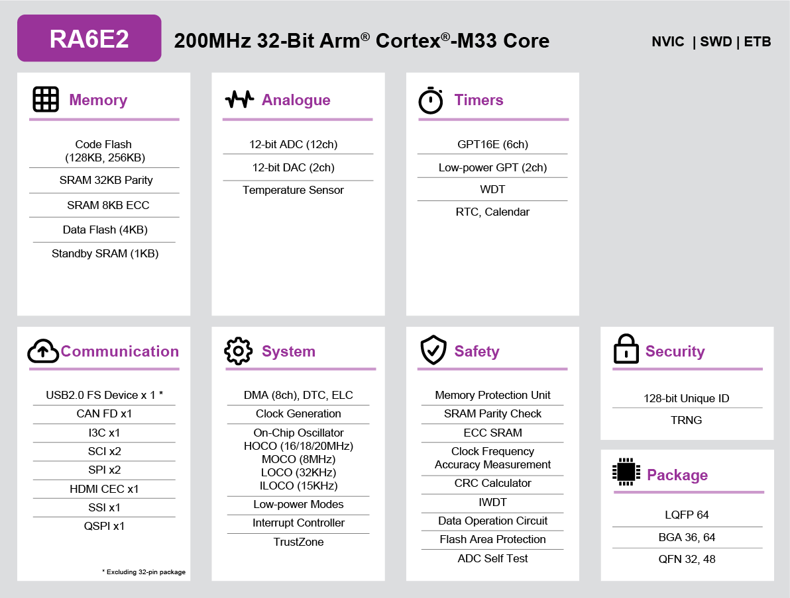

.. zephyr:board:: fpb_ra6e2

Overview
********

The FPB-RA6E2, a Fast Prototyping Board for RA6E2 MCU Group, based on
the 200 MHz Arm® Cortex®-M33 core with TrustZone, enables users to
seamlessly evaluate the features of the RA6E2 MCU group and develop
embedded systems applications using Flexible Software Package (FSP)
and e2 studio IDE. The users can use rich on-board features along with
their choice of popular ecosystems add-ons to bring their big ideas to life.

The key features of the FPB-RA6E2 board are categorized in three groups as follow:

**MCU Native Pin Access**

- 200MHz Arm Cortex-M33 based RA6E2 MCU in 64 pins, LQFP package
- 256 kB Code Flash, 40 kB SRAM
- Native pin access through 2 x 32-pin male headers
- MCU current measurement point for precision current consumption measurement
- Multiple clock sources - RA6E2 MCU oscillator and sub-clock oscillator crystals,
  providing precision 24.000 MHz and 32,768 Hz reference clock.
  Additional low precision clocks are available internal to the RA6E2 MCU

**System Control and Ecosystem Access**

- USB Full Speed Host and Device (micro-AB connector)
- Two 5V input sources

  - USB (Debug, Full Speed)
  - External power supply (using 2-pin header)

- On-board debugger (SWD)

- User LEDs and buttons

  - Two User LEDs (green)
  - Power LED (green) indicating availability of regulated power
  - Debug/power LED (yellow) indicating power and the debug connection
  - One User button
  - One Reset button

- Two popular ecosystem expansions

  - Two Digilent PmodTM (SPI, UART and I3C) connectors
  - Arduino (Uno R3) connectors

- MCU boot configuration jumper

Hardware
********
Detailed hardware features for the RA6E2 MCU group can be found at `RA6E2 Group User's Manual Hardware`_

	RA6E2 Block diagram (Credit: Renesas Electronics Corporation)

Detailed hardware features for the FPB-RA6E2 MCU can be found at `FPB-RA6E2 - User's Manual`_

Supported Features
==================

.. zephyr:board-supported-hw::

Programming and Debugging
*************************

Applications for the ``fpb_ra6e2`` board target configuration can be
built, flashed, and debugged in the usual way. See
:ref:`build_an_application` and :ref:`application_run` for more details on
building and running.

Flashing
========

Program can be flashed to fpb-RA6E2 via the on-board SEGGER J-Link debugger.
SEGGER J-link's drivers are available at https://www.segger.com/downloads/jlink/

To flash the program to board

1. Connect to J-Link OB via USB port to host PC

2. Make sure J-Link OB jumper is in default configuration as describe in `FPB-RA6E2 - User's Manual`_

3. Execute west command

	.. code-block:: console

		west flash -r jlink

Debugging
=========

You can use Segger Ozone (`Segger Ozone Download`_) for a visual debug interface

Once downloaded and installed, open Segger Ozone and configure the debug project
like so:

* Target Device: R7FA6E2BB
* Target Interface: SWD
* Target Interface Speed: 4 MHz
* Host Interface: USB
* Program File: <path/to/your/build/zephyr.elf>

**Note:** It's verified that we can debug OK on Segger Ozone v3.30d so please use this or later
version of Segger Ozone

References
**********
- `FPB-RA6E2 Website`_
- `RA6E2 MCU group Website`_

.. _FPB-RA6E2 Website:
   https://www.renesas.com/us/en/products/microcontrollers-microprocessors/ra-cortex-m-mcus/fpb-ra6e2-fast-prototyping-board-ra6e2-mcu-group

.. _RA6E2 MCU group Website:
   https://www.renesas.com/us/en/products/microcontrollers-microprocessors/ra-cortex-m-mcus/ra6e2-entry-line-200mhz-arm-cortex-m33-general-purpose-microcontroller

.. _FPB-RA6E2 - User's Manual:
   https://www.renesas.com/us/en/document/mat/fpb-ra6e2-v1-users-manual

.. _RA6E2 Group User's Manual Hardware:
   https://www.renesas.com/us/en/document/mah/ra6e2-group-users-manual-hardware

.. _Segger Ozone Download:
   https://www.segger.com/downloads/jlink#Ozone
