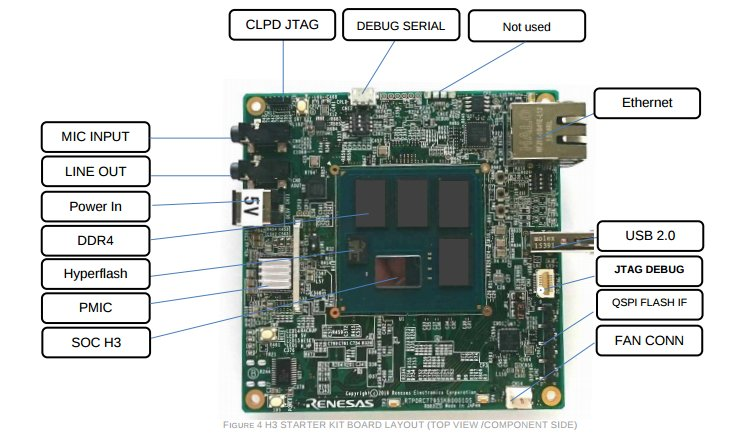
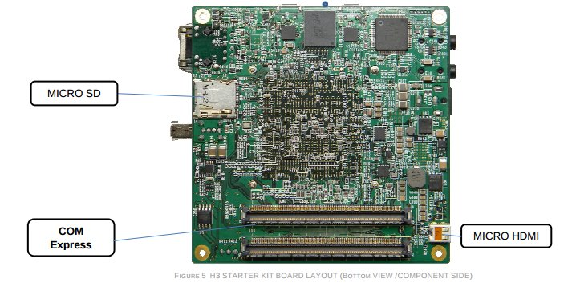

.. _rcar_h3ulcb_ca57:

R-CAR H3 ARM CA57 (ARMv8)
#########################

Overview
********
The R-Car H3 is an SOC that features the basic functions for next-generation
car navigation systems.

Hardware
********
The R-Car H3 includes:

* four 1.5-GHz ARM Cortex-A57 MPCore cores;
* four 1.2-GHz ARM Cortex-A53 MPCore cores;
* memory controller for LPDDR4-3200 with 32 bits x 4 channels;
* 2 channels for HDMI1.4b output and 1channel for RGB888 output and 1channel for LVDS;
* 4 channels MIPI-CSI2 Video Input, 2channels digital Video Input;
* serial ATA interface;
* USB3.0 x 2ch and USB2.0 x 3ch interfaces;
* 800-MHz ARM Cortex-R7 core;
* two- and three-dimensional graphics engines;
* video processing units;
* sound processing units;
* MediaLB interface;
* SD card host interface;
* USB3.0 and USB2.0 interfaces;
* PCI Express interface;
* CAN interface;
* EtherAVB.

Connections and IOs
===================

H3ULCB Board
------------

Here are official IOs figures from eLinux for H3ULCB board:

Supported Features
==================
The Renesas rcar_h3ulcb_ca57 board configuration supports the following
hardware features:

+-----------+------------------------------+--------------------------------+
| Interface | Driver/components            | Support level                  |
+===========+==============================+================================+
| PINCTRL   | pinctrl                      |                                |
+-----------+------------------------------+--------------------------------+
| CLOCK     | clock_control                |                                |
+-----------+------------------------------+--------------------------------+
| UART      | uart                         | serial port-polling            |
+-----------+------------------------------+--------------------------------+
| MMC       | renesas_rcar_mmc             | DMA and SCC                    |
+-----------+------------------------------+--------------------------------+

Other hardware features have not been enabled yet for this board.

The default configuration can be found in
:zephyr_file:`boards/renesas/rcar_h3ulcb/rcar_h3ulcb_r8a77951_a57_defconfig`

Programming and Debugging
*************************

Flashing
========

The flash on board is not supported by Zephyr at this time.

References
**********

- `Renesas R-Car Development Support website`_
- `eLinux R-Car Starter Kit page`_

.. _Renesas R-Car Development Support website:
   https://www.renesas.com/us/en/support/partners/r-car-consortium/r-car-development-support

.. _eLinux R-Car Starter Kit page:
   https://elinux.org/R-Car/Boards/H3SK
