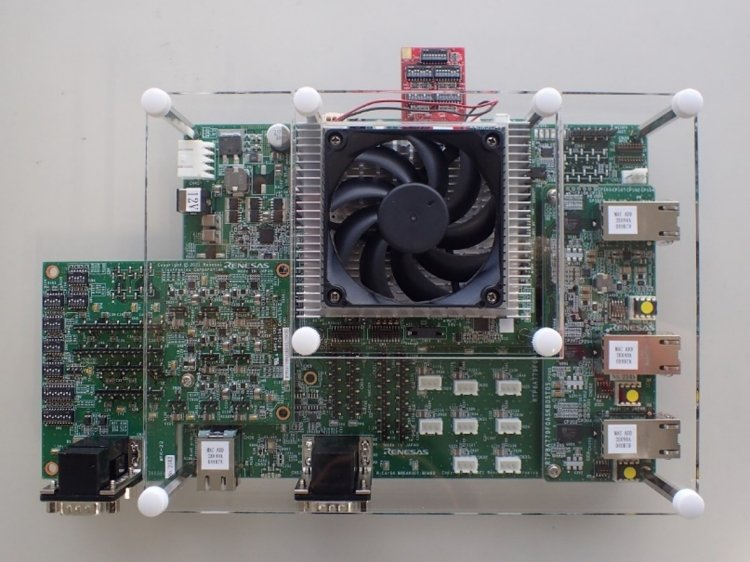
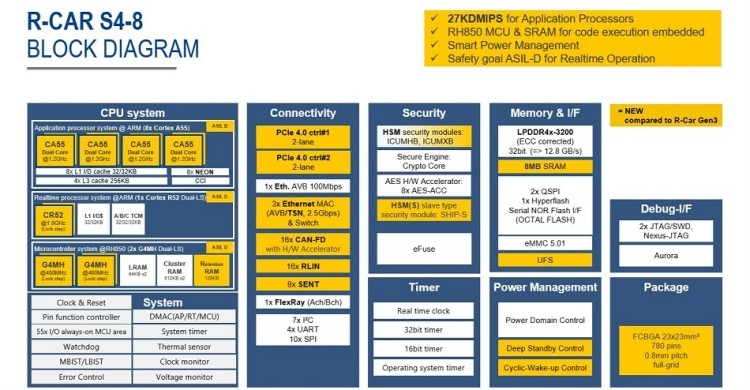

.. _rcar_spider_boards:

Renesas R-Car Spider
####################

Overview
********

| R-Car S4 enables the launch of Car Server/CoGW with high performance, high-speed networking,
| high security and high functional safety levels that are required as E/E architectures
| evolve into domains and zones.

| The R-Car S4 solution allows designers to re-use up to 88 percent of software code developed
| for 3rd generation R-Car SoCs and RH850 MCU applications.\
| The software package supports the real-time cores with various drivers and basic software
| such as Linux BSP and hypervisors.

The Renesas R-Car Spider board is the Renesas R-Car S4 reference board and is designed for
evaluating features and performance of this SoC.

More information about the board can be found at `Renesas R-Car S4 Spider`_ website.

Hardware
********

Hardware capabilities for the S4 Spider board can be found on the `eLinux S4 Spider`_ page.

.. note:: We support Zephyr running on the CR52 processor that is provided for RTOS purpose.

More information about the SoC that equips the board can be found here:

- `Renesas R-Car S4 chip`_

Supported Features
==================

Here are the current supported features when running Zephyr Project on the R-Car S4 Spider CR52:

+-----------+------------------------------+--------------------------------+
| Interface | Driver/components            | Support level                  |
+===========+==============================+================================+
| PINMUX    | pinmux                       |                                |
+-----------+------------------------------+--------------------------------+
| CLOCK     | clock_control                |                                |
+-----------+------------------------------+--------------------------------+
| GPIO      | gpio                         |                                |
+-----------+------------------------------+--------------------------------+
| UART      | uart                         | serial port-polling            |
+           +                              +                                +
|           | FT232RQ                      | serial port-interrupt          |
+-----------+------------------------------+--------------------------------+
| I2C       | i2c                          | interrupt driven               |
+-----------+------------------------------+--------------------------------+
| PWM       | pwm                          | All channels                   |
+-----------+------------------------------+--------------------------------+

It is also currently possible to write on the ram console.

More features will be supported soon.

Connections and IOs
===================

| The "Spider board" consists of a CPU board and a Breakout board.
| The CPU board is stuck on top of the Breakout board.

Here are the official IOs figures from eLinux for S4 board:

`S4 Spider CPU board IOs`_

`S4 Spider breakout board IOs`_

GPIO
----

By running Zephyr on S4 Spider, the software controllable LED 'LED8' can be used as output.

UART
----

Here is information about both serial ports provided on the S4 Spider board :

+--------------------+----------+--------------------+-------------+------------------------+
| Physical Interface | Location | Software Interface | Converter   | Further Information    |
+====================+==========+====================+=============+========================+
| CN20 USB Port      | CPU Board| SCIF0/HSCIF1       | FT232HQ     | Default Zephyr serial  |
+--------------------+----------+--------------------+-------------+------------------------+
| CN21 USB Port      | CPU Board| SCIF3/HSCIF0       | FT2232H-56Q | Used by U-BOOT & Linux |
+--------------------+----------+--------------------+-------------+------------------------+

.. note::
   The Zephyr console output is assigned to SCIF0 (CN20 USB Port) with settings:
   115200 8N1 without hardware flow control by default.

I2C
---

I2C is mainly used to manage and power-on some onboard chips on the S4 Spider board.

Embedded I2C devices and I/O expanders are not yet supported.
The current I2C support therefore does not make any devices available to the user at this time.

Programming and Debugging
*************************

Build and flash applications as usual (see :ref:`build_an_application` and
:ref:`application_run` for more details).

Supported Debug Probe
=====================

| The "Olimex ARM-USB-OCD-H" probe is the only officially supported probe.
| This probe is supported by OpenOCD that is shipped with the Zephyr SDK.

The "Olimex ARM-USB-OCD-H" probe needs to be connected with a "Coresight 20 pins"
adapter to CN1 connector on Spider board.

Configuring a Console
=====================

Connect a USB cable from your PC to CN20 USB port of your Spider board.

Use the following settings with your serial terminal of choice (minicom, putty,
etc.):

- Speed: 115200
- Data: 8 bits
- Parity: None
- Stop bits: 1

Flashing
========

First of all, open your serial terminal.

Applications for the ``rcar_spider_s4`` board configuration can be built in the
usual way (see :ref:`build_an_application` for more details).

.. zephyr-app-commands::
   :zephyr-app: samples/hello_world
   :board: rcar_spider_s4
   :goals: flash

You should see the following message in the terminal:

.. code-block:: console

	*** Booting Zephyr OS build v3.3.0-rc2 ***
	Hello World! rcar_spider_s4

Debugging
=========

First of all, open your serial terminal.

Here is an example for the :ref:`hello_world` application.

.. zephyr-app-commands::
   :zephyr-app: samples/hello_world
   :board: rcar_spider_s4
   :goals: debug

You will then get access to a GDB session for debugging.

By continuing the app, you should see the following message in the terminal:

.. code-block:: console

	*** Booting Zephyr OS build v3.3.0-rc2 ***
	Hello World! rcar_spider_s4

References
**********

- `Renesas R-Car S4 Spider`_
- `Renesas R-Car S4 chip`_
- `eLinux S4 Spider`_

.. _Renesas R-Car S4 Spider:
   https://www.renesas.com/us/en/products/automotive-products/automotive-system-chips-socs/rtp8a779f0askb0sp2s-r-car-s4-reference-boardspider

.. _Renesas R-Car S4 chip:
	https://www.renesas.com/us/en/products/automotive-products/automotive-system-chips-socs/r-car-s4-automotive-system-chip-soc-car-servercommunication-gateway

.. _eLinux S4 Spider:
	https://elinux.org/R-Car/Boards/Spider

.. _S4 Spider CPU board IOs:
	https://elinux.org/images/6/6d/Rcar_s4_spider_cpu_board.jpg

.. _S4 Spider breakout board IOs:
	https://elinux.org/images/2/29/Rcar_s4_spider_breakout_board.jpg
