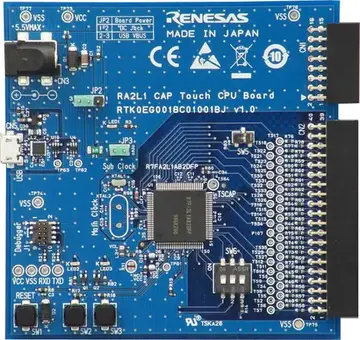

.. zephyr:board:: rssk_ra2l1

Overview
********

The RA2L1 MCU Group Capacitive Touch Evaluation System (RTK0EG0022S01001BJ) is a
kit created for evaluating the RA2L1 MCU Group Capacitive Touch Sensing Unit (CTSU).

RTK0EG0022S01001BJ is composed of two boards: The RA2L1 Cap Touch CPU Board is mounted with an
RA2L1 MCU which includes an on-chip CTSU. The Capacitive Touch Application Board Capacitive Touch
Application Board is equipped with self-capacitance touch buttons, wheel and slider electrodes, and LEDs
touch electrodes.

Renesas RA2L1 Microcontroller Group has following features

- 48MHz, Arm Cortex-M23 core
- 256kB or 128kB Code Flash, 8kB Data Flash, 32kB SRAM (divided on 2 equal areas
  with- and without- ECC support)
- SCI x 5
- SPI x 2
- I2C x 2
- CAN x 1
- 12-bit A/D Converter
- 12-bit D/A Converter
- Low-Power Analog Comparator x 2
- Temperature Sensor
- General PWM Timer 32-bit x 4
- General PWM Timer 16-bit x 6
- Low Power Asynchronous General-Purpose Timer x 2
- Watchdog Timer (WDT)
- Independent Watchdog Timer (IWDT)
- Up to 85 Input/Output pins (depends on the package type)

Hardware
********

The main functions of the RA2L1 Cap Touch CPU board are as follows:

- Renesas RA2L1 MCU Group

   - R7FA2L1AB2DFP
   - 100-pin LFQFP package
   - 48MHz Arm Cortex®-M23 Core with built-in Arm® MPU (Armv8-M architecture)
   - 32KB SRAM
   - 256KB code flash memory
   - 8KB data flash memory
   - 32-channel capacitive touch sensing unit (CTSU) pins

- Connectivity

   - USB serial conversion interface (FT234XD manufactured by FTDI)
   - 10-pin JTAG/SWD interface for connecting external debugger or programmer (option)
   - Application board GPIO interface: 2.54mm pitch, 16 pins (8 x 2 DIL)
   - Application board CTSU interface: 2.54mm pitch, 40 pins (20 x 2 DIL)

- Other functions

   - MCU current measurement jumper
   - User push button switches: 2
   - User LEDs: 2

   RA2L1 Cap Touch CPU Board (Credit: Renesas Electronics Corporation)

Key functions of the Capacitive Touch Application Board are as follows:

- Self-capacitance detection touch electrodes

   - Buttons: 3
   - Wheel (4-electrode configuration): 1
   - Slider (5-electrode configuration): 1

- LEDs: 16

Supported Features
==================

.. zephyr:board-supported-hw::

Programming and debugging
*************************

Building & Flashing
===================

You can build and flash an application with an external J-Link debug adapter connect to
J1 connector.
:ref:`build_an_application` and
:ref:`application_run` for more details.

Here is an example for building and flashing the :zephyr:code-sample:`blinky` application.

.. zephyr-app-commands::
   :zephyr-app: samples/basic/blinky
   :board: rssk_ra2l1
   :goals: build flash

Debugging
=========

Debugging also can be done with an external J-Link debug adapter connected to
J1 connector.
For the debug log output through UART console, you need to connect a USB cable
from the host PC to the USB Serial Conversion on CN5.
The following command is debugging the :zephyr:code-sample:`blinky` application.
Also, see the instructions specific to the debug server that you use.

.. zephyr-app-commands::
   :zephyr-app: samples/basic/blinky
   :board: rssk_ra2l1
   :maybe-skip-config:
   :goals: debug

Or you can use Segger Ozone (`Segger Ozone Download`_) for a visual debug interface

Once downloaded and installed, open Segger Ozone and configure the debug project
like so:

* Target Device: R7FA2L1AB
* Target Interface: SWD
* Target Interface Speed: 4 MHz
* Host Interface: USB
* Program File: <path/to/your/build/zephyr.elf>

References
**********
- `RSSK-RA2L1 Web site`_
- `RA2L1 MCU Group Website`_

.. _RSSK-RA2L1 Web site:
   https://www.renesas.com/en/products/microcontrollers-microprocessors/ra-cortex-m-mcus/rtk0eg0022s01001bj-capacitive-touch-evaluation-system-ra2l1

.. _RA2L1 MCU Group Website:
   https://www.renesas.com/en/products/microcontrollers-microprocessors/ra-cortex-m-mcus/ra2l1-48mhz-arm-cortex-m23-ultra-low-power-general-purpose-microcontroller

.. _Segger Ozone Download:
   https://www.segger.com/downloads/jlink#Ozone
