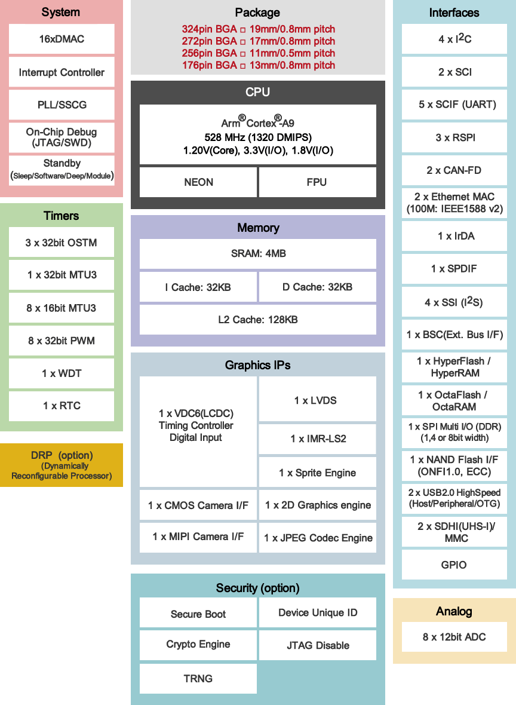

.. zephyr:board:: rza2m_evk

Overview
********

The RZ/A2M Evaluation Board Kit is a best evaluation board kit to evaluate RZ/A2M.

* On-board device: RZ/A2M (R7S921053VCBG: with DRP function, without encryption function, internal
  RAM 4MB) Evaluation of DRP (Dynamically Reconfigurable Processor) is possible.
* MIPI Camera Module (MIPI CSI) is bundled and image recognition processing etc. can be used with
  images input with MIPI camera.
* HyperMCP (Multi-chip package), in which HyperFlash and HyperRAM are installed in one package,
  is mounted. HyperFlash and HyperRAM can be evaluated.
* A Display Output Board is included and the graphic output is possible by connecting it to the
  external display.
* It is possible to evaluate 2ch Ethernet communication.
* Other peripheral functions such as SDHI and USB can also be evaluated.
* Allows for safe and secure connection to the AWS cloud.
  HyperFlash and HyperRAM are trademarks of Cypress Semiconductor Corporation of the U.S.

Hardware
********

The Renesas RZ/A2M MPU documentation can be found at `RZ/A2M Group Website`_

	RZ/A2M block diagram (Credit: Renesas Electronics Corporation)

Detailed hardware features for the board can be found at `RZ/A2M-EVK Website`_

Supported Features
==================

.. zephyr:board-supported-hw::

Programming and Debugging
*************************

.. zephyr:board-supported-runners::

Applications for the ``rza2m_evk`` board configuration can be
built and flashed in the usual way (see :ref:`build_an_application`
and :ref:`application_run` for more details).

Console
=======

The UART port is accessed by USB-Serial port (CN5).

Building & Flashing
===================

Here is an example for building and flashing the :zephyr:code-sample:`hello_world` application.

.. zephyr-app-commands::
   :zephyr-app: samples/hello_world
   :board: rza2m_evk
   :goals: build flash

References
**********

.. target-notes::

.. _RZ/A2M Group Website:
   https://www.renesas.com/us/en/products/microcontrollers-microprocessors/rz-mpus/rza2m-image-processing-rtos-mpu-drp-and-4mb-chip-ram

.. _RZ/A2M-EVK Website:
   https://www.renesas.com/en/products/microcontrollers-microprocessors/rz-mpus/rza2m-evkit-rza2m-evaluation-kit
