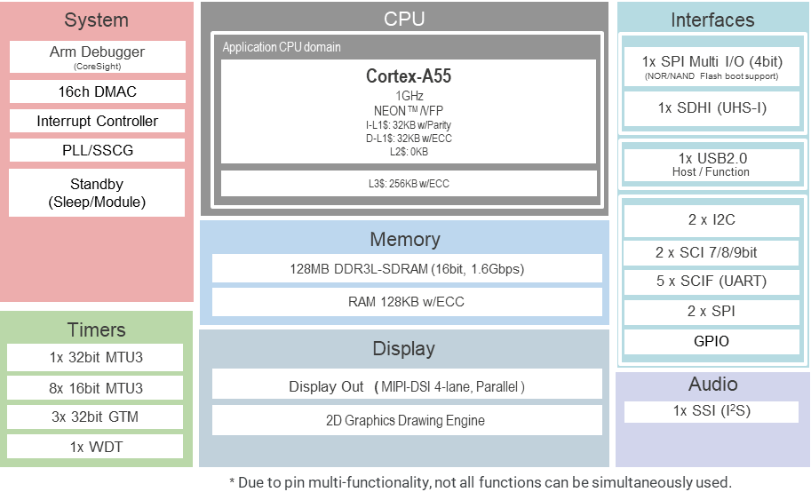

.. zephyr:board:: rza3m_ek

Overview
********

The EK-RZ/A3M evaluation kit enables users to easily evaluate the features of the RZ/A3M MPU.
This kit includes an EK-RZ/A3M board, 5-inch 720x1280 pixel LCD MIPI graphics expansion board, and
USB cables, allowing the seamless evaluation of high-definition human machine interface (HMI), camera
input through USB, and more features. Equipped with an on-board J-Link debugger, users can
conveniently start debugging without additional debuggers.
Additionally, it also has several expansion connectors such as SDIO, PMOD,and Arduino to connect
sensors, Wi-Fi, and Bluetooth® Low Energy (LE), allowing users to add more features without
expanding the board space.

* Special Feature Access

  * MIPI DSI 4 lanes & parallel graphics expansion ports
  * 5-inch MIPI LCD panel (720x1280 pixels)
  * USB High-Speed Host & Device
  * 32MB External QSPI NOR Flash
  * 128MB External QSPI NAND Flash
  * External sound codec
  * External RTC

* MPU Native Pin Access

  * R9A07G066M04GBG MPU
  * 1GHz, Arm Cortex®-A55 core w/NEON extension
  * Built-in 128MB DDR3L DRAM
  * 128KB SRAM w/ECC
  * 244 pins, BGA package
  * Native pin access
  * MPU & USB current measurement

* Ecosystem & System Control Access

  * USB High-Speed Host & Device
  * 5V input through USB (Debug, HS, USB-PD) or external power supply
  * Debug on-board (Segger J-Link®)
  * Debug external (SWD & JTAG)
  * SCIF download (SWD)
  * 3 user LEDs & 2 user buttons
  * 2 SeeedGrove® system (I2C & analog)
  * 2 Digilent Pmod™ (I2C, SPI or UART selectable)
  * Arduino™ (Uno R3)
  * MikroElektronika™ mikroBUS
  * SparkFun® Qwiic® (I2C)
  * MPU boot configuration switch
  * Audio In/Out 4-pole
  * MicroSD card slot

* Kit Contents

  * EK-RZ/A3M board
  * MIPI graphics expansion board
  * USB cable (USB C to USB C)
  * USB cable (USB A female to USB C)
  * USB cable (USB A male to USB C)
  * Screw and spacer for fixing the sub board

Hardware
********
The Renesas RZ/A3M MPU documentation can be found at `RZ/A3M Group Website`_

	RZ/A3M block diagram (Credit: Renesas Electronics Corporation)

Detailed hardware features for the board can be found at `EK-RZ/A3M Website`_

Supported Features
==================

.. zephyr:board-supported-hw::

Programming and Debugging
*************************

EK-RZ/A3M uses Initial Program Loader (IPL) to perform initial settings and copy the Zephyr image from flash to DDR SRAM for execution.
It only needs to be written to flash at lease once before running Zephyr.

1. For the board setup and connections, follow "3.2 Board Setup" of `Getting Started with RZ/A Flexible Software Package`_.

2. Enable the IPL build with ``-DCONFIG_BUILD_WITH_TFA=y``.
   The IPL image ``rza3m_ek_nor_ipl.bin`` is generated under zephyr/build/tfa/rza3m_ek_nor/release

.. zephyr-app-commands::
   :zephyr-app: samples/hello_world
   :board: rza3m_ek
   :goals: build
   :gen-args: -DCONFIG_BUILD_WITH_TFA=y

.. note::
   Currently, the IPL source code can built on Linux environment only.
   For Windows, please follow `Initial Program Loader Application Note`_

3. Flash it onto the board at address 0x20000000 by Jlink command `Segger JLink Renesas R9A07G066`_

.. code-block:: console

   $ JLinkExe
   J-Link> connect
   Device> R9A07G066M04
   TIF> s
   Speed> [Enter]
   J-Link> h
   J-Link> loadfile <ipl_bin_path> 0x20000000

Where ``<ipl_bin_path>`` is the path to the ``rza3m_ek_nor_ipl.bin`` in the output directory.

Applications for the ``rza3m_ek`` board can be built in the usual way as
documented in :ref:`build_an_application`.

Console
=======
The UART port is accessed by USB Debug connector (J10).

Debugging
=========

It is possible to load and execute a Zephyr application binary on this board on the Cortex-A55 System Core
from the DDR SDRAM, using ``JLink`` debugger (:ref:`jlink-debug-host-tools`).

Here is an example for building and debugging with the :zephyr:code-sample:`hello_world` application.

.. zephyr-app-commands::
   :zephyr-app: samples/hello_world
   :board: rza3m_ek
   :goals: build debug

Flashing
========

Zephyr application can be flashed to Quad-SPI storage and then loaded by Initial Program Loader.

.. zephyr-app-commands::
   :zephyr-app: samples/hello_world
   :board: rza3m_ek
   :goals: build flash

References
**********

.. target-notes::

.. _RZ/A3M Group Website:
   https://www.renesas.com/en/products/rz-a3m

.. _EK-RZ/A3M Website:
   https://www.renesas.com/en/design-resources/boards-kits/ek-rz-a3m

.. _Initial Program Loader Application Note:
   https://github.com/renesas/rza-initial-program-loader/tree/main/application_note

.. _Getting Started with RZ/A Flexible Software Package:
   https://www.renesas.com/en/document/apn/rza-getting-started-flexible-software-package

.. _Segger JLink Renesas R9A07G066:
   https://kb.segger.com/Renesas_R9A07G066
