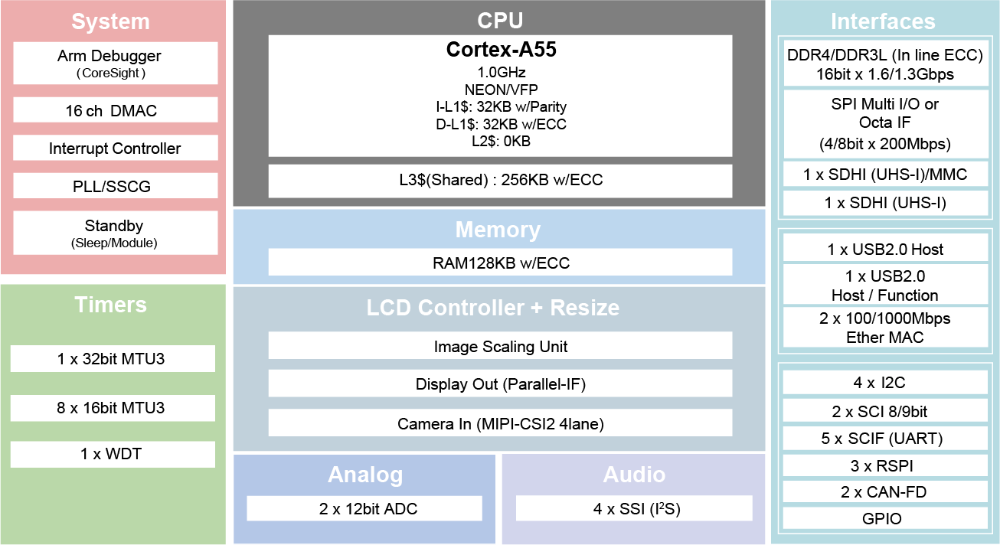

.. zephyr:board:: rza3ul_smarc

Overview
********

The Renesas RZ/A3UL SMARC Evaluation Board Kit (RZ/A3UL-EVKIT) consists of a SMARC v2.1 module board and a carrier board.
Two types of evaluation boards are available: QSPI version and Octal-SPI version. The QSPI version is supported.

* Device: RZ/A3UL R9A07G063U02GBG

  * Cortex-A55 Single
  * BGA361pin, 13mmSq body, 0.5mm pitch
  * Certified device in `Azure Certified Device Catalog <https://devicecatalog.azure.com/devices/5848d87b-5d3e-4c11-ad76-90612639b025>`_

* SMARC v2.1 Module Board Functions

  * Two types of evaluation boards are available:

    * QSPI version: QSPI Serial Flash (Boot) + DDR4
    * Octal-SPI version: Octa Flash (Boot) + OctaRAM + DDR4

  * DDR4 SDRAM: 1GB x 1pc
  * QSPI flash memory: 128Mb x 1pc `AT25QL128A <https://www.renesas.com/en/products/memory-logic/non-volatile-memory/spi-nor-flash/at25ql128a-128mbit-17v-minimum-spi-serial-flash-memory-dual-io-quad-io-and-qpi-support>`_ (QSPI version)
  * Octa RAM memory: 512Mb x 1pc / Octa flash memory: 1Gb x 1pc (Octal-SPI version)
  * eMMC memory: 64GB x 1pc
  * The microSD card slot is implemented and used as an eSD for boot.
  * 5-output clock oscillator `5P35023 <https://www.renesas.com/en/products/clocks-timing/clock-generation/programmable-clocks/5p35023-versaclock-3s-programmable-clock-generator>`_ implemented
  * PMIC power supply `DA9062 <https://www.renesas.com/en/products/power-management/multi-channel-power-management-ics-pmics/da9062-pmic-designed-applications-requiring-85a>`_ implemented

* Carrier Board Functions

  * The FFC/FPC connector is mounted as standard for connection to high-speed serial interface for camera module.
  * The Micro-HDMI connector via DSI/HDMI conversion module is mounted as standard for connection to high-speed serial interface for digital video module.
  * The Micro-AB receptacle (ch0: USB2.0 OTG) and A receptacle (ch1: USB2.0 Host) are respectively mounted as standard for connection to USB interface.
  * The RJ45 connector is mounted as standard for software development and evaluation using Ethernet.
  * The audio codec is mounted as standard for advance development of audio system. The audio jack is implemented for connection to audio interface.
  * The Micro-AB receptacles are implemented for connection to asynchronous serial port interface.
  * The microSD card slot and two sockets for PMOD are implemented as an interface for RZ/A3UL peripheral functions.
  * For power supply, a mounted USB Type-C receptacle supports the USB PD standard.

Hardware
********
The Renesas RZ/A3UL MPU documentation can be found at `RZ/A3UL Group Website`_

	RZ/A3UL block diagram (Credit: Renesas Electronics Corporation)

Detailed hardware features for the board can be found at `RZA3UL-EVKIT Website`_

Supported Features
==================

.. zephyr:board-supported-hw::

Programming and Debugging
*************************

.. zephyr:board-supported-runners::

RZ/A3UL-EVKIT uses Initial Program Loader (IPL) to perform initial settings and copy the Zephyr image from flash to DDR SRAM for execution. It only needs to be written to flash once.

There are two options to write IPL:

1. (Recommended) Follow ''4. Tutorial: Your First RZ MPU Project - Blinky'' of `Getting Started with RZ/A Flexible Software Package`_
   to start writing a blinky sample with FSP. The IPL will be written to flash by default in debugging time.

2. Follow the `Initial Program Loader Application Note`_ to write the IPL separately. The minimal steps are described below.

   a. Follow ''6. IPL development environment construction procedure'' to prepare the build environment.

   b. Follow ''7. IPL build environment construction procedure'' to build Initial Program Loader.
      If the build is successful, Initial Program Loader file will be generated in /build/a3ul/release/rza3ul_smarc_qspi_ipl.srec

   c. Follow ''8.1 Create Debug Configuration'' to create a Debug configuration to run Initial Program Loader on the target board.

   d. Follow ''8.2 Connection to SMARC EVK Board'' to setup target board with SW1 Debugger Enable (SW1-1 OFF) and Boot (1.8V) Mode (SW11[1:4]=OFF OFF OFF ON).

   e. Follow ''8.4 Execution procedure of IPL'' to write Initial Program Loader to the target board.

Applications for the ``rza3ul_smarc`` board can be built in the usual way as
documented in :ref:`build_an_application`.

Console
=======
The UART port is accessed by USB Type-mircoB port (CN14).

Debugging
=========

It is possible to load and execute a Zephyr application binary on this board on the Cortex-A55 System Core
from the DDR SDRAM, using ``JLink`` debugger (:ref:`jlink-debug-host-tools`).

Here is an example for building and debugging with the :zephyr:code-sample:`hello_world` application.

.. zephyr-app-commands::
   :zephyr-app: samples/hello_world
   :board: rza3ul_smarc
   :goals: build debug

Flashing
========

Zephyr application can be flashed to QSPI/Octal-SPI storage and then loaded by Initial Program Loader.

.. zephyr-app-commands::
   :zephyr-app: samples/hello_world
   :board: rza3ul_smarc
   :goals: build flash

References
**********

.. target-notes::

.. _RZ/A3UL Group Website:
   https://www.renesas.com/en/products/microcontrollers-microprocessors/rz-mpus/rza3ul-powerful-1ghz-64-bit-mpus-rtos-support-enables-high-definition-hmi-and-quick-startup?

.. _RZA3UL-EVKIT Website:
   https://www.renesas.com/en/products/microcontrollers-microprocessors/rz-mpus/rza3ul-evkit-rza3ul-evaluation-board-kit

.. _Initial Program Loader Application Note:
   https://github.com/renesas/rza-initial-program-loader/tree/main/application_note

.. _Getting Started with RZ/A Flexible Software Package:
   https://www.renesas.com/en/document/apn/rza-getting-started-flexible-software-package
