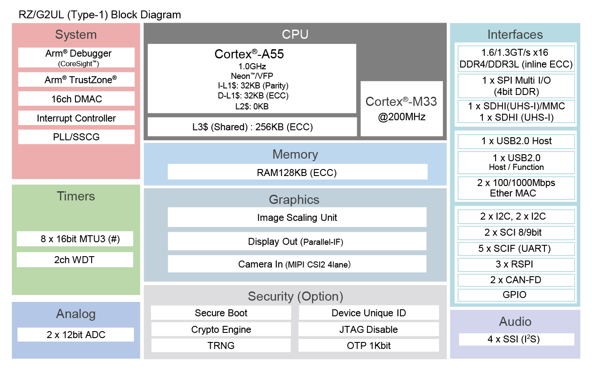

.. zephyr:board:: rzg2ul_smarc

Overview
********

The Renesas RZ/G2UL SMARC Evaluation Board Kit (RZ/G2UL-EVKIT) consists of a SMARC v2.1 module board and a carrier board.

* Device: RZ/G2UL (Type-1) R9A07G043U11GBG

  * Cortex-A55 Single, Cortex-M33
  * BGA361pin, 13mmSq body, 0.5mm pitch

* SMARC v2.1 Module Board Functions

  * DDR4 SDRAM: 1GB x 1pc
  * QSPI flash memory: 128Mb x 1pc `AT25QL128A <https://www.renesas.com/en/products/memory-logic/non-volatile-memory/spi-nor-flash/at25ql128a-128mbit-17v-minimum-spi-serial-flash-memory-dual-io-quad-io-and-qpi-support>`_
  * eMMC memory: 64GB x 1pc
  * The microSD card slot is implemented and used as an eSD for boot
  * 5-output clock oscillator `5P35023 <https://www.renesas.com/en/products/clocks-timing/clock-generation/programmable-clocks/5p35023-versaclock-3s-programmable-clock-generator>`_ implemented
  * PMIC power supply `DA9062 <https://www.renesas.com/en/products/power-management/multi-channel-power-management-ics-pmics/da9062-pmic-designed-applications-requiring-85a>`_ implemented

* Carrier Board Functions

  * The FFC/FPC connector is mounted as standard for connection to high-speed serial interface for camera module.
  * The Micro-HDMI connector via DSI/HDMI conversion module is mounted as standard for connection to high-speed serial interface for digital video module.
  * The Micro-AB receptacle (ch0: USB2.0 OTG) and A receptacle (ch1: USB2.0 Host) are respectively mounted as standard for connection to USB interface.
  * The RJ45 connector is mounted as standard for software development and evaluation using Ethernet.
  * The audio codec is mounted as standard for advance development of audio system. The audio jack is implemented for connection to audio interface.
  * The Micro-AB receptacles are implemented for connection to asynchronous serial port interface.
  * The microSD card slot and two sockets for PMOD are implemented as an interface for peripheral functions.
  * For power supply, a mounted USB Type-C receptacle supports the USB PD standard.

Hardware
********

The Renesas RZ/G2UL MPU documentation can be found at `RZ/G2UL Group Website`_

   RZ/G2UL block diagram (Credit: Renesas Electronics Corporation)

Supported Features
==================

.. zephyr:board-supported-hw::

Programming and Debugging
*************************

Applications for the ``rzg2ul_smarc`` board can be built in the usual way as
documented in :ref:`build_an_application`.

Console
=======

By default, `J-Link RTT Viewer`_ is used by Zephyr running on CM33 for providing serial console.
The only serial port (SER3_UART micro-USB) is reserved for CA55 to run Linux.

.. note::

   Set SW1-1 on the board to "OFF" to select JTAG debug mode, which is required for
   RTT to work.

There are two ways to use the RTT Viewer on this board. The basic steps for each method are
described below:

1. Using with Ozone
-------------------

After the Zephyr application has been built successfully, open J-Link RTT Viewer and configure the
connection as follows:

- **Connect to J-Link**: Existing Session (enable Auto Reconnect)
- **RTT Control Block**: Auto Detection
- Click **OK**

Next, open `Ozone Debugger`_ and choose "Create New Project". Inside the "New Project Wizard"
configure the settings as follows:

- **Device**: R9A07G043U11
- **Register Set**: Cortex-M33
- Click **Next**
- **Target Interface**: SWD
- **Target Interface Speed**: 4MHz
- **Host Interface**: USB
- Click **Next**
- Set the full path of ``zephyr.elf`` file. The path should resemble ``zephyrproject/zephyr/build/zephyr/zephyr.elf``
- Click **Next**, leave all options by default, and click **Finish**
- Press **F5** to download and reset program

2. Using with U-Boot
--------------------

After the Zephyr application has been built successfully, open the ``zephyr.map`` file located in
``zephyrproject\zephyr\build\zephyr\zephyr.map``. Locate the symbol ``_SEGGER_RTT`` and copy its
address value in hexadecimal.

Then, perform the "Flashing" steps described below to run the Zephyr application using U-Boot. As soon as the
application is invoked, open J-Link RTT Viewer and configure the connection as follows:

- **Connect to J-Link**: USB
- **Specify Target Device**: R9A07G043U11 (enable Force go on connect)
- **Target Interface & Speed**: SWD @ 4000 kHz
- **RTT Control Block**: Select "Address", then paste the address of the ``_SEGGER_RTT`` symbol copied earlier.
- Click **OK**

.. note::

   When using RTT Viewer with a Zephyr application launched by U-Boot, it is important to connect
   the RTT Viewer immediately after executing the U-Boot command sequence. This helps avoid losing
   early log output.

Debugging
=========

It is possible to load and execute a Zephyr application binary on
this board on the Cortex-M33 System Core from
the internal SRAM, using ``JLink`` debugger (:ref:`jlink-debug-host-tools`).

Here is an example for building and debugging with the :zephyr:code-sample:`hello_world` application.

.. zephyr-app-commands::
   :zephyr-app: samples/hello_world
   :board: rzg2ul_smarc/r9a07g043u11gbg/cm33
   :goals: build debug

Flashing
========

RZ/G2UL-EVKIT is designed to start different systems on different cores.
It uses Yocto as the build system to build Linux system and boot loaders
to run Zephyr on Cortex-M33 with u-boot. The minimal steps are described below.

1. Follow "2.2 Building Images" of `SMARC EVK of RZ/G2L, RZ/G2LC, RZ/G2UL Linux Start-up Guide`_ to prepare the build environment.

2. At step (4), follow step "2. Download Multi-OS Package" and "3. Add the layer for Multi-OS Package"
   of "3.2 OpenAMP related stuff Integration for RZ/G2L, RZ/G2LC and RZ/G2UL" of `Release Note for RZ/G Multi-OS Package V2.2.0`_
   to add the layer for Multi-OS Package.

   .. code-block:: console

      $ cd ~/rzg_vlp_<pkg ver>
      $ unzip <Multi-OS Dir>/r01an5869ej0220-rzg-multi-os-pkg.zip
      $ tar zxvf r01an5869ej0220-rzg-multi-os-pkg/meta-rz-features_multi-os_v2.2.0.tar.gz
      $ bitbake-layers add-layer ../meta-rz-features/meta-rz-multi-os/meta-rzg2l

3. Start the build:

   .. code-block:: console

      $ MACHINE=smarc-rzg2ul bitbake core-image-minimal

   The below necessary artifacts will be located in the build/tmp/deploy/images

   +---------------+------------------------------------------------------+
   | Artifacts     | File name                                            |
   +===============+======================================================+
   | Boot loader   | bl2_bp-smarc-rzg2ul.srec                             |
   |               |                                                      |
   |               | fip-smarc-rzg2ul.srec                                |
   +---------------+------------------------------------------------------+
   | Flash Writer  | Flash_Writer_SCIF_RZG2UL_SMARC_DDR4_1GB_1PCS.mot     |
   +---------------+------------------------------------------------------+

4. Follow "4.2 Startup Procedure" of `SMARC EVK of RZ/G2L, RZ/G2LC, RZ/G2UL Linux Start-up Guide`_ for power supply and board setting
   at SCIF download (SW11[1:4] = OFF, ON, OFF, ON) and (SW1[1:3] = ON, OFF, OFF)

5. Follow "4.3 Download Flash Writer to RAM" of `SMARC EVK of RZ/G2L, RZ/G2LC, RZ/G2UL Linux Start-up Guide`_ to download Flash Writer to RAM

6. Follow "4.4 Write the Bootloader" of `SMARC EVK of RZ/G2L, RZ/G2LC, RZ/G2UL Linux Start-up Guide`_ to write the boot loader
   to the target board by using Flash Writer.

7. Follow "4.5 Change Back to Normal Boot Mode" with switch setting (SW11[1:4] = OFF, OFF, OFF, ON) and (SW1[1:2] = ON, OFF)

8. Follow "3. Preparing the SD Card" of `SMARC EVK of RZ/G2L, RZ/G2LC, RZ/G2UL Linux Start-up Guide`_ to write files to the microSD Card

9. Copy zephyr.bin file to microSD card

10. Follow "4.4.2 CM33 Sample Program Invocation with u-boot" from the beginning to step 4 of `Release Note for RZ/G Multi-OS Package V2.2.0`_

11. Execute the commands stated below on the console to start zephyr application with CM33 core.
    Here, "N" stands for the partition number in which you stored zephyr.bin file.

   .. code-block:: console

      Hit any key to stop autoboot: 2
      => dcache off
      => mmc dev 1
      => fatload mmc 1:N 0x00010000 zephyr.bin
      => fatload mmc 1:N 0x40010000 zephyr.bin
      => cm33 start_normal 0x00010000 0x40010000
      => dcache on

Troubleshooting
===============

By default, the only valid serial port (SER3_UART micro-USB port) controlled by SCIF0 is used by Linux to
print Linux console output. Therefore, in order to use it from Zephyr, the Linux console must first be disabled.
To do this, run the following command in the Linux console to unbind the SCIF0 driver:

.. code-block:: console

   $ echo 1004b800.serial | tee /sys/bus/platform/drivers/sh-sci/unbind

This allows the SCIF0 to be accessed from the Zephyr side in debug mode for providing serial console.
Please note that the SCIF0 driver is disabled by default on the Zephyr side to prevent conflicts.

References
**********

.. target-notes::

.. _RZ/G2UL Group Website:
   https://www.renesas.com/en/products/microcontrollers-microprocessors/rz-mpus/rzg2ul-general-purpose-microprocessors-single-core-arm-cortex-a55-10ghz-cpu-and-single-core-arm-cortex-m33

.. _RZG2UL-EVKIT Website:
   https://www.renesas.com/en/products/microcontrollers-microprocessors/rz-mpus/rzg2ul-evkit-evaluation-board-kit-rzg2ul-mpu

.. _SMARC EVK of RZ/G2L, RZ/G2LC, RZ/G2UL Linux Start-up Guide:
   https://www.renesas.com/en/document/gde/smarc-evk-rzg2l-rzg2lc-rzg2ul-linux-start-guide-rev106

.. _Release Note for RZ/G Multi-OS Package V2.2.0:
   https://www.renesas.com/en/document/rln/release-note-rzg-multi-os-package-v220?r=1522841

.. _J-Link RTT Viewer:
   https://www.segger.com/products/debug-probes/j-link/tools/rtt-viewer

.. _Ozone Debugger:
   https://www.segger.com/products/development-tools/ozone-j-link-debugger/
