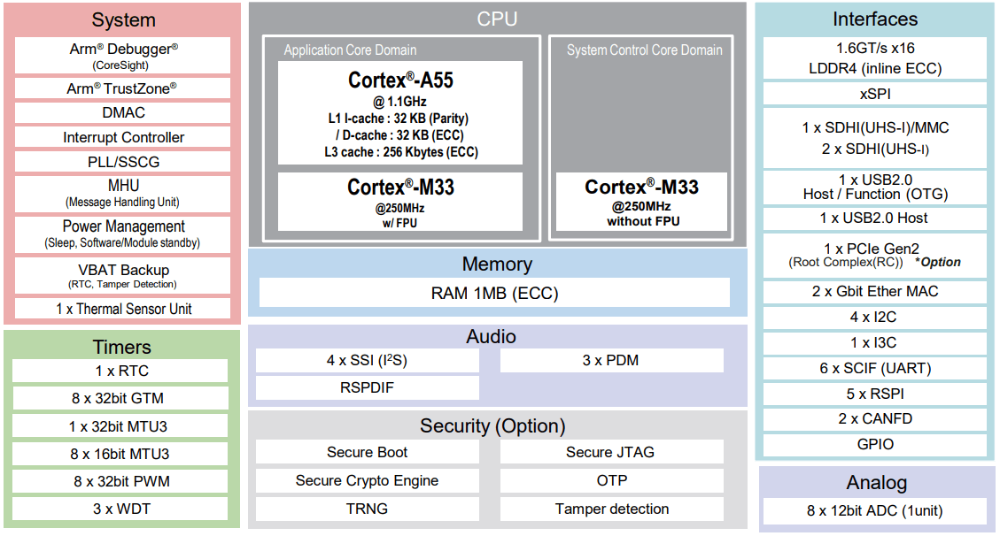

.. zephyr:board:: rzg3s_smarc

Overview
********

The Renesas RZ/G3S SMARC Evaluation Board Kit (RZ/G3S-EVKIT) consists of a SMARC v2.1 module board and a carrier board.

* Device: RZ/G3S R9A08G045S33GBG

  * Cortex-A55 Single, Cortex-M33 x 2
  * BGA 359-pin, 14mmSq body, 0.5mm pitch

* SMARC v2.1 Module Board Functions

  * LPDDR4 SDRAM: 1GB x 1pc
  * QSPI flash memory: 128Mb x 1pc
  * eMMC memory: 64GB x 1pc
  * PMIC power supply RAA215300A2GNP#HA3 implemented
  * microSD card x2
  * I3C connector
  * JTAG connector
  * ADC x8 channels
  * Current monitor (USB Micro B)

* Carrier Board Functions

  * Gigabit Ethernet x2
  * USB2.0 x2ch (OTG x1ch, Host x1ch)
  * CAN-FD x2
  * microSD card x1
  * Mono speaker, Stereo headphone, Mic., and Aux..
  * PMOD x2
  * USB-Type C for power input
  * PCIe Gen2 4-lane slot (G3S supports only 1-lane)
  * M.2 Key E
  * M.2 Key B and SIM card
  * Coin cell battery holder (3.0V support)

Hardware
********

The Renesas RZ/G3S MPU documentation can be found at `RZ/G3S Group Website`_

	RZ/G3S block diagram (Credit: Renesas Electronics Corporation)

Supported Features
==================

The ``rzg3s_smarc/r9a08g045s33gbg/cm33`` board target supports the ARM Cortex-M33 System Core without FPU
and the following hardware features:

+-----------+------------+-------------------------------------+
| Interface | Controller | Driver/Component                    |
+===========+============+=====================================+
| NVIC      | on-chip    | arch/arm                            |
+-----------+------------+-------------------------------------+
| SYSTICK   | on-chip    | arch/arm                            |
+-----------+------------+-------------------------------------+
| PINCTRL   | on-chip    | pinctrl                             |
+-----------+------------+-------------------------------------+
| GPIO      | on-chip    | gpio                                |
+-----------+------------+-------------------------------------+
| UART      | on-chip    | serial                              |
+-----------+------------+-------------------------------------+

Other hardware features are currently not supported by the port.

Programming and Debugging
*************************

RZ/G3S-EVKIT is designed to start different systems on different cores.
It uses Yocto as the build system to build Linux system and boot loaders
to run BL2 TF-A on Cortex-A55 System Core before starting Zephyr. The minimal steps are described below.

  1. Follow ''2.2 Building Images'' of `SMARC EVK of RZ/G3S Linux Start-up Guide`_ to prepare the build environment.

  2. Before build, add ``PLAT_M33_BOOT_SUPPORT=1`` to meta-renesas/meta-rzg3s/recipes-bsp/trusted-firmware-a/trusted-firmware-a.bbappend.

  .. code-block:: bash
    :emphasize-lines: 6

      require trusted-firmware-a.inc
      COMPATIBLE_MACHINE_rzg3s = "(rzg3s-dev|smarc-rzg3s)"
      PLATFORM_rzg3s-dev = "g3s"
      EXTRA_FLAGS_rzg3s-dev = "BOARD=dev14_1_lpddr PLAT_SYSTEM_SUSPEND=vbat"
      PLATFORM_smarc-rzg3s = "g3s"
      EXTRA_FLAGS_smarc-rzg3s = "BOARD=smarc PLAT_SYSTEM_SUSPEND=vbat PLAT_M33_BOOT_SUPPORT=1"

  3. Start the build:

  .. code-block:: bash

      MACHINE=smarc-rzg3s bitbake core-image-minimal

  The below necessary artifacts will be located in the build/tmp/deploy/images

  +---------------+-----------------------------+
  | Artifacts     | File name                   |
  +===============+=============================+
  | Boot loader   | bl2_bp_spi-smarc-rzg3s.srec |
  |               |                             |
  |               | fip-smarc-rzg3s.srec        |
  +---------------+-----------------------------+
  | Flash Writer  | FlashWriter-smarc-rzg3s.mot |
  +---------------+-----------------------------+

  4. Follow ''4.2 Startup Procedure'' of `SMARC EVK of RZ/G3S Linux Start-up Guide`_ for power supply and board setting
     at SCIF download (SW_MODE[1:4] = OFF, ON, OFF, ON) and Cortex-A55 cold boot (SW_CONFIG[1:6] = OFF, OFF, ON, OFF, OFF, OFF)

  5. Follow ''4.3 Download Flash Writer to RAM'' of `SMARC EVK of RZ/G3S Linux Start-up Guide`_ to download Flash Writer to RAM

  6. Follow ''4.4 Write the Bootloader'' of `SMARC EVK of RZ/G3S Linux Start-up Guide`_ to write the boot loader
     to the target board by using Flash Writer.

Applications for the ``rzg3s_smarc`` board can be built in the usual way as
documented in :ref:`build_an_application`.

Console
=======

The UART port for Cortex-M33 System Core can be accessed by connecting `Pmod USBUART <https://store.digilentinc.com/pmod-usbuart-usb-to-uart-interface/>`_
to the upper side of ``PMOD1_3A``.

Debugging
=========

It is possible to load and execute a Zephyr application binary on
this board on the Cortex-M33 System Core from
the internal SRAM, using ``JLink`` debugger (:ref:`jlink-debug-host-tools`).

.. note::

    Currently it's required Renesas BL2 TF-A to be started on Cortex-A55 System Core
    before starting Zephyr as it configures clocks and the Cortex-M33 System Core before starting it.

Here is an example for building and debugging with the :zephyr:code-sample:`hello_world` application.

.. zephyr-app-commands::
   :zephyr-app: samples/hello_world
   :board: rzg3s_smarc/r9a08g045s33gbg/cm33
   :goals: build debug

Flashing
========

Zephyr application can be flashed to QSPI storage and then loaded by
Renesas BL2 TF-A running on the Cortex-A55 System Core and starting binary on the Cortex-M33 System Core.

The Zephyr application binary has to be converted to Motorolla S-record `SREC`_ format
which is generated automatically in Zephyr application build directory with the extension ``s19``.

.. _SREC: https://en.wikipedia.org/wiki/SREC_(file_format)

.. _Flashing on QSPI:

Flashing on QSPI using Flash Writer
---------------------------------------

Zephyr binary has to be converted to **srec** format.

* Download and start **Flash Writer** as described in ''4.3 Download Flash Writer to RAM'' of `SMARC EVK of RZ/G3S Linux Start-up Guide`_
* Use **XLS2** command to flash Zephyr binary
* Input when asked:

.. code-block:: console

    ===== Please Input Program Top Address ============
      Please Input : H'23000
    ===== Please Input Qspi Save Address ===
      Please Input : H'200000

* Then send Zephyr **s19** file from terminal (use ''ascii'' mode)
* Reboot the board in the **QSPI Boot Mode**

.. code-block:: console

     -- Load Program to SRAM ---------------

    Flash writer for RZ/G3S Series V0.60 Jan.26,2023
     Product Code : RZ/G3S
    >XLS2
    ===== Qspi writing of RZ/G2 Board Command =============
    Load Program to Spiflash
    Writes to any of SPI address.
    Program size & Qspi Save Address
    ===== Please Input Program Top Address ============
      Please Input : H'23000

    ===== Please Input Qspi Save Address ===
      Please Input : H'200000
    please send ! ('.' & CR stop load)
    I Flash memory...
    Erase Completed
    Write to SPI Flash memory.
    ======= Qspi  Save Information  =================
     SpiFlashMemory Stat Address : H'00200000
     SpiFlashMemory End Address  : H'002098E6
    ===========================================================

Flashing on QSPI using west
---------------------------

Before using ``flash`` command, the board must be set to Cortex-M33 cold boot (SW_CONFIG[1:6] = OFF, OFF, ON, OFF, OFF, ON).
After flashing, it must be set back to Cortex-A55 cold boot to run.

The minimal version of SEGGER JLink SW which can perform flashing of QSPI memory is v7.96.

**Note:** It's verified that we can perform flashing successfully with SEGGER JLink SW v7.98g so please use this or later
version.

.. zephyr-app-commands::
   :zephyr-app: samples/hello_world
   :board: rzg3s_smarc/r9a08g045s33gbg/cm33
   :goals: build flash
   :compact:

References
**********

.. target-notes::

.. _RZ/G3S Group Website:
   https://www.renesas.com/us/en/products/microcontrollers-microprocessors/rz-mpus/rzg3s-general-purpose-microprocessors-single-core-arm-cortex-a55-11-ghz-cpu-and-dual-core-cortex-m33-250

.. _RZG3S-EVKIT Website:
   https://www.renesas.com/us/en/products/microcontrollers-microprocessors/rz-mpus/rzg3s-evkit-evaluation-board-kit-rzg3s-mpu

.. _SMARC EVK of RZ/G3S Linux Start-up Guide:
   https://www.renesas.com/us/en/document/gde/smarc-evk-rzg3s-linux-start-guide-rev104
