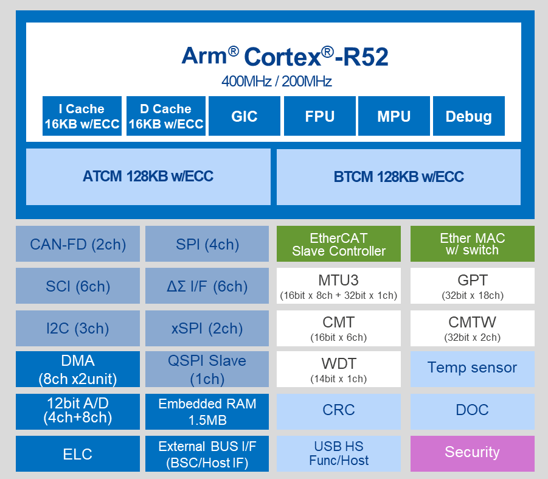

.. zephyr:board:: rzn2l_rsk

Overview
********

Renesas Starter Kit+ for RZ/N2L is for evaluation or development using the RZ/N2L MPU.
With the on-board emulator, you can start evaluation by simply connecting the bundled cable with
your PC. This product has rich functional ICs such as Gigabit Ethernet PHY and Octal Flash,
you can fully evaluate functions without an extension board.

* On-board RZ/N2L MPU 225-pin (R9A07G084M04GBG)
* Rich functional ICs such as Gigabit Ethernet PHY and Octal Flash are mounted,
  so functions of target MPU can be fully evaluated
* Generic interfaces such as Pmod/Grove/Qwiic/mikroBUS
* Pin headers for external extension enable you to evaluate many use cases
* Emulator circuit is mounted, and program debugging can be started by simply connecting USB cable
  to PC (two USB cables are included, one for emulator and the other for power supply)
* On-board memory components:

  * SDRAM (256MBit)
  * NOR Flash (256MBit)
  * Octa Flash (512MBit)
  * HyperRAM (64Mbit)
  * QSPI Serial Flash (512Mbit)
  * I2C EEPROM (32Kbit)

* Communication interfaces include:

  * Debug interfaces (J-Link OB, MIPI-10, MIPI-20)
  * Ethernet
  * CAN
  * USB
  * RS485
  * UART
  * I2C
  * SPI

Hardware
********

The Renesas RZ/N2L MPU documentation can be found at `RZ/N2L Group Website`_

	RZ/N2L block diagram (Credit: Renesas Electronics Corporation)

Detailed hardware features for the board can be found at `RZ/N2L-RSK Website`_

Supported Features
==================

.. zephyr:board-supported-hw::

Connections and IOs
===================

By default, the board is configured for use with:

* UART0 connected to the USB serial port (pins H15, G11),
* UART3 connected to the PMOD Header (J25, pins E14, E15),
* LEDs defined as ``led0``, ``led1``, ``led2`` and ``led3``,

The Zephyr console uses UART0.

Programming and Debugging
*************************

.. zephyr:board-supported-runners::

Applications for the ``rzn2l_rsk`` board can be
built, flashed, and debugged in the usual way. See :ref:`build_an_application`
and :ref:`application_run` for more details on building and running.

To use J-Link OB on RSK+RZN2L,

1. Open the jumper pin (J9) for switching the debug connection.

2. Connect the micro-USB type-B to J-Link OB USB connector (J10), and then the LED4 is lighted.

Console
=======

The UART port is accessed by USB-Serial port (CN16).

Debugging
=========

Here is an example for building and debugging with the :zephyr:code-sample:`hello_world` application.

.. zephyr-app-commands::
   :zephyr-app: samples/hello_world
   :board: rzn2l_rsk
   :goals: build debug

Flashing
=========

Before using ``flash`` command, the board must be set to xSPI boot mode.

.. zephyr-app-commands::
   :zephyr-app: samples/hello_world
   :board: rzn2l_rsk
   :goals: build flash

References
**********

.. target-notes::

.. _RZ/N2L Group Website:
   https://www.renesas.com/en/products/microcontrollers-microprocessors/rz-mpus/rzn2l-integrated-tsn-compliant-3-port-gigabit-ethernet-switch-enables-various-industrial-applications

.. _RZ/N2L-RSK Website:
   https://www.renesas.com/en/products/microcontrollers-microprocessors/rz-mpus/rzn2l-rsk-renesas-starter-kit-rzn2l
