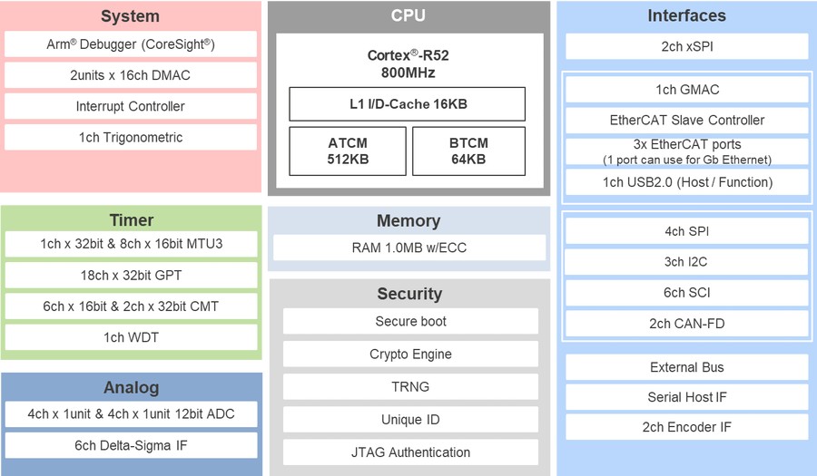

.. zephyr:board:: rzt2l_rsk

Overview
********

Renesas Starter Kit+ for RZ/T2L is an evaluation and development kit for the RZ/T2L MPU.
By simply connecting the bundled cable to your PC, you can immediately start evaluation through an
on-board emulator. This product contains rich functional ICs such as Gigabit Ethernet PHY and
Octal Flash so you can evaluate various functions of the RZ/T2L without an extension board.

* On-board RZ/T2L MPU 196-pin (R9A07G074M04GBG)
* Rich functional ICs such as Gigabit Ethernet PHY and Octal Flash
  so you can evaluate various functions of the RZ/T2L without an extension board
* Generic interfaces such as Pmod/Grove/QWIIC/mikroBUS
* Pin headers for external extension enable you to evaluate many use cases
* Emulator circuit is mounted, and program debugging can be started by simply connecting USB cable
  to PC (two USB cables are included, one for emulator and the other for power supply)
* On-board memory components:

  * Octa Flash (512MBit)
  * HyperRAM (64Mbit)
  * QSPI Serial Flash (128Mbit)
  * I2C EEPROM (16Kbit)

* Communication interfaces include:

  * Debug interfaces (J-Link OB, MIPI-10, MIPI-20, Mictor-38)
  * Ethernet
  * CAN
  * USB
  * RS485
  * UART
  * I2C
  * SPI

Hardware
********

The Renesas RZ/T2L MPU documentation can be found at `RZ/T2L Group Website`_

	RZ/T2L block diagram (Credit: Renesas Electronics Corporation)

Detailed hardware features for the board can be found at `RZ/T2L-RSK Website`_

Supported Features
==================

.. zephyr:board-supported-hw::

Connections and IOs
===================

By default, the board is configured for use with:

* UART0 connected to the USB serial port (pins G12, G11),
* UART2 connected to the PMOD Header (J25, pins M1, L2),
* LEDs defined as ``led1`` and ``led3``,

The Zephyr console uses UART0.

Programming and Debugging
*************************

.. zephyr:board-supported-runners::

Applications for the ``rzt2l_rsk`` board can be
built, flashed, and debugged in the usual way. See :ref:`build_an_application`
and :ref:`application_run` for more details on building and running.

To use J-Link OB on RSK+RZT2L,

1. Open the jumper pin (J9) for switching the debug connection.

2. Connect the micro-USB type-B to J-Link OB USB connector (J10), and then the LED6 is lighted.

Console
=======

The UART port is accessed by USB-Serial port (CN16).

Debugging
=========

Here is an example for building and debugging with the :zephyr:code-sample:`hello_world` application.

.. zephyr-app-commands::
   :zephyr-app: samples/hello_world
   :board: rzt2l_rsk
   :goals: build debug

Flashing
=========

Before using ``flash`` command, the board must be set to xSPI1 boot mode.

.. zephyr-app-commands::
   :zephyr-app: samples/hello_world
   :board: rzt2l_rsk
   :goals: build flash

References
**********

.. target-notes::

.. _RZ/T2L Group Website:
   https://www.renesas.com/en/products/microcontrollers-microprocessors/rz-mpus/rzt2l-high-performance-mpu-realizing-high-speed-and-high-precision-real-time-control-ethercat

.. _RZ/T2L-RSK Website:
   https://www.renesas.com/en/products/microcontrollers-microprocessors/rz-mpus/rzt2l-rsk-renesas-starter-kit-rzt2l
