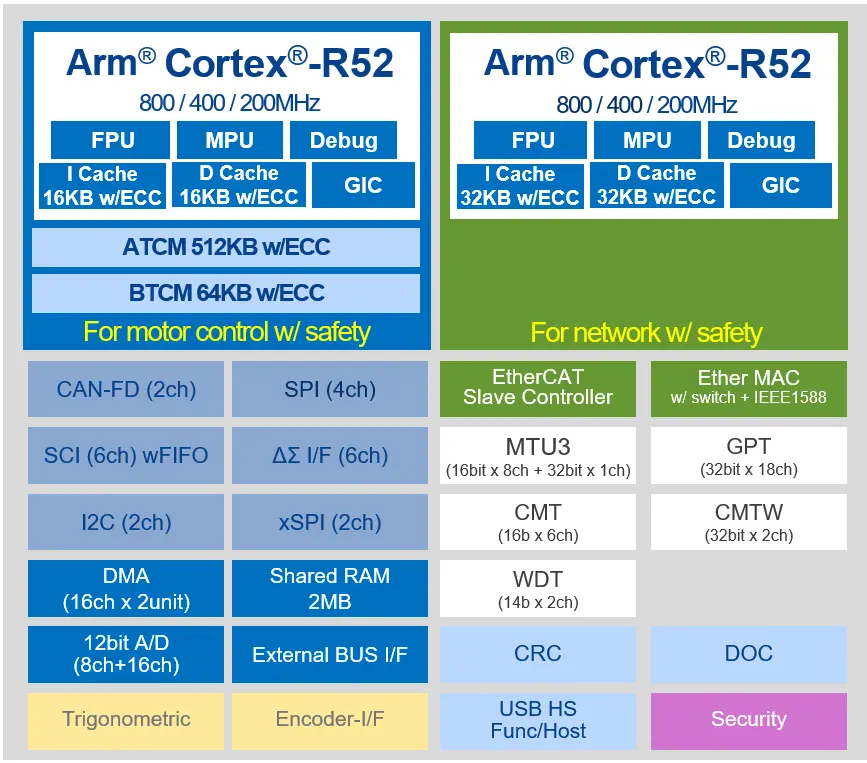

.. zephyr:board:: rzt2m_rsk

Overview
********

The Renesas Starter Kit+ for RZ/T2M is an evaluation and development kit for the RZ/T2M MPU.
The board is powered through a 5V input via a DC Power Jack or USB Type-C Connector.

* On-board RZ/T2M MPU 320-pin (R9A07G075M24GBG)
* Rich functional ICs such as Gigabit Ethernet PHY and Octal Flash are mounted,
  functions of target MPU can be fully evaluated
* Generic interface such as Pmod/Grove/QWIIC/mikroBUS
* The pin header enables users to freely combine with the user's hardware system and evaluate RZ/T2M
* Emulator circuit is mounted, can start program debugging by simply connecting USB cable
  to PC (two USB cables are bundled: one for emulator, and the other for power supply)
* On-board memory components:

  * SDRAM (256MBit)
  * NOR Flash (256MBit)
  * Octa Flash (512MBit)
  * HyperRAM (512Mbit)
  * QSPI Serial Flash (512Mbit)
  * I2C EEPROM (32Kbit)

* Communication interfaces include:

  * Debug interfaces (J-Link OB, MIPI-10, MIPI-20)
  * Ethernet
  * CAN
  * USB
  * RS485
  * UART
  * I2C
  * SPI

Hardware
********

The Renesas RZ/T2M MPU documentation can be found at `RZT2M Product page`_

Supported Features
==================

.. zephyr:board-supported-hw::

Connections and IOs
===================

By default, the board is configured for use with:

* UART0 connected to the USB serial port (pins K18, K19),
* UART3 connected to the PMOD Header (J25, pins H16, G20),
* LEDs defined as ``led0``, ``led1``, ``led2`` and ``led3``,

The Zephyr console uses UART0.

Programming and Debugging
*************************

.. zephyr:board-supported-runners::

Applications for the ``rzt2m_rsk`` board can be built in the usual way as
documented in :ref:`build_an_application`.

To use J-Link OB on RSK+RZT2M,

1. Open the jumper pin (J9) for switching the debug connection.

2. Connect the micro-USB type-B to J-Link OB USB connector (J10), and then the LED4 is lighted.

Console
=======

The UART port is accessed by USB-Serial port (CN16).

Debugging
=========

Here is an example for building and debugging with the :zephyr:code-sample:`hello_world` application.

.. zephyr-app-commands::
   :zephyr-app: samples/hello_world
   :board: rzt2m_rsk/r9a07g075m24gbg/cr520
   :goals: build debug

Flashing
=========

Before using ``flash`` command, the board must be set to xSPI boot mode.

.. zephyr-app-commands::
   :zephyr-app: samples/hello_world
   :board: rzt2m_rsk/r9a07g075m24gbg/cr520
   :goals: build flash

References
**********

.. target-notes::

.. _RZT2M Product page: https://www.renesas.com/us/en/products/microcontrollers-microprocessors/rz-mpus/rzt2m-high-performance-multi-function-mpu-realizing-high-speed-processing-and-high-precision-control
