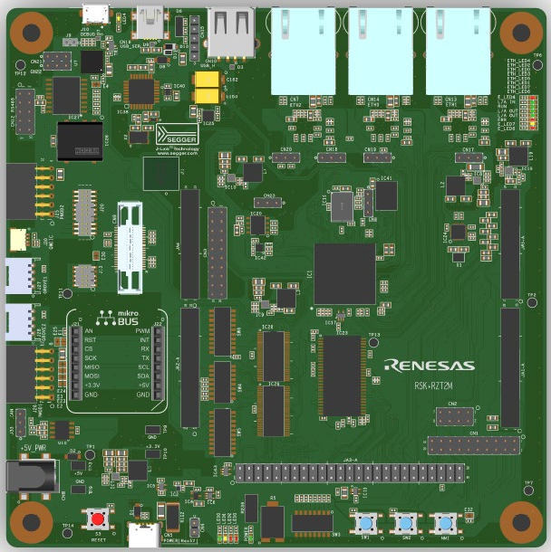

.. _rzt2m_starterkit:

Renesas Starter Kit+ for RZ/T2M
###############################

Overview
********

The Renesas Starter Kit+ for RZ/T2M is an evaluation and development kit for the RZ/T2M MPU.
The board is powered through a 5V input via a DC Power Jack or USB Type-C Connector.

   Starter Kit+ for RZ/T2M (Credit: Renesas)

Hardware
********

The board utilizes the SoC of part no. R9A07G075M24GBG, with 2MB of RAM.

It has several on-board memory components:

* SDRAM (256MBit),
* NOR Flash (256MBit),
* Octa Flash (512MBit),
* HyperRAM (512Mbit),
* QSPI Serial Flash (512Mbit),
* I2C EEPROM (32Kbit).

The communication interfaces include:

* Debug interfaces (J-Link, MIPI-10, MIPI-20),
* Ethernet,
* CAN,
* USB,
* RS485,
* UART,
* I2C,
* SPI.

Supported Features
==================

+-----------+------------+-------------------------------------+
| Interface | Controller | Driver/Component                    |
+===========+============+=====================================+
| NVIC      | on-chip    | nested vector interrupt controller  |
+-----------+------------+-------------------------------------+
| SYSTICK   | on-chip    | systick                             |
+-----------+------------+-------------------------------------+
| PINCTRL   | on-chip    | pinctrl                             |
+-----------+------------+-------------------------------------+
| UART      | on-chip    | serial                              |
+-----------+------------+-------------------------------------+
| GPIO      | on-chip    | gpio                                |
+-----------+------------+-------------------------------------+

Other hardware features are not currently supported by the port.

Connections and IOs
===================

By default, the board is configured for use with:

* UART0 connected to the USB serial port (pins K18, K19),
* UART3 connected to the PMOD Header (J25, pins H16, G20),
* LEDs defined as ``led0``, ``led1``, ``led2`` and ``led3``,

The Zephyr console uses UART0.

Programming and Debugging
*************************

Debugging
=========

Connect to the board using the J-Link On-board USB connector.
Use ``west`` to start the debug server:

.. code-block:: console

    west debugserver

Connect GDB to the server and load an application:

.. code-block::

    target remote :2331
    file build/zephyr/zephyr.elf
    load

References
**********

.. target-notes::

.. _RZT2M Product page: https://www.renesas.com/us/en/products/microcontrollers-microprocessors/rz-mpus/rzt2m-high-performance-multi-function-mpu-realizing-high-speed-processing-and-high-precision-control
