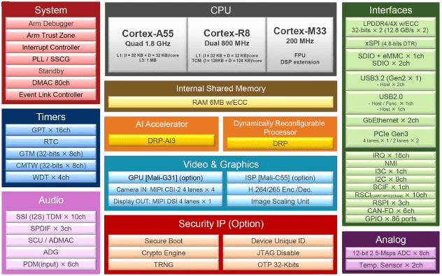

.. zephyr:board:: rzv2h_evk

Overview
********

The RZ/V2H high-end AI MPU boasts Renesas' proprietary dynamically reconfigurable processor AI accelerator (DRP-AI3),
quad Arm Cortex-A55 (1.8GHz) Linux processors, and dual Cortex-R8 (800MHz) real-time processors.
Furthermore, the RZ/V2H also includes another dynamically reconfigurable processor (DRP).
This processor can accelerate image processing, such as OpenCV, and dynamics calculations required for robotics applications.
It also features high-speed interfaces like PCIe, USB 3.2, and Gigabit Ethernet,
making it an ideal microprocessor for applications such as autonomous robots and machine vision in factory automation,
where advanced AI processing must be implemented with low power consumption.

* RZ/V2H Secure Evaluation Board (CPU Board)

  * PMIC: RAA215300
  * Clock generator: 5L35023B
  * Main memory: LPDDR4X 8GB x 2
  * xSPI Flash memory: 64MB
  * External memory: Micro SD x 2
  * High-speed interface:

    * Gigabit Ethernet x 2 ports
    * USB 3.2 Gen2 x 2ch (Host only)
    * USB 2.0 x 2ch (On-the-Go (OTG) x 1ch, Host x 1ch)
    * PCIe Gen3 x 1ch (4 lanes max)
    * MIPI CSI-2 x 4ch
    * MIPI DSI x 1ch
    * GPIO: 86 pins

* RZ/V2H-EVK Expansion Board (EXP Board):

  * HDMI Tx x 1
  * Audio AUX connector x 1ch
  * Audio MIC connector x 1ch
  * Audio HP connector x 1ch
  * Pmod x 4

Hardware
********

The Renesas RZ/V2H documentation can be found at `RZ/V2H Group Website`_

   RZ/V2H block diagram (Credit: Renesas Electronics Corporation)

Detailed hardware features for the board can be found at `RZV2H-EVK Website`_

Supported Features
==================

.. zephyr:board-supported-hw::

Connections and IOs
===================

By default, the board is configured for use with:

SCI_UART
--------

* SCI_UART0:

   * TX = Pmod 3A pin 2
   * RX = Pmod 3A pin 3

LED
---

* LED5 (yelow) = P0_0
* LED6 (yelow) = P0_1

Programming and Debugging (M33)
*******************************

.. zephyr:board-supported-runners::

Applications for the ``rzv2h_evk`` board can be built in the usual way as
documented in :ref:`build_an_application`.

Console
=======

The UART port for Cortex-M33 System Core can be accessed by connecting `Pmod USBUART <https://store.digilentinc.com/pmod-usbuart-usb-to-uart-interface/>`_
to the upper side of ``PMOD Type 3A``.

Debugging
=========

It is possible to load and execute a Zephyr application binary on
this board on the Cortex-M33 System Core from
the internal SRAM, using ``JLink`` debugger (:ref:`jlink-debug-host-tools`).

Here is an example for building and debugging with the :zephyr:code-sample:`hello_world` application.

.. zephyr-app-commands::
   :zephyr-app: samples/hello_world
   :board: rzv2h_evk/r9a09g057h44gbg/cm33
   :goals: build debug

Flashing
========

RZ/V2H-EVK is designed to start different systems on different cores.
It uses Yocto as the build system to build Linux system and boot loaders
to run Zephyr on Cortex-M33 with u-boot. The minimal steps are described below.

1. Download Multi-OS Package from the `RZ/V2H Easy Download Guide`_

2. Unzip Multi-OS Package then open "r01qs0077ej****-rzv2h-multi-os-pkg" PDF file.

3. Follow "3.2 Integration of Multi-OS Package related stuff" to build RZ/V2H AI SDK Source Code.
   Uncomment the following lines in **meta-rz-features/meta-rz-multi-os/meta-rzv2h/conf/layer.conf**.

.. code-block:: console

   #MACHINE_FEATURES_append = " RZV2H_CM33_BOOT"
   MACHINE_FEATURES_append = " SRAM_REGION_ACCESS"
   #MACHINE_FEATURES_append = " CM33_FIRMWARE_LOAD"
   #MACHINE_FEATURES_append = " CA55_CPU_CLOCKUP"

The below necessary artifacts will be located in the build/tmp/deploy/image

+---------------+-------------------------------------------------+
| Artifacts     | File name                                       |
+===============+=================================================+
| Boot loader   | bl2_bp_spi-rzv2h-evk-ver1.srec                  |
|               |                                                 |
|               | fip-rzv2h-evk-ver1.srec                         |
+---------------+-------------------------------------------------+
| Flash Writer  | Flash_Writer_SCIF_RZV2H_DEV_INTERNAL_MEMORY.mot |
+---------------+-------------------------------------------------+
| SD card image | core-image-weston-rzv2h-evk-ver1.wic.bmap       |
|               |                                                 |
|               | core-image-weston-rzv2h-evk-ver1.wic.gz         |
+---------------+-------------------------------------------------+

4. Carry out 1-9 of Step "1-B Write the Linux files to SD card" at `Step 7 Deploy AI Application`_ to prepare SD card.

5. Run the following commands to write **zephyr.bin** to SD card.

.. code-block:: console

   $ sudo mkdir /mnt/sd -p
   $ sudo mount /dev/sdb2 /mnt/sd
   $ sudo cp /path/to/zephyr.bin /mnt/sd/boot
   $ sync
   $ sudo umount /mnt/sd

.. warning::

   Change ``/dev/sdb`` to your microSD card device name. Use ``dh -h`` to check.

6. Insert the SD card into SD1 of RZ/V2H EVK, set up board at eSD mode (DSW1[4:5] = ON, OFF).

7. Turn on the board carefully, see "3.2.2.4 Power Supply" in `Getting Started with Flexible Software Package`_
   Then, you should see the following message on the console associated with CN12 of RZ/V2H EVK.

.. code-block:: console

   U-Boot 2021.10 (Jun 14 2024 - 18:14:19 +0000)
   CPU: Renesas Electronics CPU rev 1.0
   Model: Renesas EVK Version 1 based on r9a09g057h4
   DRAM: 15.9 GiB
   MMC: mmc@15c00000: 0, mmc@15c10000: 1(snip)
   Net: eth0: ethernet@15c30000, eth1: ethernet@15c40000
   Hit any key to stop autoboot: 3

8. Hit any key within 3 sec to stop autoboot.

9. Carry out the following setup of u-boot to kick CM33 Core.

.. code-block:: console

   => setenv cm33start 'dcache off
   => mw.l 0x10420D2C 0x02000000
   => mw.l 0x1043080c 0x08003000
   => mw.l 0x10430810 0x18003000
   => mw.l 0x10420604 0x00040004
   => mw.l 0x10420C1C 0x00003100
   => mw.l 0x10420C0C 0x00000001
   => mw.l 0x10420904 0x00380008
   => mw.l 0x10420904 0x00380038
   => ext4load mmc 0:2 0x08003000 boot/zephyr.bin
   => mw.l 0x10420C0C 0x00000000
   => dcache on'
   => saveenv
   => run cm33start

References
**********

.. target-notes::

.. _RZ/V2H Easy Download Guide:
   https://www.renesas.com/en/document/gde/rzv2h-easy-download-guide

.. _Step 7 Deploy AI Application:
   https://renesas-rz.github.io/rzv_ai_sdk/5.00/getting_started_v2h.html#step7

.. _Getting Started with Flexible Software Package:
   https://www.renesas.com/en/document/apn/rzv-getting-started-flexible-software-package

.. _RZV2H-EVK Website:
   https://www.renesas.com/en/products/microcontrollers-microprocessors/rz-mpus/rzv2h-evk-rzv2h-quad-core-vision-ai-mpu-evaluation-kit

.. _RZ/V2H Group Website:
   https://www.renesas.com/en/products/microcontrollers-microprocessors/rz-mpus/rzv2h-quad-core-vision-ai-mpu-drp-ai3-accelerator-and-high-performance-real-time-processor
