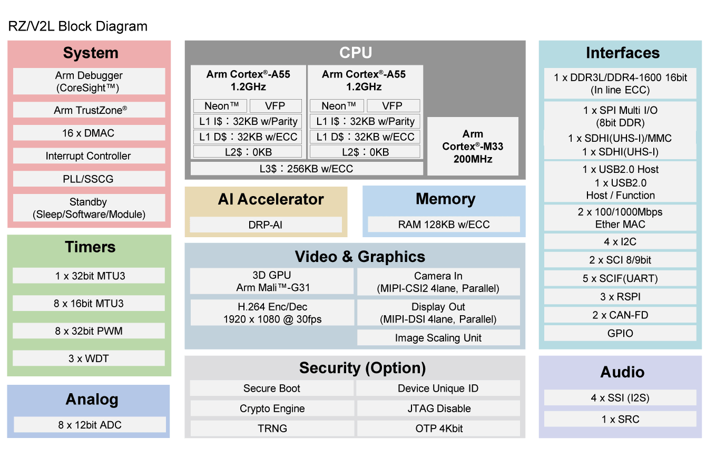

.. zephyr:board:: rzv2l_smarc

Overview
********

The Renesas RZ/V2L SMARC Evaluation Board Kit (RZ/V2L-EVKIT) consists of a SMARC v2.1 module board and a carrier board.

* Device: RZ/V2L R9A07G054L23GBG

  * Cortex-A55 Dual, Cortex-M33
  * BGA551pin, 15mmSq body, 0.5mm pitch

* SMARC v2.1 Module Board Functions

  * DDR4 SDRAM: 2GB x 1pc
  * QSPI flash memory: 512Mb x 1pc
  * eMMC memory: 64GB x 1pc
  * The microSD card slot is implemented and used as an eSD for boot
  * 5-output clock oscillator `5P35023 <https://www.renesas.com/en/products/clocks-timing/clock-generation/programmable-clocks/5p35023-versaclock-3s-programmable-clock-generator>`_ implemented
  * PMIC power supply `RAA215300 <https://www.renesas.com/en/products/power-management/multi-channel-power-management-ics-pmics/raa215300-high-performance-9-channel-pmic-supporting-ddr-memory-built-charger-and-rtc>`_ implemented

* Carrier Board Functions

  * The FFC/FPC connector is mounted as standard for connection to high-speed serial interface for camera module.
  * The Micro-HDMI connector via DSI/HDMI conversion module is mounted as standard for connection to high-speed serial interface for digital video module.
  * The Micro-AB receptacle (ch0: USB2.0 OTG) and A receptacle (ch1: USB2.0 Host) are respectively mounted as standard for connection to USB interface.
  * The RJ45 connector is mounted as standard for software development and evaluation using Ethernet.
  * The audio codec is mounted as standard for advance development of audio system. The audio jack is implemented for connection to audio interface.
  * The CAN connector is implemented for connection to CAN-Bus interface.
  * The Micro-AB receptacles are implemented for connection to asynchronous serial port interface.
  * The microSD card slot and two sockets for PMOD are implemented as an interface for RZ/V2L peripheral functions.
  * For power supply, a mounted USB Type-C receptacle supports the USB PD standard.

* MIPI Camera Module

  * MIPI Camera Module (MIPI CSI) is included. Image recognition processing can be used with images input with MIPI camera.

Hardware
********

The Renesas RZ/V2L MPU documentation can be found at `RZ/V2L Group Website`_

	RZ/V2L block diagram (Credit: Renesas Electronics Corporation)

Detailed hardware features for the board can be found at `RZV2L-EVKIT Website`_

Multi-OS processing
*******************

The RZ/V2L-EVKIT allows different applications to be executed in RZ/V2L SoC. With its multi-core architecture,
each core can operate independently to perform customized tasks or exchange data using the OpenAMP framework.
Please see :zephyr:code-sample:`rz-openamp-linux-zephyr` sample for reference.

Supported Features
==================

.. zephyr:board-supported-hw::

Programming and Debugging
*************************

.. zephyr:board-supported-runners::

Applications for the ``rzv2l_smarc`` board can be built in the usual way as
documented in :ref:`build_an_application`.

Console
=======

The UART port for Cortex-M33 System Core can be accessed by connecting `Pmod USBUART <https://store.digilentinc.com/pmod-usbuart-usb-to-uart-interface/>`_
to the upper side of ``PMOD 1``.

Debugging
=========

It is possible to load and execute a Zephyr application binary on
this board on the Cortex-M33 System Core from
the internal SRAM, using ``JLink`` debugger (:ref:`jlink-debug-host-tools`).

Here is an example for building and debugging with the :zephyr:code-sample:`hello_world` application.

.. zephyr-app-commands::
   :zephyr-app: samples/hello_world
   :board: rzv2l_smarc/r9a07g054l23gbg/cm33
   :goals: build debug

Flashing
========

RZ/V2L-EVKIT is designed to start different systems on different cores.
It uses Yocto as the build system to build Linux system and boot loaders
to run Zephyr on Cortex-M33 with u-boot. The minimal steps are described below.

1. Follow ''2.2 Building Images'' of `SMARC EVK of RZ/V2L Linux Start-up Guide`_ to prepare the build environment.

2. At step (4), follow step ''2. Download Multi-OS Package'' and ''3. Add the layer for Multi-OS Package''
   of ''3.2 Integration of OpenAMP related stuff'' of `RZ/V2L Quick Start Guide for RZ/V Multi-OS Package`_
   to add the layer for Multi-OS Package.

.. code-block:: console

   $ cd ~/rzv_vlp_<pkg ver>
   $ unzip <Multi-OS Dir>/r01an7254ej0311-rzv-multi-os-pkg.zip
   $ tar zxvf r01an7254ej0311-rzv-multi-os-pkg/meta-rz-features_multi-os_v3.1.1.tar.gz
   $ cd build
   $ bitbake-layers add-layer ../meta-rz-features/meta-rz-multi-os/meta-rzv2l

3. Start the build:

.. code-block:: console

   $ MACHINE=smarc-rzv2l bitbake core-image-minimal

The below necessary artifacts will be located in the build/tmp/deploy/images

+---------------+------------------------------------------------------+
| Artifacts     | File name                                            |
+===============+======================================================+
| Boot loader   | bl2_bp-smarc-rzv2l_pmic.srec                         |
|               |                                                      |
|               | fip-smarc-rzv2l_pmic.srec                            |
+---------------+------------------------------------------------------+
| Flash Writer  | Flash_Writer_SCIF_RZV2L_SMARC_PMIC_DDR4_2GB_1PCS.mot |
+---------------+------------------------------------------------------+

4. Follow ''4.2 Startup Procedure'' of `SMARC EVK of RZ/V2L Linux Start-up Guide`_ for power supply and board setting
   at SCIF download (SW11[1:4] = OFF, ON, OFF, ON) and (SW1[1:2] = ON, OFF)

5. Follow ''4.3 Download Flash Writer to RAM'' of `SMARC EVK of RZ/V2L Linux Start-up Guide`_ to download Flash Writer to RAM

6. Follow ''4.4 Write the Bootloader'' of `SMARC EVK of RZ/V2L Linux Start-up Guide`_ to write the boot loader
   to the target board by using Flash Writer.

7. Follow ''4.5 Change Back to Normal Boot Mode'' with switch setting (SW11[1:4] = OFF, OFF, OFF, ON) and (SW1[1:2] = ON, OFF)

8. Follow ''3. Preparing the SD Card'' of `SMARC EVK of RZ/V2L Linux Start-up Guide`_ to write files to the microSD Card

9. Copy zephyr.bin file to microSD card

10. Follow "4.3.2 CM33 Sample Program Invocation with u-boot" from the beginning to step 4 of `RZ/V2L Quick Start Guide for RZ/V Multi-OS Package`_

11. Execute the commands stated below on the console to start zephyr application with CM33 core.
    Here, ''N'' stands for the partition number in which you stored zephyr.bin file.

.. code-block:: console

   Hit any key to stop autoboot: 2
   => dcache off
   => mmc dev 1
   => fatload mmc 1:N 0x00010000 zephyr.bin
   => fatload mmc 1:N 0x40010000 zephyr.bin
   => cm33 start_normal 0x00010000 0x40010000
   => dcache on

References
**********

.. target-notes::

.. _RZ/V2L Group Website:
   https://www.renesas.com/en/products/rz-v2l

.. _RZV2L-EVKIT Website:
   https://www.renesas.com/en/design-resources/boards-kits/rz-v2l-evkit

.. _SMARC EVK of RZ/V2L Linux Start-up Guide:
   https://www.renesas.com/en/document/gde/rzv2l-linux-start-guide-rev105

.. _RZ/V2L Quick Start Guide for RZ/V Multi-OS Package:
   https://www.renesas.com/en/document/apn/rzv2l-quick-start-guide-rzv-multi-os-package-v311
