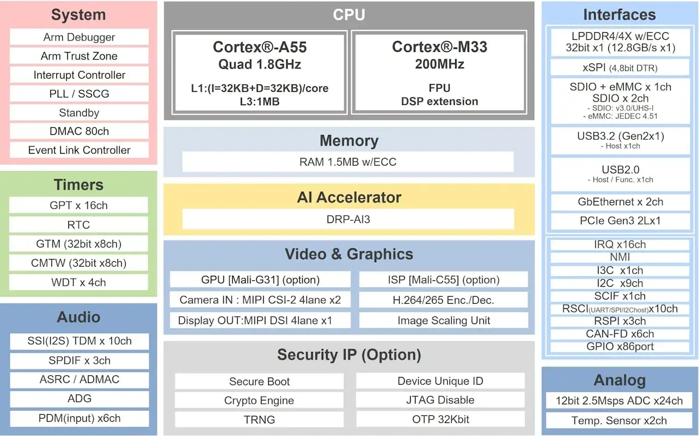

.. zephyr:board:: rzv2n_evk

Overview
********

The RZ/V2N is a vision AI microprocessor (MPU) with Renesas proprietary AI accelerator (DRP-AI3)
supporting up to 15TOPS AI performance. Its CPUs are quad Arm Cortex-A55 (1.8GHz) and Arm Cortex-M33 (200MHz).
The RZ/V2N is equipped with an ISP (Image Signal Processor) and dual-channel MIPI CSI-2 camera interfaces
for supporting dual camera signal processing, which is crucial for realizing vision systems.
It is also equipped with high-speed interfaces such as PCIe and USB 3.2, allowing for the expansion of external devices.
The RZ/V2N is an ideal microprocessor for applications requiring both low power consumption and advanced AI inference,
such as DMS (Driver Monitoring System), monitoring cameras, mobile robots, and more.

* RZ/V2N Evaluation Board (CPU Board):

  * CPU: RZ/V2N
  * PMIC: RAA215300
  * Clock generator: 5L35023B
  * Main memory: LPDDR4X 8GB x1
  * xSPI Flash memory: 64MB
  * External memory: microSD x1
  * Board-to-board connector for sub boards
  * High-speed interface:
    * Gigabit Ethernet x2 ports
    * USB 3.2 Gen2 x1ch (Host only)
    * USB 2.0 x1ch (OTG)
    * PCIe Gen3 x1ch (2 lanes max)
    * MIPI CSI-2 x2ch
    * MIPI DSI x 1ch
    * GPIO: 86 pins

* RZ/V2H-EVK Expansion Board (EXP Board): Shared with RZ/V2H

  * HDMI Tx x1ch
  * Audio auxiliary input connector x1ch
  * Audio microphone input connector x1ch
  * Audio headphone output connector x1ch
  * Pmod x4

Hardware
********

The Renesas RZ/V2N documentation can be found at `RZ/V2N Group Website`_

        RZ/V2N block diagram (Credit: Renesas Electronics Corporation)

Detailed hardware features for the board can be found at `RZV2N-EVK Website`_

Supported Features
==================

.. zephyr:board-supported-hw::

Connections and IOs
===================

By default, the board is configured for use with:

SCI_UART
--------

* SCI_UART0:

   * TX = Pmod 3A pin 2
   * RX = Pmod 3A pin 3

LED
---

* LED5 (yelow) = P0_0
* LED6 (yelow) = P0_1

Programming and Debugging (M33)
*******************************

.. zephyr:board-supported-runners::

Applications for the ``rzv2n_evk`` board can be built in the usual way as
documented in :ref:`build_an_application`.

Console
=======

The UART port for Cortex-M33 System Core can be accessed by connecting `Pmod USBUART <https://store.digilentinc.com/pmod-usbuart-usb-to-uart-interface/>`_
to the upper side of ``PMOD Type 3A``.

Debugging
=========

It is possible to load and execute a Zephyr application binary on
this board on the Cortex-M33 System Core from
the internal SRAM, using ``JLink`` debugger (:ref:`jlink-debug-host-tools`).

Here is an example for building and debugging with the :zephyr:code-sample:`hello_world` application.

.. zephyr-app-commands::
   :zephyr-app: samples/hello_world
   :board: rzv2n_evk/r9a09g056n48gbg/cm33
   :goals: build debug

Flashing
========

RZ/V2N-EVK is designed to start different systems on different cores.
It uses Yocto as the build system to build Linux system and boot loaders
to run Zephyr on Cortex-M33 with u-boot. The minimal steps are described below.

1. Download Multi-OS Package from the `RZ/V2N Group Handbook`_

2. Unzip Multi-OS Package then open "r01qs0078ej****-rzv2n-multi-os-pkg" PDF file.

3. Follow "3.2 Integration of OpenAMP related stuff" to build RZ/V2N AI SDK Source Code.
   Uncomment the following lines in **meta-rz-features/meta-rz-multi-os/meta-rzv2n/conf/layer.conf**.

.. code-block:: console

   #MACHINE_FEATURES_append = " RZV2N_CM33_BOOT"
   MACHINE_FEATURES_append = " SRAM_REGION_ACCESS"
   #MACHINE_FEATURES_append = " CM33_FIRMWARE_LOAD"
   #MACHINE_FEATURES_append = " CA55_CPU_CLOCKUP"

The below necessary artifacts will be located in the build/tmp/deploy/image

+---------------+-----------------------------------------+
| Artifacts     | File name                               |
+===============+=========================================+
| Boot loader   | bl2_bp_spi-rzv2n-evk.srec               |
|               |                                         |
|               | fip-rzv2n-evk.srec                      |
+---------------+-----------------------------------------+
| Flash Writer  | Flash_Writer_SCIF_RZV2N_DEV_LPDDR4X.mot |
+---------------+-----------------------------------------+
| SD card image | core-image-weston-rzv2n-evk.wic.bmap    |
|               |                                         |
|               | core-image-weston-rzv2n-evk.wic.gz      |
+---------------+-----------------------------------------+

4. Carry out 1-9 of Step "1-B Write the Linux files to SD card" at `Step 7 Deploy AI Application`_ to prepare SD card.

5. Run the following commands to write **zephyr.bin** to SD card.

.. code-block:: console

   $ sudo mkdir /mnt/sd -p
   $ sudo mount /dev/sdb2 /mnt/sd
   $ sudo cp /path/to/zephyr.bin /mnt/sd/boot
   $ sync
   $ sudo umount /mnt/sd

.. warning::

   Change ``/dev/sdb`` to your microSD card device name. Use ``dh -h`` to check.

6. Insert the SD card into SD1 of RZ/V2N EVK, set up board at eSD mode (DSW1[4:5] = ON, OFF).

7. Turn on the board carefully, see "3.3.2.4 Power Supply" in `Getting Started with Flexible Software Package`_
   Then, you should see the following message on the console associated with CN12 of RZ/V2N EVK.

.. code-block:: console

   U-Boot 2021.10 (Sep 19 2024 - 10:13:55 +0000)
   CPU:   Renesas Electronics CPU rev 1.0
   Model: Renesas EVK based on r9a09g056
   DRAM:  7.9 GiB
   MMC:   mmc@15c00000: 0, mmc@15c10000: 1
   Loading Environment from SPIFlash...
   SF: Detected mt25qu512a with page size 256 Bytes, erase size 64 KiB, total 64 MiB
   OK
   In:    serial@11c01400
   Out:   serial@11c01400
   Err:   serial@11c01400
   Net:   eth0: ethernet@15c30000
   Hit any key to stop autoboot: 3

8. Hit any key within 3 sec to stop autoboot.

9. Carry out the following setup of u-boot to kick CM33 Core.

.. code-block:: console

   => setenv cm33start 'dcache off
   => mw.l 0x10420D2C 0x02000000
   => mw.l 0x1043080c 0x08003000
   => mw.l 0x10430810 0x18003000
   => mw.l 0x10420604 0x00040004
   => mw.l 0x10420C1C 0x00003100
   => mw.l 0x10420C0C 0x00000001
   => mw.l 0x10420904 0x00380008
   => mw.l 0x10420904 0x00380038
   => ext4load mmc 0:2 0x08003000 boot/zephyr.bin
   => mw.l 0x10420C0C 0x00000000
   => dcache on'
   => saveenv
   => run cm33start

References
**********

.. target-notes::

.. _RZ/V2N Group Handbook:
   https://www.renesas.com/en/document/gde/rzv2n-group-handbook

.. _Step 7 Deploy AI Application:
   https://renesas-rz.github.io/rzv_ai_sdk/5.10/getting_started_v2n.html#step7

.. _Getting Started with Flexible Software Package:
   https://www.renesas.com/en/document/apn/rzv-getting-started-flexible-software-package

.. _RZV2N-EVK Website:
   https://www.renesas.com/en/products/microcontrollers-microprocessors/rz-mpus/rzv2n-evk-rzv2n-quad-core-vision-ai-mpu-evaluation-kit

.. _RZ/V2N Group Website:
   https://www.renesas.com/en/products/microcontrollers-microprocessors/rz-mpus/rzv2n-15tops-quad-core-vision-ai-mpu-2-camera-connection-and-excellent-power-efficiency
