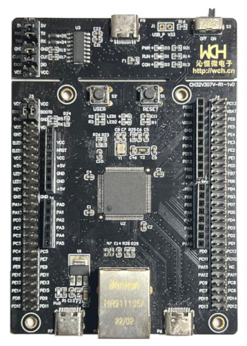

.. _ch32v307v_evt_r1:

WCH CH32V307V EVT R1
####################

Overview
********

The WCH CH32V307V-EVT-R1 is a fully-featured development board.
The board has FPU supported RISC-V processor, USB, Ethernet,
and various and many basic peripherals.

- `CH32V307V Page <http://www.wch-ic.com/products/CH32V307.html?>`_
- `CH32V307V Datasheet Download Page <http://www.wch-ic.com/downloads/CH32V20x_30xDS0_PDF.html>`_
- `CH32V307V Reference Manual Download Page <http://www.wch-ic.com/downloads/CH32FV2x_V3xRM_PDF.html>`_
- `QingKe V4 Processor Manual Download Page (Chinese) <https://www.wch.cn/downloads/QingKeV4_Processor_Manual_PDF.html>`_
- `GitHub Page (Firmware, board schematics, ...) <https://github.com/openwch/ch32v307>`_

Hardware
********

- FPU supported 144MHz RISC-V processor
- 64KB SRAM/256KB Flash
- 80 x I/O ports
- 3 x USART, 5 x UART
- 2 x ADC(16 channel)
- 2 x I2C
- 3 x SPI
- 2 x I2S
- 2 x CAN
- 2 x 12-bit DAC
- 2 x basic 16-bit timer
- 4 x universal 16-bit timer
- 4 x advanced 16-bit timer
- 1 x RTC
- 1 x SysTick
- 2 x Watchdog timer
- 2 x DMA
- 4 x Applifier
- 1 x True random number generator
- 1 x Digital Video Port
- 1 x SDIO
- 1 x USBFS(OTG)
- 1 x USBHS
- 1 x ETH(Gigabit Ethernet controller)

Supported Features
==================

The board configuration supports the following hardware features:

.. list-table::
   :header-rows: 1

   * - Peripheral
     - Kconfig option
     - Devicetree compatible
   * - WCH QingKe SysTick
     - :kconfig:option:`CONFIG_WCH_QINGKE_SYSTICK`
     - :dtcompatible:`wch,qingke-systick`
   * - WCH PFIC Interrupt Controller
     - :kconfig:option:`CONFIG_WCH_PFIC`
     - :dtcompatible:`wch,pfic`
   * - GPIO
     - :kconfig:option:`CONFIG_GPIO`
     - :dtcompatible:`gd,gd32-gpio`
   * - USART
     - :kconfig:option:`CONFIG_SERIAL`
     - :dtcompatible:`gd,gd32-usart`

Serial Port
===========

The USART1 connects to the P9 USB connector via WCH-Link.
Connect the USB connecter and launch a terminal application on your PC
to show the UART message.

Onboard LED
===========

The board has two onboard LEDs. But these are not connected to any GPIO pin.
You need to connect the LED pin with any GPIO pin in connectors to light it.
The default configuration uses PB13, the Arduino LED pin, as the LED pin.

Programming and debugging
*************************

Building & Flashing
===================

You'll need OpenOCD with WCH CH32V series support to upload the application
to the device. First, download the binaries for your OS from the
`MounRiver Studio download page <http://mounriver.com/download>`_.
(MounRiver Studio contains WCH CH32V supported OpenOCD binaries.)

The Zephyr SDK uses a bundled version of OpenOCD by default. You can
overwrite that behavior by adding the
``-DOPENOCD=<path/to/riscv-openocd/bin/openocd>``
parameter when building:

Here is an example of building the :ref:`blinky-sample` application.

.. zephyr-app-commands::
   :zephyr-app: samples/basic/blinky
   :board: ch32v307v_evt_r1
   :goals: build flash
   :gen-args: -DOPENOCD=<path/to/riscv-openocd/bin/openocd>

Debugging
=========

You can debug an application in the usual way.  Here is an example for the
:ref:`blinky-sample` application.

.. zephyr-app-commands::
   :zephyr-app: samples/basic/blinky
   :board: ch32v307v_evt_r1
   :maybe-skip-config:
   :goals: debug
   :gen-args: -DOPENOCD=<path/to/riscv-openocd/bin/openocd>
