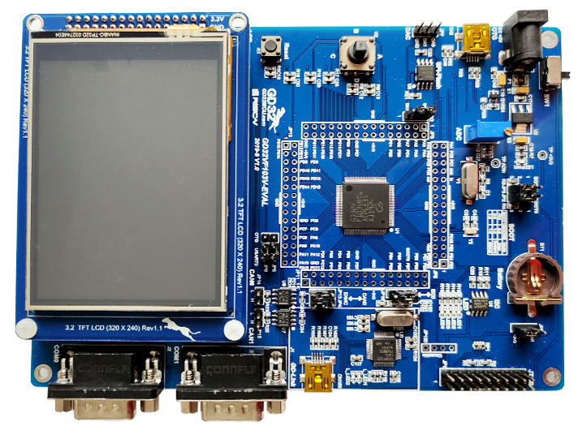

.. _gd32vf103v_eval:

GigaDevice GD32VF103V-EVAL
##########################

Overview
********

The GD32V103V-EVAL board is a hardware platform that enables prototyping
on GD32VF103VB RISC-V MCU.

The GD32VF103VB features a single-core RISC-V 32-bit MCU which can run up
to 108 MHz with flash accesses zero wait states, 128 KiB of Flash, 32 KiB of
SRAM and 80 GPIOs.

Hardware
********

- GD32VF103VBT6 MCU
- AT24C02C 2Kb EEPROM
- GD25Q16 16Mbit SPI and QSPI NOR Flash
- 4 x User LEDs
- 1 x Joystick (L/R/U/D/C)
- 2 x USART (RS-232 at J1/J2 connectors)
- 1 x POT connected to an ADC input
- USB FS connector
- Headphone interface
- 1 x CAN
- 3.2" RGB-LCD (320x240)
- GD-Link on board programmer
- J-Link/JTAG connector

For more information about the GD32VF103 SoC and GD32VF103V-EVAL board:

- `GigaDevice RISC-V Mainstream SoC Website`_
- `GD32VF103 Datasheet`_
- `GD32VF103 User Manual`_
- `GD32VF103V-EVAL Documents`_

Supported Features
==================

The board configuration supports the following hardware features:

.. list-table::
   :header-rows: 1

   * - Peripheral
     - Kconfig option
     - Devicetree compatible
   * - GPIO
     - :kconfig:option:`CONFIG_GPIO`
     - :dtcompatible:`gd,gd32-gpio`
   * - Machine timer
     - :kconfig:option:`CONFIG_RISCV_MACHINE_TIMER`
     - :dtcompatible:`riscv,machine-timer`
   * - Nuclei ECLIC Interrupt Controller
     - :kconfig:option:`CONFIG_NUCLEI_ECLIC`
     - :dtcompatible:`nuclei,eclic`
   * - PWM
     - :kconfig:option:`CONFIG_PWM`
     - :dtcompatible:`gd,gd32-pwm`
   * - USART
     - :kconfig:option:`CONFIG_SERIAL`
     - :dtcompatible:`gd,gd32-usart`
   * - ADC
     - :kconfig:option:`CONFIG_ADC`
     - :dtcompatible:`gd,gd32-adc`

Serial Port
===========

The GD32VF103V-EVAL board has two serial communications port. The default port
is USART0 with TX connected at PA9 and RX at PA10.

Programming and Debugging
*************************

Before programming your board make sure to configure boot and serial jumpers
as follows:

- JP2/3: Select 2-3 for both (boot from user memory)
- JP5/6: Select 1-2 positions (labeled as ``USART0``)

Using GD-Link
=============

The GD32VF103V-EVAL includes an onboard programmer/debugger (GD-Link) which
allows flash programming and debugging over USB. There is also a JTAG header
(JP1) which can be used with tools like Segger J-Link.

.. note::

   The OpenOCD shipped with Zephyr SDK does not support GD32VF103. You will need
   to build the `riscv-openocd fork <https://github.com/riscv/riscv-openocd>`_.
   Note that compared with OpenOCD, J-Link offers a better programming and
   debugging experience on this board.

#. Build the Zephyr kernel and the :ref:`hello_world` sample application:

   .. zephyr-app-commands::
      :zephyr-app: samples/hello_world
      :board: gd32vf103v_eval
      :goals: build
      :gen-args: -DOPENOCD=<path/to/riscv-openocd/bin/openocd> -DOPENOCD_DEFAULT_PATH=<path/to/riscv-openocd/share/openocd/scripts>
      :compact:

#. Run your favorite terminal program to listen for output. On Linux the
   terminal should be something like ``/dev/ttyUSB0``. For example:

   .. code-block:: console

      minicom -D /dev/ttyUSB0 -o

   The -o option tells minicom not to send the modem initialization
   string. Connection should be configured as follows:

      - Speed: 115200
      - Data: 8 bits
      - Parity: None
      - Stop bits: 1

#. To flash an image:

   .. zephyr-app-commands::
      :zephyr-app: samples/hello_world
      :board: gd32vf103v_eval
      :goals: flash
      :compact:

   You should see "Hello World! gd32vf103v_eval" in your terminal.

#. To debug an image:

   .. zephyr-app-commands::
      :zephyr-app: samples/hello_world
      :board: gd32vf103v_eval
      :goals: debug
      :compact:

.. _GigaDevice RISC-V Mainstream SoC Website:
   https://www.gigadevice.com/products/microcontrollers/gd32/risc-v/mainstream-line/

.. _GD32VF103 Datasheet:
   https://www.gigadevice.com/datasheet/gd32vf103xxxx-datasheet/

.. _GD32VF103 User Manual:
   https://www.gd32mcu.com/data/documents/userManual/GD32VF103_User_Manual_Rev1.4.pdf

.. _GD32VF103V-EVAL Documents:
   https://github.com/riscv-mcu/GD32VF103_Demo_Suites/tree/master/GD32VF103V_EVAL_Demo_Suites/Docs
