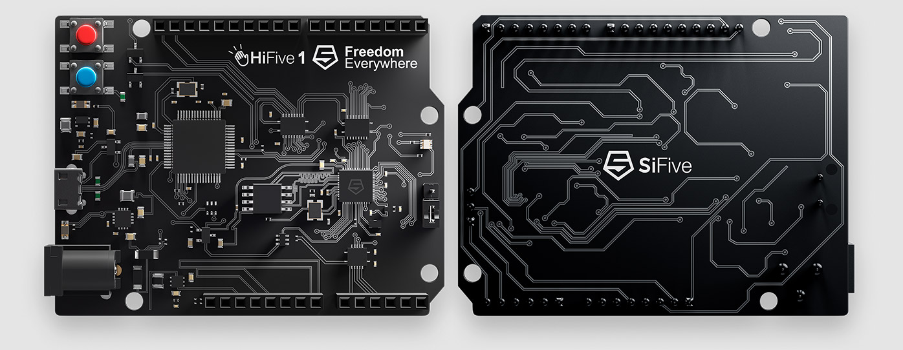

.. _hifive1:

SiFive HiFive1
##############

Overview
********

The HiFive1 is an Arduino-compatible development board with
an FE310 RISC-V SoC.
More information can be found on
`SiFive's website <https://www.sifive.com/boards/hifive1>`_.

Programming and debugging
*************************

Building
========

Applications for the ``hifive1`` board configuration can be built as usual
(see :ref:`build_an_application`) using the corresponding board name:

.. zephyr-app-commands::
   :board: hifive1
   :goals: build

Flashing
========

In order to upload the application to the device, you'll need OpenOCD with
RISC-V support. Download the tarball for your OS from the `SiFive website
<https://www.sifive.com/boards>`_ and extract it.

The Zephyr SDK uses a bundled version of OpenOCD by default. You can
overwrite that behavior by adding the
``-DOPENOCD=<path/to/riscv-openocd/bin/openocd>`` parameter when building:

.. zephyr-app-commands::
   :board: hifive1
   :goals: build
   :gen-args: -DOPENOCD=<path/to/riscv-openocd/bin/openocd>

When using a custom toolchain it should be enough to have the downloaded
version of the binary in your ``PATH``.

Now you can flash the application as usual (see :ref:`build_an_application` and
:ref:`application_run` for more details):

.. code-block:: console

   ninja flash

Depending on your OS you might have to run the flash command as superuser.

Debugging
=========

Refer to the detailed overview about :ref:`application_debugging`.
