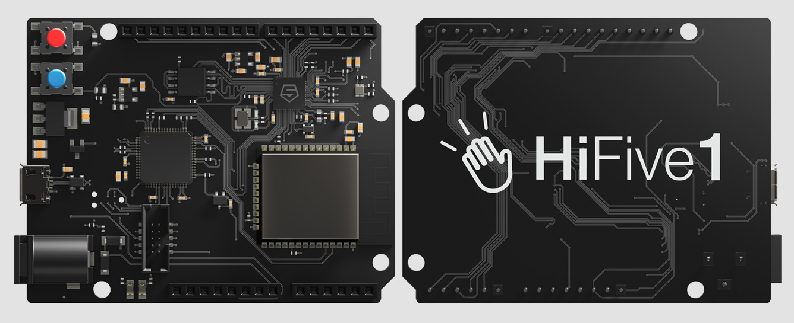

.. _hifive1_revb:

SiFive HiFive1 Rev B
####################

Overview
********

The HiFive1 Rev B is an Arduino-compatible development board with
a SiFive FE310-G002 RISC-V SoC.

Programming and debugging
*************************

Building
========

Applications for the ``hifive1_revb`` board configuration can be built as usual
(see :ref:`build_an_application`) using the corresponding board name:

.. zephyr-app-commands::
   :board: hifive1_revb
   :goals: build

Flashing
========

The HiFive 1 Rev B uses Segger J-Link OB for flashing and debugging. To flash and
debug the board, you'll need to install the
`Segger J-Link Software and Documentation Pack
<https://www.segger.com/downloads/jlink#J-LinkSoftwareAndDocumentationPack>`_
and choose version V6.46a or later (Downloads for Windows, Linux, and macOS are
available).

With the Segger J-Link Software installed, you can flash the application as usual
(see :ref:`build_an_application` and :ref:`application_run` for more details):

.. code-block:: console

   west flash

Debugging
=========

Refer to the detailed overview about :ref:`application_debugging`.
