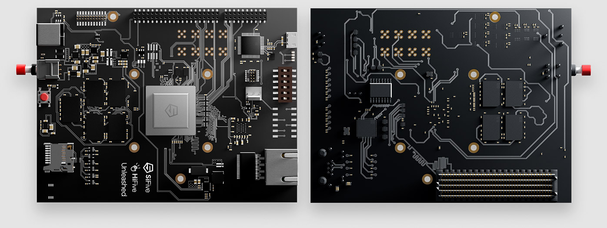

.. _hifive_unleashed:

SiFive HiFive Unleashed
#######################

Overview
********

The HiFive Unleashed is a development board with a SiFive FU540-C000
multi-core 64bit RISC-V SoC.

Programming and debugging
*************************

Building
========

Applications for the ``hifive_unleashed`` board configuration can be built as
usual (see :ref:`build_an_application`) using the corresponding board name:

.. zephyr-app-commands::
   :board: hifive_unleashed
   :goals: build

Flashing
========

Current version has not yet supported flashing binary to onboard Flash ROM.

This board has USB-JTAG interface and this can be used with OpenOCD.
Load applications on DDR and run as follows:

.. code-block:: console

   openocd -c 'bindto 0.0.0.0' \
           -f boards/riscv/hifive_unleashed/support/openocd_hifive_unleashed.cfg
   riscv64-zephyr-elf-gdb build/zephyr/zephyr.elf
   (gdb) target remote :3333
   (gdb) c

Debugging
=========

Refer to the detailed overview about :ref:`application_debugging`.
