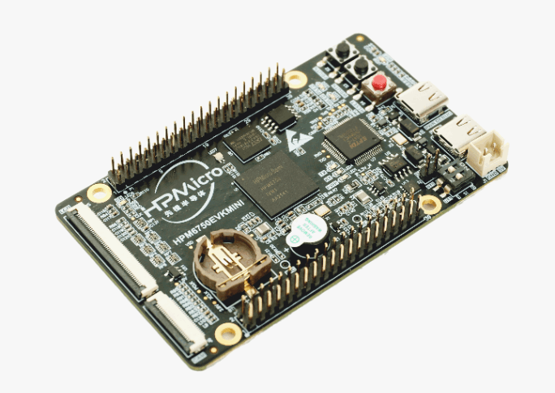

.. _hpm6750evkmini:

HPMicro HPM6750EVKMINI
######################

Overview
********

The HPM6750 is a dual-core flashless MCU running 816Mhz.
It has a 2MB continuous on-chip ram.
Also, it provides various memory interfaces, including SDRAM, Quad SPI NOR Flash, SD/eMMC.

The figure shows the HPM6750EVKMINI board.

Hardware
********

The HPM6750EVKMINI platform integrates 2 cores 32-bit 816MHz RISC-V CPUs, DSP,
2MB RAM, Cache, SPI flash memory, ethernet controller and other peripherals.

- HPM6750IVM MCU (816Mhz, 2MB OCRAM)
- Onboard Memory
  - 128Mb SDRAM
  - 64Mb Quad SPI NOR Flash
- Display & Camera
  - LCD connector
  - Camera (DVP)
- WiFi
  - RW007 over SPI
- USB
  - USB type C (USB 2.0 OTG) connector x2
- Audio
  - Mic
  - DAO
- Others
  - TF Slot
  - FT2232
  - Beeper
  - RGB LED
- Expansion port
  - ART-PI extension port

For more information about the HPMICRO SoC and HPM6750EVKMINI board:

- `HPMICRO Design Resources`_

Serial Port
===========

The HPM6750EVKMINI platform has 2 UARTs.
The Zephyr console output is by default assigned to UART0 and the default
settings are 115200 8N1.

Programming and debugging
*************************

Building
========

You can build applications in the usual way. Here is an example for
the :ref:`hello_world` application.

.. zephyr-app-commands::
   :board: hpm6750evkmini
   :zephyr-app: samples/hello_world
   :goals: build

Flashing
========

If you want to use XIP mode (``CONFIG_XIP=y``).
If ``CONFIG_XIP=n``, you can load the program into RAM directly
and execute it.

.. zephyr-app-commands::
   :board: hpm6750evkmini
   :zephyr-app: samples/hello_world
   :goals: flash

Open a serial terminal with the following settings:

- Speed: 115200
- Data: 8 bits
- Parity: None
- Stop bits: 1

you should see the following message in the terminal:

.. code-block:: console

   Hello World! hpm6750evkmini

Debugging
=========

.. zephyr-app-commands::
   :board: hpm6750evkmini
   :zephyr-app: samples/hello_world
   :goals: debug

References
==========

.. _HPMICRO Design Resources:
   http://www.hpmicro.com/resources/resources.html
