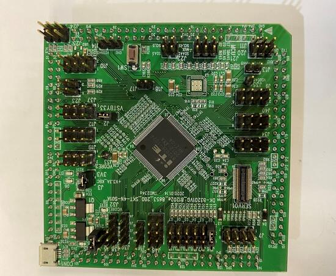

.. _it8xxx2_evb:

ITE IT8XXX2 series
######################

Overview
********

The IT8XXX2 is a 32-bit RISC-V Micro-controller.
And a highly integrated embedded controller with system functions.
It is suitable for mobile system applications.

To find out more about ITE, visit our World Wide Web at:`ITE's website`_

Hardware
********
The IT8XXX2 series contains different chip types(ex, it81302, it83202),
and they support different hardware features.
Listing the IT81302 hardware features as following:

- RISC-V RV32IMAFC instruction set
- 4KB instruction cache size
- 60KB SDRAM in total
- Built-in 32.768 kHz clock generator
- PWM, eSPI, LPC, FLASH, UART, GPIO, Timer, Watchdog, ADC, JTAG
- 6 SMBus channels, with 3 DMA controllers, compatiable with I2C
- SPI master/slave
- USB Type-c CC Logic
- USB Power Delivery
- Support KB scan

Supported Features
==================
currently supports the following hardware features:

.. list-table:: Supported Features
   :header-rows: 1
   :widths: auto

   * - Interface
     - Controller
     - Driver/Component
   * - NVIC
     - on-chip
     - interrupt controller
   * - TIMER
     - on-chip
     - timer
   * - UART
     - on-chip
     - serial
   * - GPIO
     - on-chip
     - gpio

Programming and debugging
*************************

Building
========

Applications for the ``it8xxx2_evb`` board configuration can be built as usual
(see :`Zephyr Getting Started Guide`_):

.. zephyr-app-commands::
   :board: it8xxx2_evb
   :goals: build

Flashing
========

In order to upload the application to the device,
you'll need our winflash tool and download board.
You can get the winflash tool at here:`Download Link`_
Use the winflash.exe tool to program a zephyr application
to the it8xxx2 board flash.

Debugging
=========

Supporting uart debug, currently.

References
==========

.. target-notes::

.. _ITE's website: http://www.ite.com.tw/en/product/view?mid=149
.. _Zephyr Getting Started Guide: https://docs.zephyrproject.org/latest/getting_started/index.html
.. _Download Link: http://www.ite.com.tw/en/product/view?mid=149
