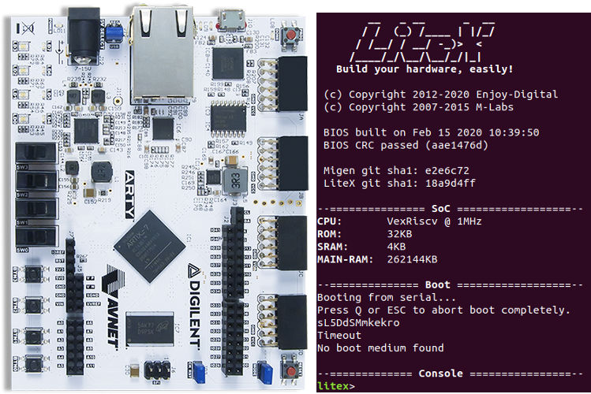

.. _litex-vexriscv:

LiteX VexRiscv
##############

LiteX VexRiscv is an example of a system on a chip (SoC) that consists of
a `VexRiscv processor <https://github.com/SpinalHDL/VexRiscv>`_
and additional peripherals. This setup has been generated using
`LiteX SoC Builder <https://github.com/enjoy-digital/litex>`_ and can be used
on various FPGA chips. The bitstream (FPGA configuration file) can be
obtained using both vendor-specific tools and open-source tools, including the
`SymbiFlow toolchain <https://symbiflow.github.io/>`_.

The ``litex_vexriscv`` board configuration in Zephyr is meant for the
LiteX VexRiscv SoC implementation generated for the
`Digilent Arty A7-35T Development Board <https://store.digilentinc.com/arty-a7-artix-7-fpga-development-board-for-makers-and-hobbyists>`_.

LiteX is based on
`Migen <https://m-labs.hk/gateware/migen/>`_/`MiSoC SoC builder <https://github.com/m-labs/misoc>`_
and provides ready-made system components such as buses, streams, interconnects,
common cores, and CPU wrappers to create SoCs easily. The tool contains
mechanisms for integrating, simulating, and building various designs
that target multiple chips of different vendors.
More information about the LiteX project can be found on
`LiteX's website <https://github.com/enjoy-digital/litex>`_.

VexRiscv is a 32-bit implementation of the RISC-V CPU architecture
written in the `SpinalHDL <https://spinalhdl.github.io/SpinalDoc-RTD/>`_.
The processor supports M, C, and A RISC-V instruction
set extensions, with numerous optimizations that include multistage
pipelines and data caching. The project provides many optional extensions
that can be used to customize the design (JTAG, MMU, MUL/DIV extensions).
The implementation is optimized for FPGA chips.
More information about the project can be found on
`VexRiscv's website <https://github.com/SpinalHDL/VexRiscv>`_.

LiteX VexRiscv with SymbiFlow
*****************************

To run the ZephyrOS on the VexRiscv CPU, it is necessary to prepare the
bitstream for the FPGA on a Digilent Arty A7-35 Board. This can be achieved
using the LiteX SoC Builder together with the SymbiFlow toolchain.

SymbiFlow is an Open Source Verilog-to-Bitstream FPGA synthesis flow,
targeting FPGAs of multiple vendors. Currently, it targets the Xilinx 7-Series,
Lattice iCE40, Lattice ECP5 FPGAs, QuickLogic EOS S3 and is gradually being
expanded to provide a comprehensive end-to-end FPGA synthesis flow.
More information about the project can be found on
`Symbiflow's website <https://symbiflow.github.io/>`_.

Bitstream Generation
====================

In order to generate the bitstream for the Digilent Arty A7-35 Board, proceed
with the following instruction:

1. Install the SymbiFlow toolchain using instruction available in the
   `symbiflow-examples <https://github.com/SymbiFlow/symbiflow-examples>`_ repository.

#. Install the RISC-V toolchain:

   .. code-block:: bash

      wget https://static.dev.sifive.com/dev-tools/riscv64-unknown-elf-gcc-8.1.0-2019.01.0-x86_64-linux-ubuntu14.tar.gz
      tar -xf riscv64-unknown-elf-gcc-8.1.0-2019.01.0-x86_64-linux-ubuntu14.tar.gz
      export PATH=$PATH:$PWD/riscv64-unknown-elf-gcc-8.1.0-2019.01.0-x86_64-linux-ubuntu14/bin/

#. Download LiteX:

   .. code-block:: bash

      wget https://raw.githubusercontent.com/enjoy-digital/litex/master/litex_setup.py
      chmod +x litex_setup.py
      ./litex_setup.py init
      ./litex_setup.py install

#. Generate the bitstream:

   .. code-block:: bash

      cd litex/litex/boards/targets && ./arty.py --toolchain symbiflow --cpu-type vexriscv --sys-clk-freq 80e6 --build

Programming and debugging
*************************

Building
========

Applications for the ``litex_vexriscv`` board configuration can be built as usual
(see :ref:`build_an_application`).
In order to build the application for ``litex_vexriscv``, set the ``BOARD`` variable
to ``litex_vexriscv``.

Booting
=======

You can boot from a serial port using `flterm: <https://github.com/timvideos/flterm>`_, e.g.:

.. code-block:: bash

    flterm --port /dev/ttyUSB0 --kernel <path_to_zephyr.bin> --kernel-adr 0x40000000
