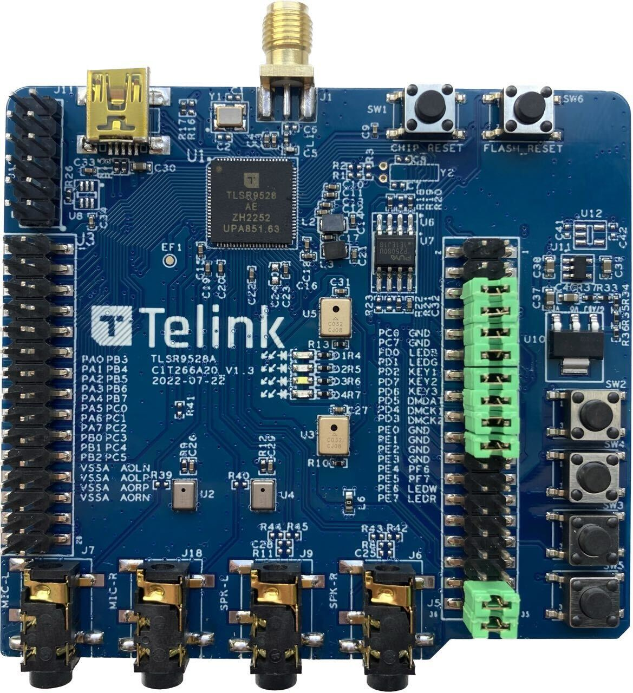
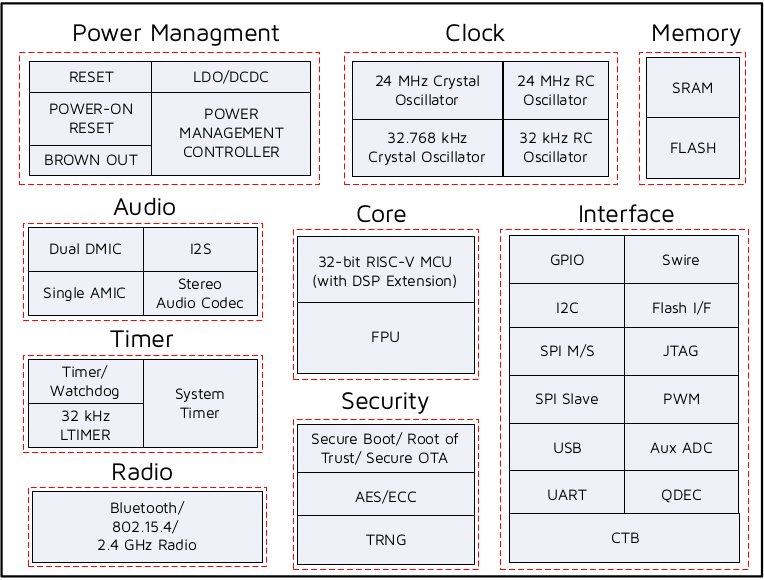

.. _tlsr9528a:

Telink TLSR9528A
#####################

Overview
********

The TLSR9528A Generic Starter Kit is a hardware platform which
can be used to verify the `Telink TLSR9 series chipset`_ and develop applications
for several 2.4 GHz air interface standards including Bluetooth 5.2 (Basic data
rate, Enhanced data rate, LE, Indoor positioning and BLE Mesh),
Zigbee 3.0, Homekit, 6LoWPAN, Thread and 2.4 Ghz proprietary.

More information about the board can be found at the `Telink B92 Generic Starter Kit Hardware Guide`_ website.

Hardware
********

The TLSR9528A SoC integrates a powerful 32-bit RISC-V MCU, DSP, 2.4 GHz ISM Radio, 512
KB SRAM (256 KB of Data Local Memory and 256 KB of Instruction Local Memory first 96 KB of this memory
supports retention feature), external Flash memory, stereo audio codec, 14 bit AUX ADC,
analog and digital Microphone input, PWM, flexible IO interfaces, and other peripheral blocks required
for advanced IoT, hearable, and wearable devices.

The TLSR9528A default board configuration provides the following hardware components:

- RF conducted antenna
- 1 MB External SPI Flash memory with reset button. (Possible to mount 1/2/4 MB)
- Chip reset button
- Mini USB interface
- 4-wire JTAG
- 4 LEDs, Key matrix up to 4 keys
- 2 line-in function (Dual Analog microphone supported when switching jumper from microphone path)
- Dual Digital microphone
- Stereo line-out

Supported Features
==================

The Zephyr TLSR9528A board configuration supports the following hardware features:

+----------------+------------+------------------------------+
| Interface      | Controller | Driver/Component             |
+================+============+==============================+
| PLIC           | on-chip    | interrupt_controller         |
+----------------+------------+------------------------------+
| RISC-V Machine | on-chip    | timer                        |
| Timer (32 KHz) |            |                              |
+----------------+------------+------------------------------+
| PINCTRL        | on-chip    | pinctrl                      |
+----------------+------------+------------------------------+
| GPIO           | on-chip    | gpio                         |
+----------------+------------+------------------------------+
| UART           | on-chip    | serial                       |
+----------------+------------+------------------------------+
| PWM            | on-chip    | pwm                          |
+----------------+------------+------------------------------+
| TRNG           | on-chip    | entropy                      |
+----------------+------------+------------------------------+
| FLASH (MSPI)   | on-chip    | flash                        |
+----------------+------------+------------------------------+
| RADIO          | on-chip    | Bluetooth,                   |
|                |            | ieee802154, OpenThread       |
+----------------+------------+------------------------------+
| SPI (Master)   | on-chip    | spi                          |
+----------------+------------+------------------------------+
| I2C (Master)   | on-chip    | i2c                          |
+----------------+------------+------------------------------+
| ADC            | on-chip    | adc                          |
+----------------+------------+------------------------------+
| USB (device)   | on-chip    | usb_dc                       |
+----------------+------------+------------------------------+
| AES            | on-chip    | mbedtls                      |
+----------------+------------+------------------------------+
| PKE            | on-chip    | mbedtls                      |
+----------------+------------+------------------------------+

Board supports power-down modes: suspend and deep-sleep. For deep-sleep mode only 96KB of retention memory is available.
Board supports HW cryptography acceleration (AES and ECC till 256 bits). MbedTLS interface is used as cryptography front-end.

.. note::
   To support "button" example project PD6-KEY3 (J5-13, J5-14) jumper needs to be removed and KEY3 (J5-13) should be connected to GND (J3-30) externally.

   For the rest example projects use the default jumpers configuration.

Limitations
-----------

- Maximum 3 GPIO ports could be configured to generate external interrupts simultaneously. All ports should use different IRQ numbers.
- DMA mode is not supported by I2C, SPI and Serial Port.
- SPI Slave mode is not implemented.
- I2C Slave mode is not implemented.
- Bluetooth is not compatible with deep-sleep mode. Only suspend is allowed when Bluetooth is active.
- USB working only in active mode (No power down supported).
- During deep-sleep all GPIO's are in Hi-Z mode.
- Shell is not compatible with sleep modes.

Default configuration and IOs
=============================

System Clock
------------

The TLSR9528A board is configured to use the 24 MHz external crystal oscillator
with the on-chip PLL/DIV generating the 48 MHz system clock.
The following values also could be assigned to the system clock in the board DTS file
(``boards/riscv/tlsr9528a/tlsr9528a-common.dtsi``):

- 16000000
- 24000000
- 32000000
- 48000000
- 60000000
- 96000000

.. code-block::

   &cpu0 {
       clock-frequency = <48000000>;
   };

PINs Configuration
------------------

The TLSR9528A SoC has five GPIO controllers (PORT_A to PORT_F), and the next are
currently enabled:

- LED0 (blue): PD0, LED1 (green): PD1, LED2 (white): PE6, LED3 (red): PE7
- Key Matrix SW2: PD2_PD6, SW3: PD2_PF6, SW4: PD7_PD6, SW5: PD7_PF6

Peripheral's pins on the SoC are mapped to the following GPIO pins in the
``boards/riscv/tlsr9528a/tlsr9528a-common.dtsi`` file:

- UART0 TX: PB2, RX: PB3
- UART1 TX: PC6, RX: PC7
- PWM Channel 0: PD0
- LSPI CLK: PE1, MISO: PE3, MOSI: PE2
- GSPI CLK: PA2, MISO: PA3, MOSI: PA4
- I2C SCL: PC0, SDA: PC1

Serial Port
-----------

The TLSR9528A SoC has 2 UARTs. The Zephyr console output is assigned to UART0.
The default settings are 115200 8N1.

Programming and debugging
*************************

Building
========

.. important::

   These instructions assume you've set up a development environment as
   described in the `Zephyr Getting Started Guide`_.

To build applications using the default RISC-V toolchain from Zephyr SDK, just run the west build command.
Here is an example for the "hello_world" application.

.. code-block:: console

   # From the root of the zephyr repository
   west build -b tlsr9528a samples/hello_world

Open a serial terminal with the following settings:

- Speed: 115200
- Data: 8 bits
- Parity: None
- Stop bits: 1

Flash the board, reset and observe the following messages on the selected
serial port:

.. code-block:: console

   *** Booting Zephyr OS version 2.5.0  ***
   Hello World! tlsr9528a

Flashing
========

To flash the TLSR9528A board see the sources below:

- `Burning and Debugging Tools for all Series`_

It is also possible to use the west flash command. Download BDT tool for Linux `Burning and Debugging Tools for Linux`_ or
`Burning and Debugging Tools for Windows`_ and extract archive into some directory you wish TELINK_BDT_BASE_DIR

- Now you should be able to run the west flash command with the BDT path specified (TELINK_BDT_BASE_DIR).

.. code-block:: console

   west flash --bdt-path=$TELINK_BDT_BASE_DIR --erase

- You can also run the west flash command without BDT path specification if TELINK_BDT_BASE_DIR is in your environment (.bashrc).

.. code-block:: console

   export TELINK_BDT_BASE_DIR="/opt/telink_bdt/"

References
**********

.. target-notes::

.. _Telink TLSR9 series chipset: [UNDER_DEVELOPMENT]
.. _Telink B92 Generic Starter Kit Hardware Guide: [UNDER_DEVELOPMENT]
.. _Burning and Debugging Tools for all Series: https://wiki.telink-semi.cn/wiki/IDE-and-Tools/Burning-and-Debugging-Tools-for-all-Series/
.. _Burning and Debugging Tools for Linux: https://wiki.telink-semi.cn/tools_and_sdk/Tools/BDT/Telink_libusb_BDT-Linux-X64-V1.6.0.zip
.. _Burning and Debugging Tools for Windows: https://wiki.telink-semi.cn/tools_and_sdk/Tools/BDT/BDT.zip
.. _Zephyr Getting Started Guide: https://docs.zephyrproject.org/latest/getting_started/index.html
