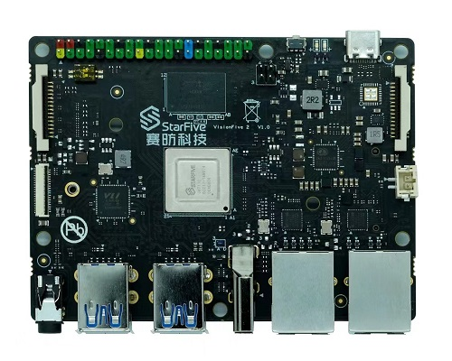

.. _visionfive2_jh7110:

Starfive VisionFive2 JH7110
########################

Overview
********

Starfive VisionFive 2 is the world’s first high-performance RISC-V single board computer (SBC) with an integrated GPU. Compared with its last generation, VisionFive 2 has been fully upgraded with significant improvements in the processor work frequency, multimedia processing capabilities, scalability, etc. Its superior performance and reasonable price make VisionFive 2 the best affordable RISC-V development board ever.

Programming and debugging
*************************

Building
========

Applications for the ``visionfive2_jh7110`` board configuration can be built
as usual (see :ref:`build_an_application`) using the corresponding board name:

.. zephyr-app-commands::
   :board: visionfive2_jh7110
   :goals: build

To build zephyr.bin for this board use this command : 

.. code-block:: console
   west build -p always -b visionfive2_jh7110 samples/hello_world/

spl_tool is a jh7110 signature tool used to generate spl header information and generate zephyr.bin.normal.out.
 `here <https://github.com/starfive-tech/Tools/tree/master/spl_tool/>`_

.. code-block:: console
 ./spl_tool -c -f build/zephyr/zephyr.bin
This will create a new file build/zephyr/zephyr.bin.normal.out that can be flashed.

Flashing
========

.. note::
   The following steps use minicom for serial communication, feel free to use
   any other serial terminal that supports xmodem based file transfers.

git clone the vf2-loader tool from https://github.com/orangecms/vf2-loader.git and xmodem tool from https://github.com/orangecms/xmodem.rs.git side by side. 

#. VisionFive2 uses uart for flashing. Refer to `VisionFive2 Recovery Quick Start Guide here <https://doc-en.rvspace.org/VisionFive2/Quick_Start_Guide/VisionFive2_SDK_QSG/recovering_bootloader%20-%20vf2.html>`_
   to connect your serial-to-usb converter. Now power on the board and using
   minicom access board's serial and press the reset switch on the board until you see CCCCCC... prompt

Copy the zephyr.bin.normal.out from build/zephyr/zephyr.bin.normal.out to previously git cloned vf2-loader/ directory and cd into it.
Flash the zephyr.bin.normal.out using this command: 

.. code-block:: console
    cargo run -- zephyr.bin.normal.out && minicom -D /dev/ttyUSB0

.. code-block:: console
    cargo run -- zephyr.bin.normal.out && minicom -D /dev/ttyUSB0
    Finished dev [unoptimized + debuginfo] target(s) in 0.03s
    Running `target/debug/vf2-loader zephyr.bin.normal.out`
    Welcome to minicom 2.7.1
    OPTIONS: I18n
    Compiled on Dec 23 2019, 02:06:26.
    Port /dev/ttyUSB0, 14:59:24
    Press CTRL-A Z for help on special keys
    6*** Booting Zephyr OS build v3.6.0-rc3 ***
    Hello World! visionfive2_jh7110

